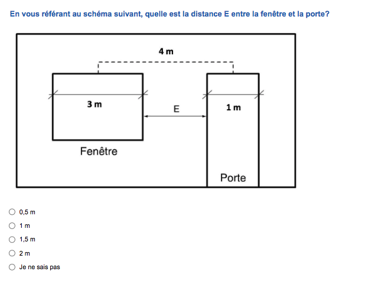
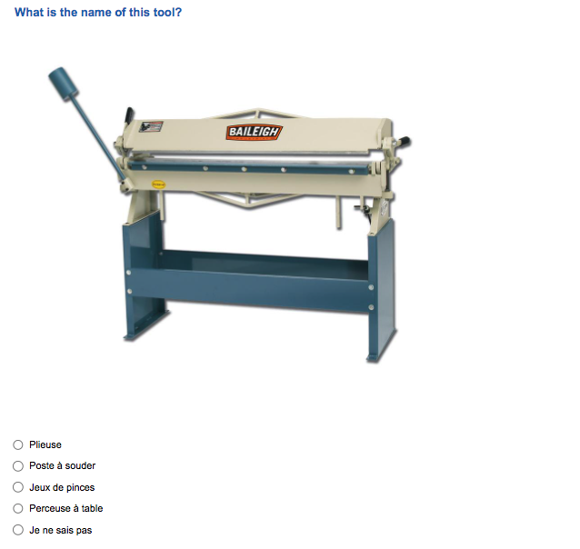

```{r setup, include=FALSE}
packages <- c("lfe", "lme4", "plm", "bookdown", "gtsummary", "labelled", "grid", "gridExtra", "rstatix", "kableExtra", "stargazer", "tidyverse")

# install packages not yet installed
installed_packages <- packages %in% rownames(installed.packages())
if (any(installed_packages == FALSE)) {
  install.packages(packages[!installed_packages], silent = TRUE)
}

# load packages
invisible(lapply(packages, library, character.only = TRUE))

rm(packages, installed_packages)

# load functions
source("../functions/add_by_n.R")

# load data
# source("../code/master.R") # to rerun all code periodically
load("../data/df.rda")
selected <- df %>% filter(SELECTED == 1)
baseline <- df %>% filter(wave == 0)
endline <- df %>% filter (wave == 1)
firms <- df %>% select(FS1.2, wave, FS3.4, firm_size, FS6.1, contains("cb")) %>% group_by(FS1.2, wave) %>% summarise_all(mean, na.rm = T) %>% ungroup()

# load code chunks
knitr::read_chunk('../code/allowances_big_table.R')
knitr::read_chunk('../code/costbenefits_big_table.R')
knitr::read_chunk('../code/attrition.R')
knitr::read_chunk('../code/tbls_body.R')
knitr::read_chunk('../code/tbls_appendix.R')
knitr::read_chunk('../code/figures.R')

# set R options
ggplot2::theme_set(ggplot2::theme_bw())
options(scipen=2, digits=2)

# set knitr options
knitr::opts_chunk$set(message=FALSE,
                      warning=FALSE,
                      echo = FALSE,
                      cache = TRUE,
                      fig.path='figures/',
                      out.extra = "",
                      floatfoot.envs = c("figure", "table", "longtabu"))
```


```{r loaddata, include=FALSE, cache = TRUE}


```

\doublespacing

# Introduction {#intro}

In sub-Saharan Africa (SSA), interest in apprenticeship is on the rise. In economies with large informal sectors, traditional apprenticeships (also referred to as apprenticeships in the informal economy or informal apprenticeships) are the most important source of skills for early school leavers, accounting for as much as 80% percent of technical and vocational training (TVET) in SSA [@filmer2014], and for as much as 90 percent of total employment in the crafts sector [@walther2007; @worldbank2017]. For youth who drop out of school early, informal on-the-job training is often the only alternative for acquiring the skills necessary to start a business or find employment. As increasing numbers of youth in SSA suffer from a lack of labor attachment, underemployment, and poverty, informal sector training is seen by many policy experts as an important tool to tackle the youth employment challenge [@filmer2014].

Traditional apprenticeships take place predominantly in the informal sector and generally last between three and four years. They involve a private contractual arrangement between an apprentice - usually a school-leaver between the ages of 14 and 18 - or his or her parents and a master craftsman (MC) who trains the apprentice in the workplace for a fee [@bas1989]. In contrast to formal TVET, which takes place almost exclusively in the classroom in the SSA context, traditional apprentices train on-the-job. Upon completion of the apprenticeship, the MC issues a certificate acknowledging the training; some apprentices continue to work for the same or for another workshop as a wage employee, though most seek to start their own firm given access to sufficient capital [@frazer2006]. While unregulated at the national level, informal apprenticeships are nevertheless structured according to the dictates of tradition and the customs of local professional associations, and are considered more effective at generating relevant skills than formal TVET [@ahadzie2009].

While abundant and flexible, training in the informal economy is subject to little oversight. The unregulated nature of traditional apprenticeships give rise to a number of potential market failures that negatively affect their provision and quality, and have led to calls for their reform [@walther2011]. For instance, in the absence of complete, enforceable contracts, firms may be unable to commit to providing general skills training [@acemogluWhyFirmsTrain1998; @acemogluStructureWagesInvestment1999; @dustmann2012]. Others have argued that traditional apprentices are exposed to inexperienced trainers who keep them in their apprenticeship for too long [@bas1989]. Apprentice productivity may be so low that subsistence levels (paid in the form of "chop money" by the firm owner) outstrip returns from training, causing an underprovision of training. A deeper understanding of the costs and benefits are critical for guiding any reforms to adjust such market failures. Finally, since informal apprenticeships are often outside formal accreditation systems, they offer limited labor market mobility into formal sector wage jobs relative to formal education and training schemes [@acemogluCertificationTrainingTraining2000; @worldbank2017; @alfonsi2020]. Policies introducing competency-based, nationally-accredited certification of informal apprenticeship are thus a popular solution to this issue, and have been recently introduced in SSA in countries including Malawi and Tanzania.

Another proposed reform is the introduction of a classroom component to traditional apprenticeship, producing a hybrid "dual system" comparable to the Swiss and German variety [@walther2011]. Dual systems promise to increase training quality by introducing a state-regulated classroom component, while also improving the signalling ability of apprentices upon graduation by offering official certification. In SSA, dual apprenticeship schemes were first introduced in Bénin and Togo in the 1980s by the Hans Seidel Foundation, a German NGO, and apprenticeship reforms based on the dual system have since been introduced in Mali, Ivory Coast, Senegal, Tanzania, Togo, and Niger [@walther2011, @ilo2020a]. Many of these schemes have struggled with funding issues and integration into the existing national TVET and regulatory frameworks. With their potential to simultaneously harness the abundance of training firms in the informal sector and the growing demand among parents and youth for formal education, dual system apprenticeship certification schemes seem to remain an underutilized approach in the field of TVET reform.

In this paper, we employ apprentice-firm survey data collected in Bénin in two waves (2019 and 2021) for 427 apprentices training in 197 firms to analyze the impact of a national dual system training program on participating apprentices and firms. The program offered youth in select trades the opportunity to attend classroom training at a local training center once a week while continuing with their traditional in-firm apprenticeship training with an MC. Youth and firms were interviewed before the onset of training and after three years (somewhat shorter than the typical duration of an apprenticeship). We use a sector-specific skills test to compare the learning outcomes of dual system apprentices to unsuccessful program applicants and non-applicants (with both comparison groups pursuing traditional apprenticeships at the same firms as dual-system participants). We also estimate the marginal effect of apprentice participation in dual system training on firm size and profits.

Vocational training interventions combining on-the-job and classroom teaching in LICs have suffered from low take-up, high dropout, and low efficacy (see @blattman2015; @tripney2013; @ghisletta2021 for an overview). Unlike the dual system program studied in this paper, however, these programs are generally short in duration (under a year in total) and exist outside the national education framework. To our knowledge, @crepon2019 is the only study of a dual system apprenticeship program in SSA. The authors study a program in Côte d'Ivoire that offered a stipend to youth to participate in a 12-24 month long dual apprenticeship --- also eliminating all training fees. They find that, about two years after graduation, dual apprentices partake in more complex, non-routine tasks than traditional apprentices and have 15% higher earnings. We study a similarly structured program, but one that is about twice as long and does not involve any direct subsidies or eliminate any fees.

In a second contribution, we provide a detailed account of the costs and benefits associated with (dual) apprenticeship training for firms in the informal sector in SSA. Apprenticeship fees paid by apprentices to their MCs and allowances disbursed to apprentices by firms are reported in papers relating the specificity of training in Ghana to contract type [@velenchikApprenticeshipContractsSmall1995] and propensity of apprenticeship graduates to enter self-employment [@frazer2006], but firm training costs are not. Due to data limitations, neither study is conclusive about whether firms benefit from dual system training. Meanwhile, the intervention in @crepon2019 precludes the study of net costs and benefits of traditional apprenticeship, as it removes training fees and apprentice allowances --- the two largest transfers between training firm and apprentice --- by design. Using detailed firm survey data that includes information on training costs, this paper attempts to fill this gap.

Our paper contributes to several strands of research. First, empirical research from high-income countries suggests that completing an apprenticeship improves overall labor market outcomes for participating youth, both in terms of employment and earnings [@oecdinternationallabourorganization2017]. Though traditional apprenticeships are very common in West Africa [@adams2013; @filmer2014; @walther2011], there is limited direct empirical evidence on their impact on labor market outcomes. Existing studies suggest that long-term returns to training are heterogeneous, but tend to favor apprentices with lower starting levels of education. In the context of Ghana, @monk2008 show that while former apprentices earn significantly less than the rest of the working population, there are positive returns to apprenticeship training for individuals with little or no formal education. Similarly, @frazer2006 points to positive returns to informal training in Ghana, but, like @alfonsi2020 in Uganda, highlights that skills acquired in informal training tend to be firm-specific and thus less conducive to career progression than those acquired through formal schooling. Indeed, the sector-specific or even firm-specific nature of skills acquired in informal apprenticeship may be a reason why self-employment is the dominant path after graduation for many apprentices: for example, @hardy2019 find that youth who participate in an apprenticeship are more likely to shift out of wage work and into self-employment (and thereby suffer a 3% wage penalty), though training under more experienced firm owners increases the likelihood of an increase in earnings. 

Two experimental studies on the benefits of traditional apprenticeship have shown that, on the balance, apprentices increase their human capital through training.  @crepon2019 shows that treated youth who enroll in the subsidized dual training program are more likely to be involved in complex, non-routine tasks after two years than traditional apprentices, with the likelyhood to undertake non-routine analytical tasks increasing by .24 standard deviations (SDs) and non-routine interpersonal tasks increasing by 0.08 SDs. A task intesity index was found to be .21 SDs lower for dual apprentices, i.e. dual apprentices were found to be involved in a wider range of tasks. @alfonsi2020 find that six months of in-firm training improved skills in Uganda, and these skills persisted two to three years after training. However, they observe no difference between formal TVET and informal, in-firm training. @hardy2019 report that training with more experienced trainers leads to higher skills transmission, though the authors do not estimate the progress made by apprentices or compare them to the skills of youth following other educational paths.

We also contribute to the literature on the impact of training on informal firms, which suggests that firms may be the more unambiguous beneficiaries of traditional apprenticeship training. @hardy2022 find that assigning an apprentice to informal firms in Ghana increase firm size by about half a worker, while firm revenues increase by 5-15% per apprentice. Firms not assigned an apprentice do not hire new workers instead, suggesting that screening costs are high. Using data on manufacturing firms from Kenya, Zimbabwe and Ghana in 1992, @rosholm2007 observe a significant wage increase (of about 20%) among firms that trained in the previous 12 months. Large firms are shown to benefit more than small firms. However, the study focuses primarily on formal firms in the manufacturing sector. While @crepon2019 looks at the impact of fee subsidies on firm's apprentice and employee stocks, and both @crepon2019 and @alfonsi2020 investigate substitution effects within firms resulting from apprenticeship subsidies, they do not estimate the change in size or revenues that a firm can expect from hiring additional (dual) apprentices. This study is the first, to our knowledge, to report the impact of training on firm size and profits in this context. 

While these studies suggest that informal apprenticeship training can have positive impacts on firm productivity, they differ from a formal cost-benefit analysis in focusing only on a subset of outcomes and cost components.  The net benefits of dual apprenticeship training has been formally studied in the European context using a variety of detailed cost-benefit surveys and simulations [see @muehlemann2014; @muhlemann2016; and @muhlemann2019 for a review], but cost-benefit studies in lower-middle and low-income countries have not been undertaken until recently [@bolli2020 in Nepal; @bolli2021 in Serbia; @deamesti2021 in Chile], and are non-existent for SSA. Firm lose money training apprentices in Serbia (though the costs vary a great deal by size, with larger firms suffering relatively small losses), while Nepali firms profit from training, with little variation across firm size.

Few studies have focused on the details of the financial arrangements between traditional apprentices and firms, despite some authors suggesting that training fees may be a substantial source of financing for some firms [@velenchikApprenticeshipContractsSmall1995, @frazer2006]. @velenchikApprenticeshipContractsSmall1995 studies the structure of apprenticeship contracts in small informal firms in Ghana, and identifies three dominant transactions between apprentice and firm --- apprentice wages, fees and allowances --- and distinguishes between two broad types of contracts, with and without training fees. She finds that firms that do not charge fees are smaller and tend to offer more specific training.

<!-- @bolli2021  _participating companies are relatively large compared to the large share of micro and small companies in the Nepali economy, employ a relatively high share of high-skilled workers and face high labor market tightness....companies make average net benefits of about 17’000 NPR [137 USD - over 20 months]. These net benefits are substantially higher for the electrical engineering occupation (62’000 NPR) than for the mechanical engineering occupation (6’000 NPR), mainly due to the higher productivity of apprentices from the beginning onwards. The results suggest that apprentices create 270’000 NPR in productive value in the 20 months of workplace training. These benefits are reduced substantially by the costs that amount to 252’000 NPR. The wages of apprentices represent the most important cost component (56%), 9 Note that total benefits and instructor costs are calculated as the surfaces shown in Figure 6 and Figure 7. To derive total benefits and instructor costs based on values shown in Figure 8, it is important to remember that Figure 8 shows values after some time has elapsed rather than averages of a month. Hence, calculating total benefits and instructor costs based on these values consists of adding up the values but give a weight of 50% to the observations after three and 23 months. 25 followed by instructor costs (35%). Non-wage compensation is the least important cost component (9%). However, total benefits are larger than total costs, suggesting that the difference yields a net benefit for companies of 17’000 NPR._ -->

<!-- @deamesti2021 _by participating in dual training, the surveyed companies incur gross costs of $3,298,440 Chilean pesos (CLP) per year per student on average. This corresponds to US$4,650 or about 4.3 monthly wages of a skilled employee in the same area as the dual student. These gross costs consider four different types of costs: (1) training costs (57%), (2) student labour costs (28%), (3) administrative costs (13%), and (4) educational supplies (2%). Regarding the benefits, companies capture around $1,180,207 CLP per year per student. The benefits come from three sources: (1) the productive value that students contribute through their skilled and semi-skilled activities (79%), (2) savings in hiring (2%), and (3) savings in adjustment or induction (19%)._ -->

<!-- @chen2013 _have analysed the costs and benefits of apprenticeship training in a cooperation project between the Guangzhou Communications Technician Institute and Guangzhou Machine Tool Works Co, Ltd. using a calculation methodology also based on CBQ/QEK, but -- with regard to the cost benefit section -- adapted to the Chinese context. Data were collected within the framework of a three-year apprenticeship programme with 28 apprentices taking part. According to this field study, a company was able to obtain net benefits in each year of training, the first year being the most beneficial (for the exact figures, see Appendix, table A.5). This was due to the fact that leaners only received very little or sometimes even no training allowances in the first year of training. Moreover, it was discovered that the share of training allowances was about 90 per cent of the total cost of training, which easily explained the rather unusual result of high benefits in a first year of training in China._ -->

Finally, we contribute to the literature on the CQP program in Benin: the history of dual apprenticeship in Benin by @davodoun2011, an audit and critical appraisal of the CQP by @david-gnahoui2017, and a sociological study of the relationship of CQP stakeholders by @bankole2020.

We find that, in general, all apprentices gain trade-specific human capital over the three observed years of training. However, we are unable to show that participation in dual system training contributes to additional learning. We find large variation in learning across trades, and the largest gains in human capital to be for youth with low learning scores at baseline. On the firm side, we find that the majority of MCs suffer net losses for each apprentice they train. The proportion of firms with negative net benefits from training, and the magnitude these losses, vary considerably depending on assumptions around allowances disbursed by the firms. Mean net benefits per apprentice range from a total `r mean(df$cb_II/605, na.rm = T)` \$US to `r mean(df$cb_V/605, na.rm = T)` \$US depending on the costs and benefits taken into consideration. Only 33%-45% of apprentices are estimated to generate a profit for their MC; a similar range captures the proportion of firms that are estimated to profit (generate a positive net benefit) from their training activities. Finally, we find that larger firms benefit the most, while smaller firms suffer the largest losses, suggesting that economies of scale contribute to the incentive structures surrounding firm training.

The paper proceeds as follows. Informal apprenticeship in Bénin, the CQP program, and the survey data used for the analysis are presented in Section \ref{data}. Results are presented in Section \ref{results}. Section \ref{conclusion} concludes.

\FloatBarrier 

# Data and Methods {#data}

## Country Context

Despite the relative stability of its democratic government and strategic importance as a transportation hub, Bénin (population approx. 12.1 million) performs poorly on many development indicators, ranking 158th out of 189 countries on the 2020 Human Development Index. Youth employment is a particularly pressing issue, with an alarming decrease in youth labor force participation in the past decade. As in other parts of SSA, secondary and tertiary school enrollment has seen a steady increase in the past two decades, with the predominant effect of displacing employment: according to the most recent labor force surveys, the youth employment-to-population ratio decreased by 22\%, from 40\% to 31\%, between 2011 and 2018, compared to an 8\% decrease for adults over the age of 25 over the same time period. Meanwhile, the share of youth neither in employment, education or training (NEET) increased from 17.2\% in 2011 to 35.1\% in 2018 (see Figure \@ref(fig:enrolment)) --- one the highest rates in West Africa, and the world [@ilo2022].

```{r enrolment, fig.cap="Rates of youth enrolment and inactivity: Bénin and SSA", fig.height=4, fig.width=8, , fig.pos='H'}

x <- read_csv("../data/API_SE.SEC.ENRR_DS2_en_csv_v2_4029558.csv", show_col_types = FALSE) %>% as.data.frame() %>% mutate(Indicator = "Enrolment ratio")

y <- read_csv("../data/EIP_2EET_SEX_RT_A-filtered-2022-05-20.csv", show_col_types = FALSE) %>% as.data.frame() %>% select(Country = "ref_area.label", value = "obs_value", Year = time) %>% mutate(Indicator = "% of youth not in\n employment,\n education, or \n training (NEET)")

z = rbind(x, y)

ggplot(z, aes(x=Year, y=value, color=Country, shape = Indicator)) +
  geom_line(aes(linetype = Indicator), size = .75) +
  labs(x = "",
       y = "NEET rate (%), Enrolment ratio (secondary) (%)",
       color = "Country",
       fill = "") +
  theme_minimal() + 
  scale_color_viridis_d(end = .5) +
  labs(caption = "Sources: ILOSTAT (NEET rate) and UNESCO (Enrolment ratio)")
  
```

As enrollment in formal education has not translated to increasing rates of youth employment, interest in promoting alternative pathways to the labor force in Bénin has grown. Recent examples of investment in Bénin's apprenticeship system include $6.3 million from the World Bank's for the Benin Youth Employment Project (PEJ), completed in 2019, and a planned \$16.4 million dollar investment in strengthening the TVET system starting in 2020 [@worldbank2020].

In 2005, the government of Bénin announced a restructuring of traditional apprenticeship in the informal sector. Two national apprenticeship schemes were introduced: a formalization of the existing, firm-based apprenticeship program in the form of the _Certificat de Qualification aux Métiers_ (CQM) certification system, and the **dual system** _Certificat de Qualification Professionnelle_ (CQP) program, which combined in-firm training and classroom teaching. The three stated objectes were to (i) offer practical and theoretical training to youth under apprenticeship contracts in the craft sector (ii) train a high-performance labor force; and (iii) improve the productivity and profitability of workshops in the craft sector [@davodoun2011]. The government organs tasked with the administration of the CQP were the national TVET directorate (DETFP), the Direction of Test and Exam Services (DEC), in charge of the entrance and exit examinations for the CQP, and FODEFCA, responsible for procuring and distributing funding for the CQP [@nouatin2019]. The CQP began curriculum planning in 2005 with technical assistance from the French Development Agency (AFD) and the Swiss Agency for Development and Cooperation (SDC), among others, and became operational in 2008. In 2012, management of the program passed from Swisscontact, a Swiss NGO, entirely into the hands of FODEFCA [@nouatin2019].

Entry into formal technical and vocational education and training (TVET) begins after the completion of the second year of secondary school, or nine years of education. Yet across the country, the median number of years spent in the education system is four; only five percent of youth of secondary school age are enrolled in TVET [@ilo2021], in line with the six percent of young workers estimated to participate in formal TVET across SSA [@hofmann2022]. Thus, rather than formal TVET, it is informal apprenticeship that is the primary conduit into the labor market for early school leavers in Bénin, with as many as 300,000 young men and women estimated to be in training [@ilo2021].

Officially, the CQP recognizes "professional, technological and general skills acquired by the apprentice for the exercise of a professional activity" [@benin2010]. It also allows the pursuit of further technical and professional studies upon its completion. To participate in the CQP, applicants must (i) be at least 14 years old, unless otherwise authorized by the labor inspector; (ii) have a written apprenticeship contract that complies with labor laws; (iii) have completed at least 6 years of formal schooling; and (iv) pass a national entry examination [@kof2017]. Firm owners apply on behalf of the apprentices in their charge, generally through local craftsmen associations. 

The CQP is currently available for 13 out of the more than 300 trades listed in the craft sector: auto mechanics, motorcycle mechanics, air conditioning mechanics, tailors, masons, carpenters, metalworkers, electricians, and plumbers [@swisscontact2019]^[This selection of trades was based at least in part on existing trades from early experimental dual training programs to take advantage of existing training center infrastructure. The CQM is available for about 50 trades.]. Cost sharing for the CQP program is shared by the state and the apprentice, with the state financing body for dual apprenticeship, FODEFCA, officially taking on 90 percent of the training costs [@kof2017]. However, FODEFCA is largely reliant on external donor funding, and regular financing has been an issue for the program in recent years [@david-gnahoui2017].

<!-- With the goal of expanding the number of trades eligible for the CQP and CQM, the Béninese government, through the Youth Employment Project (PEJ) co-financed by the World Bank, has focused on expanding the programs to the crafts, tourism and food processing sectors in recent years.

*Dual apprenticeship* is a particular form of this institution, most popular in Germany and Switzerland but practiced across Europe, which combines on-the-job training with continued classroom-based general and trade-specific education. Generally, apprentices in the dual system spend between 20 and 30 percent of their training in the classroom, and train for two to four (most commonly three) years, depending on country and trade.  _Theory training enables young people to acquire general education as well as technical and vocational skills._ Due to the additional costs of classroom training, investments per apprentice will be higher, whether these are covered by the apprentice (in the form of a wage reduction), the firm, or state subsidies. Evidence from Germany suggests that dual training results in net costs in the time of training, which is recouped by firms when apprentices stay with the firm after training [@acemogluWhyFirmsTrain1998, @pfeifer2009]; though recent results suggest that net benefits during the training period are closer to neutral when the impact of hiring an apprentice on profits is compared to the hiring of similarly unskilled or semi-skilled workers on the labor market [@mohrenweiser2009].  -->

The financing of dual training comprises three main budget items: the firm/workshop, the training center and certification. While on-the-job training in the firm is paid for by the parents, training in the training center is largely financed through FODEFCA from various sources (national budget, donors, NGOs, etc.).

CQP qualification is attained upon the completion of a three to four year apprenticeship with a training firm in one of the designated trades or crafts and the passing of the annual national CQP examination. The final examination has a practical and a written component and is carried out by state representatives and local craftsmen. Upon successful completion, apprentices receive a nationally-recognized certificate. Certification upon successful completion of the CQP exam is allocated to the national budget via the Directorate of Examinations, DEC [@david-gnahoui2017].

Criticisms of the CQP include the lack of certified and accredited trainers at the training centers and unstable financing, which leads to high fluctuation in the number of applicants admitted to the program [@david-gnahoui2017; @ilo2020a].

<!---
_From an economic point of view, it seems obvious that a firm would hire the more apprentices the higher the net benefit of apprenticeship training amounts to. So far, most studies suggested that apprenticeship training results in net cost during the apprenticeship (e.g. Beicht et al. 2004). This would imply that companies need to be able to recoup these net cost by employing graduated apprentices as skilled workers and paying them a wage lower than the value of their marginal productivity, because otherwise they would not o↵er an apprenticeship programme. Themostrecent study of the Swiss apprenticeship system shows, unlike other studies, that about two thirds of the training firms find it profitable to train apprentices (Schweri et al. 2003)._
--->

## Sampling

The data for this study was collected in two separate surveys. The first consisted of interviews with apprentices who had applied to the 2019 cohort of the CQP program; the second was conducted with the owners of their respective training firms. To reduce travel distances and allow for subsample analyses across trades, apprentices were randomly selected from a subsample of apprentices: those who had applied to train in electrical installation, carpentry, masonry, metalwork (primarily welding of gates for living compounds), or plumbing (out of a total of 13 participating trades) and who were training in the south of Bénin.

In addition to questions regarding training practices and firm performance, master craftsmen were interviewed on the subject of specific apprentices training at their firm. These apprentices were either participants in the CQP program, unsuccessful applicants to the program, or non-applicants. As the apprentice survey consisted only of applicants to the program, the only data on non-applicants comes from master craftsmen. To limit the duration of the firm interviews, apprentice-specific questions were only posed for a randomly chosen subset of apprentices for firm owners with high numbers of trainees. This sampling procedure is summarized in Table \@ref(tab:sampling) below.

| CQP Status | Explanation | Apprentice Survey Sampling | Firm Survey Sampling |
|---|---|---|---|
| Selected | Already in apprenticeship, applied via master craftsmen. Passed exam and selected. | Random sampling from list of all CQP  applicants in five chosen trades and geographic region (Southern Bénin) | If more than one CQP applicant training in firm, at most two apprentices were  randomly selected at baseline. |
|   |
| Not selected | Already in apprenticeship, applied via master craftsmen. Not selected due to exam score or lack of training center. | Random sampling from list of all CQP  applicants in five chosen trades and geographic region (Southern Bénin) | If more than one CQP applicant training in firm, at most two apprentices were  randomly selected at baseline. |
|   |
| Did not apply | Did not apply to CQP. Trained as traditional apprentice. |  N/A | Firm owner listed *up to* 5 apprentices who did not apply to CQP. One randomly selected at baseline.|

Table: (\#tab:sampling) Apprentice Sampling

The baseline wave for the two surveys was collected in July-August 2019. The apprentice survey included questions on training characteristics, employment outcomes, skill and competency assessments and apprentice assessments of training quality, while the firm survey included questions on workforce composition in the firm, wages, costs and revenues. In addition, we surveyed all MCs about the firm's training practices and expenditures for training, as well as their perception of individual apprentices’ skills, experience, diligence, efficiency, learning ability, and so on. Data on `r (df %>% group_by(wave) %>% summarise(n_distinct(IDYouth)))[1,2]` apprentices working for `r (df %>% group_by(wave) %>% summarise(n_distinct(FS1.2)))[1,2]` unique firms was collected at baseline. Descriptive statistics for apprentices and firms is shown in Table \@ref(tab:tbl-desc) below. 

```{r, tbl-desc, echo=FALSE}
```

Summary statistics from the baseline survey show the sample to be predominantly male youth who, though of average age for an apprenticeship at `r mean(baseline$age, na.rm = T)` years [@ilo2022], are significantly more educated than is typical for traditional apprentices, with over half having completed at least some secondary schooling. Apprentices selected for participation in the CQP are more educated than those not selected. Though all applicants applied to the same cohort of the CQP program, they came in having more experience than the required six months: the average apprentice had `r mean((df %>% filter(SELECTED == 3))$baseline_duration, na.rm = T)` years of experience at the time of application. Non-applicants have the lowest educational attainment and are the least experienced at baseline, suggesting that master craftsmen send most able apprentices to stand for the entrance exam. Finally, it is notable that CQP applicants have over three years of apprenticeship experience on average, though the CQP entrance requirement only stipulates six months. This again suggests a selection mechanism for more experienced/able applicants that may indicate that the CQP is considered more of a continuing education program among craftsmen than an entry-level apprenticeship program.

The majority of training firms are small workshops comprising the firm owner --- the master trainer --- and several apprentices. Two firm sizes are shown in Table \@ref(tab:tbl-desc): those stated directly by the firm owner in response to the question, "How many people (including you and your apprentices) are currently working in your business?" and those calculated by the author by summing the number of apprentices, partners, paid and unpaid family workers, and occasional workers engaged by the firm owner. Using self-reported size, `r sum(prop.table(table(baseline$firm_size_bins_reported))[1:2])*100`% of firms employed a total of five or less (including the owner) at baseline and `r sum(prop.table(table(baseline$firm_size_bins_reported))[1:3])*100`% of firms employed no more than ten. Using the calculated firm size, `r sum(prop.table(table(baseline$firm_size_bins))[1:2])*100`% of firms employed a total of five or less (including the owner) at baseline and `r sum(prop.table(table(baseline$firm_size_bins))[1:3])*100`% of firms employed no more than ten. Thus, training firms in the sample are small, in line with observations from the informal sector in Ghana [@frazer2006, @velenchikApprenticeshipContractsSmall1995]. Moreover, the workforce of the average firm in the sample is dominated by apprentices: at baseline, the average firm employs about four apprentices for every other type of employee (`r mean((firms %>% filter(wave == 0, firm_size > 1))$FS6.1/((firms %>% filter(wave == 0, firm_size > 1))$firm_size-1), na.rm = T)*100`% of calculated firm size at baseline and `r mean((firms %>% filter(wave == 1, firm_size > 1))$FS6.1/((firms %>% filter(wave == 1, firm_size > 1))$firm_size-1), na.rm = T)*100`% at endline).

The endline survey was conducted in August-September 2021. It is quite common for studies of training programs to be affected by high rates of attrition [@mckenzie2017]. Overall apprentice attrition in our sample, at `r round((1-(df %>% group_by(wave) %>% summarise(n_distinct(IDYouth)))[2,2]/(df %>% group_by(wave) %>% summarise(n_distinct(IDYouth)))[1,2])*100,1)`%, is clearly very high, even when compared to studies in similar contexts: for instance, @crepon2019 and @hardy2019 both report youth attrition of around 10%. It is driven both by youth non-response and firm non-response^[Data on apprentices who had not applied to the CQP was only obtained from firm owners, and thus only subject to firm attrition.]. However, dropout rates suggest that survey attrition is not caused predominantly by apprenticeship leavers: even when considering as dropouts apprentices whose reason for discontinuing training is unknown, just `r sum(endline$grad == "Dropped out" | endline$grad == "Unknown", na.rm = T)/nrow(endline)*100`% of all apprentices for whom data was collected at endline left their program before graduation. `r sum(endline$grad == "Graduated", na.rm = T)/nrow(endline)*100`% had graduated after three years, and the majority, `r sum(endline$grad == "Still training", na.rm = T)/nrow(endline)*100`%, were still training. Graduation rates are highest for electrician apprentices, at `r sum((endline %>% filter(FS1.11 == 5))$grad == "Graduated", na.rm = T)/nrow((endline %>% filter(FS1.11 == 5)))*100`%, but comparable across trades. However, graduation rates were much lower for participants in the CQP than non-participants, potentially caused by Covid-19 related training delays. As we were observing the cohort that began training in 2019, it is consistent with an apprenticeship duration of 4 years that the majority of the sample was still training after three years. Program dropout is quite low compared to similar studies, e.g. @crepon2019 who report 31.2% dropout for dual apprenticeships and 32.5% for traditional apprenticeships. Table \@ref(tab:test-j) in the Appendix gives no indication of attrition bias, as there is no systematic difference in the sample composition by CQP participation status, trade, or relevant socioeconomic variables.  

Similarly, of `r (df %>% group_by(wave) %>% summarise(n_distinct(FS1.2)))[1,2]` firms interviewed at baseline, only `r (df %>% group_by(wave) %>% summarise(n_distinct(FS1.2)))[2,2]` could be contacted at endline, for an overall firm attrition rate of `r round((1-(df %>% group_by(wave) %>% summarise(n_distinct(FS1.2)))[2,2]/(df %>% group_by(wave) %>% summarise(n_distinct(FS1.2)))[1,2])*100, 1)`%. Table \@ref(tab:test-k) in the Appendix likewise suggests that firm attrition was not correlated with key firm characteristics such as trade or the number of CQP applicants (selected or non-selected).

Though dual training is predicated on classroom teaching about once a week, we found that external training (classes or training that took place outside of their master's workshop) was not limited to CQP participants. At endline, `r mean(as.numeric(endline$YS4.43), na.rm = T)*100`% of apprentices reported participating in such training in the preceding three months. However, only `r mean(as.numeric((endline %>% filter(SELECTED == 1))$YS4.43), na.rm = T)*100`% of CQP participants reported doing so, despite external training being a constituent and necessary component of the CQP program's dual training structure.

The majority  (`r sum(df$YS4.48[!is.na(df$YS4.48)]<4)/length(df$YS4.48[!is.na(df$YS4.48)])*100`%) of apprentices reported that the training center they attended was within one hour of traveling distance. Among apprentices who attended classes or training outside their master's workshop, nearly three quarters <!--`r 64/(64+23)*100`%--> reported that the training took place in a training center (the rest said it took place in another workshop).

Apprentices also explained their motivation for starting an apprenticeship. The most frequently cited motive was interest in the trade, followed by the promise of good earning opportunities and the insistence of the parents. They were also asked why they had chosen the craftsmen they were training with; the majority replied that they were attracted by the patron's reputation, or that their parents had made the choice in their stead. As found in previous studies of informal apprenticeship in SSA, most apprentices express a wish to start their own business after graduation (`r sum(df$YS4.53[!is.na(df$YS4.53)]==2)/length(df$YS4.53[!is.na(df$YS4.53)])*100`%) followed by seeking employment with a different workshop (`r sum(df$YS4.53[!is.na(df$YS4.53)]==1)/length(df$YS4.53[!is.na(df$YS4.53)])*100`%). 

By combining time trained at the time of the survey with the expected graduation date, we find that apprentices expect their training to last `r mean(df$projected_duration, na.rm = T)` years, with a standard deviation of `r sd(df$projected_duration, na.rm = T)` years, in line with our assumption of four-year apprenticeships. Metalworking apprenticeships reportedly last almost a year longer than the other trades in the sample.

Apprentices report working `r round(mean(df$a_weekly_hours, na.rm = T),2)` hours in the previous week, compared to `r round(df %>% group_by(FS1.2) %>% summarise(x = mean(firm_weekly_hours)) %>% select(x) %>% colMeans(na.rm = T),2)` hours reported by the patron.

## Estimating Apprentice Benefits

We first examine the benefits accruing to apprentices over the observed time period of two years. These benefits can be separated into material benefits and human capital gains.

Material benefits accruing to apprentices amount to **total fees paid** less **allowances received**. Fees are typically paid by the parents directly to the MC at the beginning and end of an apprenticeship.

Human capital gains, the second category of benefits accruing to apprentices, are measured using a set of trade-specific scores measured separately for each apprentice at baseline and endline. These amount to a simplified version of the "task approach" utilized in the technological change literature [see @dicarlo2016; @crepon2019]. Unlike the general tasks used to measure skill  in the task approach, however, we measure craft knowledge using a short test designed using CQP curricula, and experience using a short roster of tasks drafted in collaboration with local craft experts and practitioners, similar to @hardy2019. Firms were asked to assess apprentices on this series of trade-relevant tasks, while apprentices were given the short knowledge test as a small part of their interview at baseline and endline. Similar to the task approach, this method allows for worker-level measurement of ability and experience based on tasks performed, as each apprentice receives a score in each of the three dimensions. 

The **competency and experience scores** are the percentage of tasks in which apprentices are deemed competent or experienced. They are based on a set of 10 to 15 tasks for each trade in question that apprentices should master in the course of an apprenticeship in their selected trade that were selected with the help of active local craftsmen (shown in Appendix \@ref(hcqs)). Apprentices are evaluated on each task by their master trainer^[Apprentices were asked to self-evaluate their competence at endline using the same metric. Self-evaluation was not initially planned and thus unavailable at baseline] on a binary scale: they are either competent at realizing a given task (competency metric) or have already realized a given task in the past (experience metric), or not.

The **knowledge score** is based on a short battery of questions drawn from the official competency charts for each trade and posed directly to the apprentices. Each question was a multiple choice question, and between 4 and 5 knowledge questions were posed to each apprentice. The knowledge questions are reproduced in Appendix \@ref(knowqs). Because apprentices who did not apply to the CQP were not interviewed directly, the knowledge score was only measured for CQP applicants.

We also use regression analysis to examine the impact of dual training on our various measures of apprentice learning outcomes. We use the specification

$$ y_{it} = a+\sum_{j}\text{status}_{ij}+CQP_{i}\text*{wave}_t+\mathbf{X}_{it}+\mathbf{Z}_{jt}+u_{it} $$ 
where $y_{it}$ is the outcome for apprentice $i$ at time $t$, $\text{status}_{ij}$ corresponds to apprentice status $j$ of apprentice $i$ in the context of the CQP program for: either successful applicant, unsuccessful applicant, or non-applicant. $\mathbf{X}_{it}$ is a column vector of apprentice characteristics, $\mathbf{Z}_{jt}$ is a column vector of training-related training characteristics, $a$ is a constant, and $u_{it}$ is an error term. $CQP_{i}\text*{wave}_t$ is a dummy for CQP apprentices interacted with survey wave, which identifies any gains in learning outcomes that can be linked with participation in the CQP.

## Estimating Firm Benefits

\input{tables/tbl-cbmodels}

Firm benefits were calculated using the accounting approach [@gambinlynn2013; @muehlemann2014], which relies on survey data from training firms to identify and quantify the costs and benefits arising from training provision, and which has recently started to be applied in lower-middle income countries [@renold2018; @bolli2020; @bolli2021]. This approach involves subtracting the costs of training from its benefits and is a simple way of estimating the value that training apprentices generates for the training firm. In a second step, regression analysis is used to directly assess the impact of hiring additional apprentices, both traditional and CQP dual trainees, on firm profits and firm size.

The components of the accounting approach used in this study are summarized in Table \@ref(tab:cbmodels). To identify **costs** accruing to the firm, owners were asked to identify any costs directly or indirectly related to their training activities. These costs can be divided into two categories: **Equipment costs** comprise all costs for physical infrastructure necessary for training: **raw materials** such as cement, lumber, or scrap metal used in the course of training; **training equipment** such as workbenches, toolkits, or other machines purchased or rented specifically for training purposes, **rent** for training facilities if training was not conducted exclusively in the firm owner's workshop, and **books and any other training materials**. Firms report training costs for each category the past month; to estimate annual training costs per apprentice per year, the reported costs are thus divided by the number of apprentices training in the firm and multiplied by the number of months the firm was open in the previous year. Annual sums for training costs are reported at the firm level and thus normalized by the number of apprentices training in the firm, yielding approximate costs per apprentice per year.

**Allowances** are disbursed irregularly by the firm owner for small expenses such as travel and meals. These are reported by firms at the apprentice level (separate reported allowances for each apprentice). To estimate total annual allowance expenditures per apprentice, we thus sum over all allowance categories and assume that apprentices work 20 days per month; the extrapolated monthly sum is then multiplied by the number of months the training firm was operating in the past year to arrive at an annual estimate for each apprentice.

The simplest model of net benefits reduces the value of training accruing to the firm to the direct material incomes and expenditures related to training; namely, apprenticeship fees from the apprentices and their parents, an approximation of training costs, and the total reported allowances disbursed to the apprentice. This model estimates the benefit per apprentice per year thus:

<!-- $$ \textbf{Model I:} $$ -->
<!-- $$\textit{annual net benefits}_i = \frac{\textit{fees paid}_i}{4} - \textit{apprentice allowances}_i - \frac{\textit{total training costs}_j}{N_j}$$ 

\noindent for each apprentice $i$ in firm $j$, where $N_j$ is the total number of apprentices in firm $j$.-->

In a second approach, we keep all components of Model I and add two additional factors. 

First, we estimate an additional benefit of training to the firm: **apprentices' net productive value** for the firm. In the competitive model of labor markets (with heterogeneous wages), workers are paid the marginal product of their labor. We assume this model and use detailed wage information elicited from each firm to estimate the total productive output of apprentices. Namely, we assume apprentice productivity is equal to that of an untrained employee with no more than a primary education for the first two years of training, and increases to that of trained employee (who had trained at the training firm) for the final two years. Under these assumptions, the annual productive value generated by apprentice work amounts to the average of these two wages\footnote{A popular alternative to this approach involves eliciting specific tasks performed by apprentices and estimating costs savings based on the wages paid to workers who would otherwise be responsible for said tasks [@hauschildt2018]. Our firm-apprentice data did not cover specific tasks and is thus not equipped to carry out such an analysis.}.

Second, we add to Model I an additional estimated cost of training: **foregone trainer productivity**. Firms estimated the hours trained on the last day the firm stopped all productive activities to train apprentices, as well as the number of days per week that such training occurred. We use this information as the basis for our estimation. We extrapolate weekly hours of training (hours trained on previous day of training x days trained per week) to annual hours by assuming four work weeks per month and multiplying by the number of months the firm owner reported being open in the previous year. As when estimating apprentice productivity, we set reported monthly wages for skilled workers (wage employees who had trained with the current firm) equal to trainer productivity and divide by the approximate hours worked in the past month to arrive at approximate hourly wage per trainer (assuming four work weeks per month and using firm-reported days open last week and hours worked on the last day). Finally, we multiply by the number of trainers and divide by the number apprentices per firm to arrive at an estimated cost, per apprentice, in terms of total foregone employee productivity resulting from training activities.

In this formulation, the net annual benefits accruing to the firm take the form:

<!-- $$ \textbf{Model V:} $$ -->

<!-- $$ \begin{aligned} \textit{annual net benefits}_i =  &\frac{\textit{fees paid}_i}{4} - \textit{apprentice allowances}_i - \frac{\textit{total training costs}_j}{N_j} + \\ & \textit{estimated apprentice productivity}_i - \\[1em] & \frac{\textit{estimated foregone productivity per trainer}_j}{N_j} \end{aligned} $$

\vspace{.5cm}
\noindent for each apprentice $i$ in firm $j$, where $N_j$ is the total number of apprentices in firm $j$.  -->

To estimate the effect dual training on firm size and profits, we run a simple pooled OLS regression taking the form

$$ y_{it} =  a+CQP_i+apprentices_{it}+\mathbf{X}_{it}+u_{it}, $$

where $y_{it}$ is the outcome of interest, $\mathbf{X}_{it}$ is a matrix of additional covariates for firm $i$ in wave $t$, and $u_{it}$ is an error term. $CQP_i$ is the number of CQP applicants who were accepted into the 2019 cohort of the program, while $apprentices_{it}$ controls for the total number of apprentices training with the firm (and in contrast to $CQP_i$ is a time-varying measure).

\FloatBarrier

# Results {#results}

##	Impact of Informal and Dual Training on Individuals {#appbenefits}

```{r tbl-skills}
```

Changes in the three human capital measures are presented in Table \@ref(tab:skills). We find that apprentice knowledge indeed increased between 2019 and 2021, from an average knowledge score of 77% to 81% across all trades (paired t-test significant at the 10% level.) Mean knowledge scores increase in each individual trade, though the increase is only statistically significant for plumbing; thus, the marginally significant increase in knowledge scores is driven by improvements in a single trade. Evidence of apprenticeship effectiveness is clearer when regarding the apprentice competency and experience metrics. Table \@ref(tab:skills) shows that mean competency score among all apprentices improved from 76% of tasks at baseline to 92% at endline, an improvement of .66 standard deviations. Improvements were observed across all trades, and all differences were statistically significant at standard levels (with the exception of carpentry). Similarly, apprentice experience improved from having performed 73% of tasks at baseline to 92% at endline, an improvement of .73 standard deviations.

In Table \@ref(tab:skills) above, scores are pooled at the trade level in each wave. Alternatively, we can observe the change in scores for individuals before taking means. Individual changes in score averaged across trades are shown in Figure \@ref(fig:improvement2) in the Appendix. Viewed thus, improvements in competence and experience scores are much more pronounced, with apprentices in masonry doubling their experience and nearly doubling their competence (on the other hand, improvements for electrical installation appear lower compared to the case where data is pooled). However, due to attrition between the two waves, this subgroup analysis suffers from small group size, with $N=34$ for masonry and $N=20$ for carpentry.

Apprentices who participated in the CQP program exhibit greater improvement across all three human capital metrics than apprentices who applied but were not accepted or chose not to participate, though these differences are not statistically significant. On average, CQP apprentices improved by 14.8%, 11%, and 3.4% on their experience score, competency score, and knowledge score, respectively, while those who applied but did not participate in the program improved by 10.4%, 6% and 1.7%, respectively (see Table \@ref(tab:metricsbycqp) in the Appendix). However, it should be noted that apprentices that did not apply to the CQP program at all made the largest strides of all: 20.6% and 15.8% on the experience and competence metrics, respectively (knowledge was not measured for non-applicants).

The three metrics used to measure apprentice progress are not comprehensive, in that they do not measure outcomes such as the physical and psychological well-being of apprentices, "soft skills", etc. Thus, we also examine subjective measures of apprenticeship quality captured by a 5-point Likert scale rating of the following characteristics of the firm, as perceived by the apprentice: physical safety of the workshop, the master trainer's knowledge, the master trainer's treatment of apprentices, the treatment of the apprentice by other employees and apprentices, apprenticeship benefits, apprenticeship working hours, the quality of training, and the quality of the equipment and machinery in the workshop. We observe generally positive levels of satisfaction with training quality, ranging from an average of 4 (somewhat good) to 5 (very good) on all categories except physical safety at baseline (average = 3.96) and working hours at endline (3.66). Subjective ratings are also generally constant over time. One exception is satisfaction with working hours, which decreases from an average rating of 4.07 to 3.66 - indeed, we observe an increase in reported working hours from 42 to 45 average hours worked in the past week for apprentices who applied but did not participate in the program (while CQP participants work hours remained stable). Generally, we observe no significant differences in satisfaction between CQP participants and apprentices who applied to the program but did not participate.

To summarize, satisfaction is generally high and stable among all apprentice throughout their training period, though apprentices not participating in the CQP report a sharp increase in working hours towards the tail end of their training.


``` {r appregnew, results = 'asis', fig.align = 'center'}
# interaction term
df$did <- ifelse(df$SELECTED == 1, (as.numeric(df$SELECTED)-1)*df$wave, 0)

x <- df %>% mutate(total_apps = selected + not_selected + did_not_apply)
y <- x %>% filter(SELECTED != 3)

m1 <- lm(exp_all_trades ~ as.factor(SELECTED) + as.factor(wave) + baseline_duration + firm_size_sans_app + total_apps, data = x)
m2 <- lm(exp_all_trades ~ as.factor(SELECTED) + as.factor(wave) + did + baseline_duration + firm_size_sans_app + total_apps, data = x)
m3 <- lm(exp_all_trades ~ as.factor(SELECTED) + as.factor(wave) + did + baseline_duration + firm_size_sans_app + total_apps + as.factor(IDYouth), data = x)
m4 <- lm(exp_all_trades ~ as.factor(SELECTED) + as.factor(wave) + did + baseline_duration + firm_size_sans_app + total_apps + as.factor(IDYouth), data = y)

m5 <- lm(comp_all_trades ~ as.factor(SELECTED) + as.factor(wave) + baseline_duration + firm_size_sans_app + total_apps, data = x)
m6 <- lm(comp_all_trades ~ as.factor(SELECTED) + as.factor(wave) + did + baseline_duration + firm_size_sans_app + total_apps, data = x)
m7 <- lm(comp_all_trades ~ as.factor(SELECTED) + as.factor(wave) + did + baseline_duration + firm_size_sans_app + total_apps + as.factor(IDYouth), data = x)
m8 <- lm(comp_all_trades ~ as.factor(SELECTED) + as.factor(wave) + did + baseline_duration + firm_size_sans_app + total_apps + as.factor(IDYouth), data = y)

m9 <- lm(skills_all_trades ~ as.factor(SELECTED) + as.factor(wave) + baseline_duration + firm_size_sans_app + total_apps, data = y)
m10 <- lm(skills_all_trades ~ as.factor(SELECTED) + as.factor(wave) + did + baseline_duration + firm_size_sans_app + total_apps + as.factor(IDYouth), data = y)


stargazer(m1, m3, m4, m5, m7, m8, m9, m10, df = FALSE, omit = "IDYouth", column.sep.width = "-8pt",
          no.space = TRUE, digits = 2, header = F, table.placement = "H",
          notes = c("Omitted CQP category: applied but did not participate.",
                    "$^†$Baseline experience refers to years of training prior to 2019.",
                    "$^{††}$Excluding apprentices."),
          notes.align = "r",
          notes.append = TRUE,
          covariate.labels = c("CQP participant",
                               "CQP non-applicant",
                               "Endline",
                               "CQP participant x endline",
                               "Baseline experience$^†$",
                               "Firm size$^{††}$",
                               "Total apprentices"),
          title = "Apprentice regressions",
          omit.stat=c("aic", "bic", "adj.rsq", "ser"),
          dep.var.labels = c("Experience", "Competence", "Knowledge"),
          model.names = FALSE,
          dep.var.caption = "",
          label = "tab:appregnew",
          add.lines = list(c("Individual FE", "NO", "YES", "YES", "NO", "YES", "YES", "NO", "YES")))
```
     
\noindent Table \@ref(tab:appregnew) reports knowledge and competence score regressions. For each of the two measures, the first two columns report coefficient estimates without firm fixed effects; in the third column, fixed effects are added, and in the fourth column apprentices who did not apply to the CQP program are dropped from the analysis.

The results indicate that while apprentices show gains in experience and competence scores, participation in the CQP program is not associated with greater gains along these two metrics. All CQP applicants (including those not accepted into the program) receive higher scores than non-applicants. This suggests that trainers choose the more experience of their existing apprentices to apply to the dual apprenticeship program. An analogous analysis of apprentice performance on knowledge questions (which were posed directly to apprentices, rather than their trainers) shows a similar pattern (see Table \@ref(tab:knowreg) in the Appendix): participation in the CQP has no measurable effect on apprentice knowledge, while apprentices in the program score slightly lower on the metric than those who apply but do not get in.

```{r, tbl-netappbenefits, echo=FALSE}
```

<!---
Most classroom training takes place in training centers that are less than an hour away from the apprentices' domicile. 

According to survey data, about a quarter of respondents say training does not take place at a training center, but rather at another firm. At endline, when the answer choice was first included, 50% of apprentices reported attending a technical high school and 44 reported attending a training center. 70% report continuing CQP classes during the Coronavirus pandemic.
--> 

## Impact of Informal and Dual Training on Firms  {#firmimpact}

```{r, tbl-netbenefits, echo=FALSE}
```

In contrast to the dual training program studies by @crepon2019, the CQP program did not eliminate fees or directly subsidize apprentices. Training fees for both CQP participants and other, traditional apprentices are summarized in Table \@ref(tab:tbl-netbenefits). General training fees represent the largest single fee paid to the firms and account for over half of total fees paid. Other minor fees cover the provision of equipment and materials, application fees (pertinent for the CQP, as the master trainer must submit paperwork in their apprentices' stead), and initiation and graduation fees. In total, apprentices report paying about 175,000 FCFA (280 \$US) in fees for training, while firm owner report around 160,000 FCFA (255 \$US) in fees per apprentice. This indicates a minor increase in the costs of training in Bénin over the past two decades: @walther2007 reports total fees ranging from 50,000 to 150,000 FCFA (96-290 \$US, inflation adjusted). Though generally unregulated, in some cases professional associations and public authorities step in to regulate fees, particularly those levied for initiation and graduation ceremonies.

Apprentices report significantly higher fees than firms, for the training fee in particular (Table \@ref(tab:tbl-fees) in the Appendix). Firms may underreport fees to avoid accusations of gauging, but are at the same time likely to have more direct knowledge of all fees than apprentices, whose parents and relatives usually pay the craftsmen directly. Finally, firms report collecting higher initiation and application fees at the time of the endline survey. This may indicate a shift to fee payments to the beginning of the apprenticeship as graduation ceremonies (and the concomitant graduation fees) are phased out as legislation prohibiting graduation ceremonies is put into practice over time.

<!---
Averaging over both survey waves, the largest fees reported by the firms are training fees, totalling `r round(mean(df$fee_formation, na.rm = T), 0)` FCFA (`r round(mean(df$fee_formation/605, na.rm = T), 0)` \$US). The remaining fees total `r round(mean(df$fee_entry, na.rm = T) + mean(df$fee_liberation, na.rm = T) + mean(df$fee_materials, na.rm = T) + mean(df$fee_contract, na.rm = T) + mean(df$fee_application, na.rm = T), 0)` FCFA (`r round((mean(df$fee_entry, na.rm = T) + mean(df$fee_liberation, na.rm = T) + mean(df$fee_materials, na.rm = T) + mean(df$fee_contract, na.rm = T) + mean(df$fee_application, na.rm = T))/605, 0)` \$US).
--->

<!---
As argued by @muhlemann2016: "_Dual apprenticeship training requires a firm to make a training investment, mainly in the form of personnel costs for apprentice instructors and paying apprentices a salary. However, a training firm also receives a benefit because apprentices work productively during training._"

_Dual apprenticeship training is a special type of training, as apprentices are hired specifically for the period of the apprenticeship programme, and the apprenticeship contract expires automatically after the end of training. Lindley (1975) discusses the two main motives as to why a firm would be willing to take on apprentices: (i) production motive, and (ii) investment motive (see also Merrilees, 1983). For the first motive, the relevance of the costs and benefits of apprenticeship training are immediately clear: if a firm’s main motive is to use apprentices for production during the apprenticeship period and does not wish to subsequently retain the graduated apprentices, then a firm would never hire an apprentice if the expected training costs exceed the expected training benefits. A similar logic applies if the firm expects that most apprentices will leave the firm voluntarily after training, for example, to pursue further studies or to go on and work for a different firm. Consequently, when a firm trains according to the production motive, apprentice pay must adjust so that the productive contribution of the apprentice covers a firm’s training expenditures._


_@hauschildt2018: Cost-benefit calculations of in-company training are regularly conducted in Germany by the BIBB following the work of the Sachverständigenkommission Kosten und Finanzierung der beruflichen Bildung, better known as the Edding Commission, in 1974. Since 1980, studies have regularly been carried out (1991, 2007/2008, 2012/2013, and 2017/18) (see Wenzelmann, et al., 2015, and bibb.de12)...a total of 3,000 companies form the basis of calculations. The first results of a representative large-scale Swiss study (Schweri et al., 2003) were based on a survey of 4,778 companies. Switzerland is currently running its fourth cost-benefit study, based on 3,000 firms._

_The methodology behind the German and Swiss large-scale assessments is the same. Research in both projects is based on company interviews, conducted face-to-face or on the phone, whereas in the first rounds of data collection, paper and pencil methods were used – nowadays, data entry is done via computer. Both studies aim primarily at providing representative results that help to understand developments from a national perspective. Comparison projects between the two country’s initiatives are possible and also provided (see Pfeifer, Wenzelmann, and Wolter, 2016)._

_Another approach is offered by QEK/CBQ, a method established by the University of Bremen in Germany, that has been high-income as an online measurement instrument based on self-evaluation and designed to deliver individual, company-specific results. The initiative to set up this instrument was taken within a project called IBB 2010 (Innovative Berufliche Bildung 2010) that was launched in 2006 as part of a larger EU-project consisting of a total of 14 sub-projects. Aiming at proving training firms with a tool-kit to investigate an individual cost-benefit situation, but simultaneously opening the opportunity to consulting activities in this domain, the instrument was not meant to be applied on a very large-scale as it was /is the case with the original BIBB approach. Since 2006, the QEK instrument has been applied in a number of local and regional projects, for example in Bremen/Bremerhaven, or in Saxony, as well as in a national sector study in elderly care. To date, about 1,000 companies have applied QEK in Germany so far. In addition, it has been modified and adapted for South Africa, where approximately 150 companies have used it thus far._
--->


<!---
Raw materials take a particular toll on small firms (no more than one employee and one apprentice) and carpentry workshops, accounting for xx% of total costs for the former and xx% of total costs for the latter. Since questions addressed apprenticeship in the firm in general, not a specific program, we are not able to differentiate between CQP and traditional apprentices in estimating cost of training, and will assume equal costs in the net benefit analysis in the following section.
--->

Figure \@ref(fig:costspie) shows the breakdown of various costs per apprentice, averaged over both interview waves. All costs total to approximately 240,000 FCFA, or 400 \$US, per apprentice per year. The largest expenses are associated with allowances and raw materials (which are particularly high in the carpentry trade). They also in line with the upper range of costs from @david-gnahoui2017, who, citing Zinsou, 2012, reported total costs of 100,000 to 250,000 FCFA (\$165-\$413) for a complete CQP training program in 2012. Figure \@ref(fig:costspie2) in the Appendix accounts for the number of apprentices training in firms and reports mean total training expenditures per firm. These total, on average, 1.4 million FCFA, or 2,325 \$US, per firm, corresponding to over half of the reported annual firm revenues (`r round(mean(df$FS4.7/605*df$FS4.1, na.rm = T), 0)` \$US) and about 135\% of reported total annual costs (`r round(mean(df$FS5.1/605*df$FS4.1, na.rm = T), 0)` \$US), as averaged over the two survey waves.


<!-- \noindent An even more comprehensive accounting of firm costs and benefits from training may account for factors which are not directly observable, such as technological upgrading and savings on hiring costs, as well as benefits that materialize in the future, such as apprentice labor after graduation [@walther2007]. However, savings on hiring costs are bound to be minimal, as firms are composed primarily of apprentices, and future productive value can also be ignored at first pass, since most apprentices strike out on their own upon graduation. The costs of recruiting and hiring apprentices may be an important omitted cost which was not covered by the survey, but even in this regard, many firms reported that parents and apprentices approached them rather than _vice-versa_. -->

\noindent Table \@ref(tab:tbl-netbenefits) shows the estimated annual net benefits of training per apprentice by wave. Estimated benefits by CQP status are also shown for baseline numbers. Depending on which model is used, training is, on average, associated with a net loss ranging from about 30 \$US to about 120 \$US per apprentice per year for the training firm.

The net costs of apprenticeship according to Model I are lower for CQP apprentices, despite CQP apprentices paying the lowest fees (see Table \@ref(tab:fees2) in the Appendix) and receiving higher allowances than non-applicants (and on par with unsuccessful applicants, see Table \@ref(tab:allowances) in the Appendix). This suggests that CQP participants train predominantly in firms with lower reported training costs. Estimated net benefits do not change drastically between the baseline and the endline (Table \@ref(tab:netbenefits1) in the Appendix). 

Mean benefits per apprentice total `r mean(df$cb_I/605, na.rm = T)` \$US when using Model I, `r mean(df$cb_II/605, na.rm = T)` \$US using Model II, `r mean(df$cb_III/605, na.rm = T)` \$US using Model III, `r mean(df$cb_IV/605, na.rm = T)` \$US using Model IV, and `r mean(df$cb_V/605, na.rm = T)` \$US using Model V.

The distributions of net benefits by individual apprentice have long left and right tails. With higher wages (reported especially by larger firms) skewing the projected apprentice productivity estimates, and the high number of apprentices in certain firms generating unrealistic annual allowance totals, Model V generates especially exaggerated numbers, extending from `r min(df$cb_V/605)` \$US in losses for a single apprentice to as much `r max(df$cb_V/605)` \$US in annual benefits. Such estimates should be taken with caution as they suggest apprentices generate costs and/or benefits out of proportion with firm revenues.

To account for such outliers, we truncate estimated net benefits per apprentice at the 1st, 5th and 10th percentiles and present the truncated distributions in a histogram and kernel density plot, shown in Figure \@ref(fig-apphist) in the Appendix. Using Model I, mean net benefits amount to `r mean(df[between(df$cb_I, quantile(df$cb_I, .01), quantile(df$cb_I, .99)), ]$cb_I/605, na.rm = T)` \$US per apprentice when dropping the top and bottom percentile, `r mean(df[between(df$cb_I, quantile(df$cb_I, .05), quantile(df$cb_I, .95)), ]$cb_I/605, na.rm = T)` \$US per apprentice when the top and bottom 5% are dropped, and `r mean(df[between(df$cb_I, quantile(df$cb_I, .1), quantile(df$cb_I, .9)), ]$cb_I/605, na.rm = T)` \$US per apprentice when the top and bottom deciles are dropped.

Using Model II, mean net benefits per apprentice are `r mean(df[between(df$cb_II, quantile(df$cb_II, .01), quantile(df$cb_II, .99)), ]$cb_II/605, na.rm = T)` \$US when dropping the top and bottom percentile, `r mean(df[between(df$cb_II, quantile(df$cb_II, .05), quantile(df$cb_II, .95)), ]$cb_II/605, na.rm = T)` \$US when the top and bottom 5% are dropped, and `r mean(df[between(df$cb_II, quantile(df$cb_II, .1), quantile(df$cb_II, .9)), ]$cb_II/605, na.rm = T)` \$US when the top and bottom deciles are dropped.

Using Model III, mean net benefits per apprentice are `r mean(df[between(df$cb_III, quantile(df$cb_III, .01), quantile(df$cb_III, .99)), ]$cb_III/605, na.rm = T)` \$US when dropping the top and bottom percentile, `r mean(df[between(df$cb_III, quantile(df$cb_III, .05), quantile(df$cb_III, .95)), ]$cb_III/605, na.rm = T)` \$US when the top and bottom 5% are dropped, and `r mean(df[between(df$cb_III, quantile(df$cb_III, .1), quantile(df$cb_III, .9)), ]$cb_III/605, na.rm = T)` \$US when the top and bottom deciles are dropped.

Using Model IV, mean net benefits per apprentice are `r mean(df[between(df$cb_IV, quantile(df$cb_IV, .01), quantile(df$cb_IV, .99)), ]$cb_IV/605, na.rm = T)` \$US when dropping the top and bottom percentile, `r mean(df[between(df$cb_IV, quantile(df$cb_IV, .05), quantile(df$cb_IV, .95)), ]$cb_IV/605, na.rm = T)` \$US when the top and bottom 5% are dropped, and `r mean(df[between(df$cb_IV, quantile(df$cb_IV, .1), quantile(df$cb_IV, .9)), ]$cb_IV/605, na.rm = T)` \$US when the top and bottom deciles are dropped.

Using Model V, mean net benefits per apprentice are `r mean(df[between(df$cb_V, quantile(df$cb_V, .01), quantile(df$cb_V, .99)), ]$cb_V/605, na.rm = T)` \$US when dropping the top and bottom percentile, `r mean(df[between(df$cb_V, quantile(df$cb_V, .05), quantile(df$cb_V, .95)), ]$cb_V/605, na.rm = T)` \$US when the top and bottom 5% are dropped, and `r mean(df[between(df$cb_V, quantile(df$cb_V, .1), quantile(df$cb_V, .9)), ]$cb_V/605, na.rm = T)` \$US when the top and bottom deciles are dropped.

<!---
The distribution of net benefits per apprentice is bimodal in both models, with a concentration of firms breaking even for each apprentice trained and a second clustering of firms with annual net losses of about 100 \$US per apprentice.--->

According to Model I, `r round(sum(baseline$cb_I>0)/count(baseline)*100, 2)`\% and `r round(sum(endline$cb_I>0)/count(endline)*100, 2)`\% of apprentices are estimated to generate a positive net benefit during training at baseline and endline, respectively; using Model II, `r round(sum(baseline$cb_II>0)/count(baseline)*100, 2)`\% and `r round(sum(endline$cb_II>0)/count(endline)*100, 2)`\% of apprentices are estimated to do so; using Model III, `r round(sum(baseline$cb_III>0)/count(baseline)*100, 2)`\% and `r round(sum(endline$cb_III>0)/count(endline)*100, 2)`\% of apprentices are estimated to do so; using Model IV, `r round(sum(baseline$cb_IV>0)/count(baseline)*100, 2)`\% and `r round(sum(endline$cb_IV>0)/count(endline)*100, 2)`\% of apprentices are estimated to do so; using Model V, `r round(sum(baseline$cb_V>0)/count(baseline)*100, 2)`\% and `r round(sum(endline$cb_V>0)/count(endline)*100, 2)`\% of apprentices are estimated to do so.

``` {r df1, include = FALSE}
df1 <- df %>% group_by(FS1.2, wave) %>% summarise_at(c("cb_I", "cb_II", "cb_III", "cb_IV", "cb_V", "FS6.1", "FS5.1", "FS4.7", "FS4.1"), mean) %>% ungroup() %>% mutate(cb_I = cb_I * FS6.1, cb_II = cb_II * FS6.1, cb_III = cb_III * FS6.1, cb_IV = cb_IV * FS6.1, cb_V = cb_V * FS6.1)
baseline1 <- df1 %>% filter(wave == 0) %>% select(contains("cb"), FS1.2)
endline1 <- df1 %>% filter(wave == 1) %>% select(contains("cb"), FS1.2)
```

We are also interested in total firm benefits from training, i.e. the net benefit from all apprentices being trained in a firm at a particular point in time. Although apprentices taken individually generate a net loss on average, it is possible that larger firms hire productive and unproductive apprentices in equal measure, leading to higher net benefits at the firm than at the apprentice level.

To generate a firm-level distribution of net benefits, apprentice benefits are averaged at the firm level. This firm-specific mean benefit is then multiplied by the number of apprentices training in the firm, thus assuming that the mean net benefits associated with apprentices for whom data was collected are, on average, equal to the net benefits for all unobserved apprentices in the same firm. Net firm benefits total, on average, `r mean(df1$cb_I/605, na.rm = T)` \$US using Model I, `r mean(df1$cb_II/605, na.rm = T)` \$US using Model II, `r mean(df1$cb_III/605, na.rm = T)` \$US using Model III, `r mean(df1$cb_IV/605, na.rm = T)` \$US using Model IV, and `r mean(df1$cb_V/605, na.rm = T)` \$US using Model V.

Truncating again at the 1st, 5th and 10th percentiles and present the truncated distributions in a histogram and kernel density plot, shown in Figure \@ref(fig:hist2) in the Appendix. Using Model I, mean net benefits amount to `r mean(df1[between(df1$cb_I, quantile(df1$cb_I, .01), quantile(df1$cb_I, .99)), ]$cb_I/605, na.rm = T)` \$US per apprentice when dropping the top and bottom percentile, `r mean(df1[between(df1$cb_I, quantile(df1$cb_I, .05), quantile(df1$cb_I, .95)), ]$cb_I/605, na.rm = T)` \$US per apprentice when the top and bottom 5% are dropped, and `r mean(df1[between(df1$cb_I, quantile(df1$cb_I, .1), quantile(df1$cb_I, .9)), ]$cb_I/605, na.rm = T)` \$US per apprentice when the top and bottom deciles are dropped.

Using Model II, mean net benefits per apprentice are `r mean(df1[between(df1$cb_II, quantile(df1$cb_II, .01), quantile(df1$cb_II, .99)), ]$cb_II/605, na.rm = T)` \$US when dropping the top and bottom percentile, `r mean(df1[between(df1$cb_II, quantile(df1$cb_II, .05), quantile(df1$cb_II, .95)), ]$cb_II/605, na.rm = T)` \$US when the top and bottom 5% are dropped, and `r mean(df1[between(df1$cb_II, quantile(df1$cb_II, .1), quantile(df1$cb_II, .9)), ]$cb_II/605, na.rm = T)` \$US when the top and bottom deciles are dropped.

Using Model III, mean net benefits per apprentice are `r mean(df1[between(df1$cb_III, quantile(df1$cb_III, .01), quantile(df1$cb_III, .99)), ]$cb_III/605, na.rm = T)` \$US when dropping the top and bottom percentile, `r mean(df1[between(df1$cb_III, quantile(df1$cb_III, .05), quantile(df1$cb_III, .95)), ]$cb_III/605, na.rm = T)` \$US when the top and bottom 5% are dropped, and `r mean(df1[between(df1$cb_III, quantile(df1$cb_III, .1), quantile(df1$cb_III, .9)), ]$cb_III/605, na.rm = T)` \$US when the top and bottom deciles are dropped.

Using Model IV, mean net benefits per apprentice are `r mean(df1[between(df1$cb_IV, quantile(df1$cb_IV, .01), quantile(df1$cb_IV, .99)), ]$cb_IV/605, na.rm = T)` \$US when dropping the top and bottom percentile, `r mean(df1[between(df1$cb_IV, quantile(df1$cb_IV, .05), quantile(df1$cb_IV, .95)), ]$cb_IV/605, na.rm = T)` \$US when the top and bottom 5% are dropped, and `r mean(df1[between(df1$cb_IV, quantile(df1$cb_IV, .1), quantile(df1$cb_IV, .9)), ]$cb_IV/605, na.rm = T)` \$US when the top and bottom deciles are dropped.

Using Model V, mean net benefits per apprentice are `r mean(df1[between(df1$cb_V, quantile(df1$cb_V, .01), quantile(df1$cb_V, .99)), ]$cb_V/605, na.rm = T)` \$US when dropping the top and bottom percentile, `r mean(df1[between(df1$cb_V, quantile(df1$cb_V, .05), quantile(df1$cb_V, .95)), ]$cb_V/605, na.rm = T)` \$US when the top and bottom 5% are dropped, and `r mean(df1[between(df1$cb_V, quantile(df1$cb_V, .1), quantile(df1$cb_V, .9)), ]$cb_V/605, na.rm = T)` \$US when the top and bottom deciles are dropped.

Mean net benefits are thus even more sensitive to large outliers, especially positive ones, at the firm level than at the apprentice level.

According to Model I, `r round(sum(baseline1$cb_I>0)/count(baseline1)*100, 2)`\% and `r round(sum(endline1$cb_I>0)/count(endline1)*100, 2)`\% of firms are estimated to earn a positive net benefit from training (positive net benefits) at baseline and endline, respectively; using Model II, `r round(sum(baseline1$cb_II>0)/count(baseline1)*100, 2)`\% are estimated to do so at baseline and `r round(sum(endline1$cb_II>0)/count(endline1)*100, 2)`\% at endline, using Model III, `r round(sum(baseline1$cb_III>0)/count(baseline1)*100, 2)`\% are estimated to do so at baseline and `r round(sum(endline1$cb_III>0)/count(endline1)*100, 2)`\% at endline; using Model IV, `r round(sum(baseline1$cb_IV>0)/count(baseline1)*100, 2)`\% are estimated to do so at baseline and `r round(sum(endline1$cb_IV>0)/count(endline1)*100, 2)`\% at endline; using Model V, `r round(sum(baseline1$cb_V>0)/count(baseline1)*100, 2)`\% are estimated to do so at baseline and `r round(sum(endline1$cb_V>0)/count(endline1)*100, 2)`\% at endline.
 
 
``` {r tbl-cblong, echo = FALSE}
```

<!---
In contrast to dual apprenticeship in the European context, in which apprentice wages represent the bulk of training costs, most apprentices in Bénin receive no regular wages whatsoever (see Table \@ref(tab:wages)). Allowances or "pocket money" for minor expenditures such as food and transportation disbursed by training firms amount to a small percentage of total training costs. On the other hand, apprenticeship fees, paid by apprentices directly to the master trainer, contribute significantly more to total firm revenues than in Swiss or German firms.
--->

Apprentice training thus represents a relatively large fraction of firm costs, or revenues, depending on the preferred model. At the upper extreme (Model II, untruncated), the average ratio of total net training benefits to total firm revenues is `r round(df1 %>% filter(cb_V >= 0, FS4.7 > 0, FS4.1 > 0) %>% mutate(ratio = cb_V/FS4.7/FS4.1) %>% summarise_at("ratio", mean, na.rm = T), 2)` for firms that benefit from or break even on training, and the ratio of total (negative) net benefits from training to total firm expenses is `r round(df1 %>% filter(cb_V < 0, FS5.1 > 0, FS4.1 > 0) %>% mutate(ratio = -cb_V/FS5.1/FS4.1) %>% summarise_at("ratio", mean, na.rm = T), 2)`. At the low-benefit extreme (the simpler Model I, untruncated), the average ratio of total net training benefits to total firm revenues is `r round(df1 %>% filter(cb_II >= 0, FS4.7 > 0, FS4.1 > 0) %>% mutate(ratio = cb_II/FS4.7/FS4.1) %>% summarise_at("ratio", mean, na.rm = T), 2)` for firms that benefit from or break even on training, and the ratio of total (negative) net benefits from training to total firm expenses is `r round(df1 %>% filter(cb_II < 0, FS5.1 > 0, FS4.1 > 0) %>% mutate(ratio = -cb_II/FS5.1/FS4.1) %>% summarise_at("ratio", mean, na.rm = T), 2)`.

This implies that for firms that benefits from apprenticeship, apprenticeship fees and apprentice productivity are estimated to only contribute slightly to their total revenues. For firms that do not turn a profit on their apprentices, on the other hand, estimated training costs are actually higher on average than the total costs reported by firm owners.

In addition to direct financial benefits associated with training, which are reflected by a positive balance in the net benefit calculations presented above, apprenticeship training may affect firm productivity through a variety of additional channels. For the CQP program in particular, participating apprentices may acquire skills at a faster pace than their traditional counterparts as a direct result of their theoretical training. Moreover, theoretical training may "spill over" to the master trainer and other employees in the workshop, for instance by introducing new technologies or improving knowledge about the operation of existing workshop machinery. Additional apprentices in general may improve firm productivity by encouraging the owner to hire more employees (e.g. as trainers) or through investments in additional machinery. Indeed, evidence from previous studies indicates that small firms in Uganda and Ghana, when randomly assigned apprentices to train, increased profits by up to 15\% per apprentice [@hardy2022; @alfonsi2020]. 


``` {r firmregs, results = 'asis'}
x <- df %>% select(FS1.2, FS4.7, wave, firm_size_sans_app, selected, not_selected, did_not_apply, profits) %>%
  mutate(wave = factor(wave, levels = 0:1, labels = c('Baseline', 'Endline')),
         revenues = FS4.7/605*12,
         profits = profits / 605 * 12,
         apps_sans_cqp = not_selected + did_not_apply,
         total_apps = selected + not_selected + did_not_apply) %>% 
  group_by(FS1.2, wave) %>% summarise_all(mean, na.rm = T) %>% ungroup() %>% 
  mutate(revenues = ifelse(revenues > 0, log(revenues), NA),
         profits = ifelse(profits > 0, log(profits), NA),
         firm_size_sans_app = ifelse(firm_size_sans_app > 1, log(firm_size_sans_app), NA))


m1 <- lm(revenues ~ apps_sans_cqp + selected + as.factor(wave) + firm_size_sans_app, data = x)
m2 <- plm(revenues ~ total_apps + firm_size_sans_app + as.factor(wave), data = x, index = c("FS1.2", "wave"), model = "within")
m3 <- lm(profits ~ apps_sans_cqp + selected + as.factor(wave) + firm_size_sans_app, data = x)
m4 <- plm(profits ~ total_apps + as.factor(wave) + firm_size_sans_app , data = x, index = c("FS1.2", "wave"), model = "within")
m5 <- lm(firm_size_sans_app ~ apps_sans_cqp + selected + as.factor(wave), data = x)
m6 <- plm(firm_size_sans_app ~ total_apps + as.factor(wave), data = x, index = c("FS1.2", "wave"), model = "within")

stargazer(m1, m2, m3, m4, m5, m6, df = FALSE, omit = "FS1.2",
          no.space = TRUE, digits = 2, header = F, table.placement = "H",
          notes = c("$^†$Excluding apprentices."),
          notes.align = "r",
          notes.append = TRUE,
          covariate.labels = c("Non-CQP apprentices",
                               "CQP selected",
                               "Total apprentices",
                               "Endline",
                               "log Firm size$^†$"),
          title = "Firm-level regressions",
          omit.stat=c("aic", "bic", "adj.rsq", "ser"),
          model.names = FALSE,
          dep.var.caption = "",
          dep.var.labels = c("log revenues (USD)", "log profits (USD)", "log Firm size$^†$"),
          add.lines = list(c("Firm FE", "NO", "YES", "NO", "YES", "NO", "YES")),
          label = "tab:firmregs")
```

Pooled OLS estimation results are shown in Columns 1, 3 and 5 of Table \@ref(tab:firmregs), while firm fixed effects are included in the specification shown in Columns 2, 4, and 6. Reported firm revenues increase by close to 50\% between the two waves, but are offset by rising costs and wages, to the point of eliminating any observed growth in profitability. According to the pooled specifications, additional apprentices are associated with smaller gains in revenue than the hiring of other types of workers, but higher profits (about 92 \$US annual profit per additional apprentice). Specifications including firm fixed effects to control for heterogeneity between firms, on the other hand, suggest that the hiring of non-apprentice employees is associated with both higher revenues and profits, while the number of apprentices is not a significant predictor of either. Regressions (5) and (6) reinforce the notion that firms hire more apprentices than non-apprentice employees: taking into account firm fixed effects, a single additional employee is associated with over three additional apprentice hires, on average. Finally, we note that the number apprentices from the 2019 cohort of the CQP program have no discernible association with firm revenues or profits.

# Conclusion {#conclusion}

This paper analyses the costs and benefits of apprenticeship training with informal firms in Bénin, with a particular focus on the 2019 cohort of apprentices participating in the CQP dual training program. Apprentice-firm data is used to (1) estimate the human capital gains accumulated by apprentices over the three-year observation period, (2) calculate the total benefits (primarily in the form of apprenticeship fees received) and (3) costs of training reported by firms, (4) calculate the net benefits accruing to firms using two models, one estimating apprentice contribution and foregone trainer productivity and one not, and (5) identify the association between apprenticeship training, and participation in the CQP program in particular, on firm profitability, apprentice human capital gains, and the net benefits accruing to firms per apprentice.

First, we find that there is visible selection into the CQP program. CQP applicants are better educated, older, and have spent more time as apprentices than other apprentices in the firm. Firms sending apprentices to the CQP have fewer than 10 total workers on average, of whom the majority are apprentices. 

Human capital gains as measured by trainers' subjective appraisal of apprentice experience and competence were significant, with improvements of .73 and .66 standard deviation between survey waves, respectively. Gains were concentrated in the masonry and carpentry sector, in larger firms, and among apprentices who did not apply for the CQP program.

Two cost benefit models help us understand how net benefits are distributed across firms and apprentice types. When only fees, allowances, and reported training costs are considered, firms suffer a net loss of `r mean(-df$cb_II/605, na.rm = T)` \$US per apprentice per year, and a total of `r mean(-df1$cb_II/605, na.rm = T)` \$US when accounting for the number of apprentices trained. Using reported wages for skilled and unskilled workers to estimate apprentice productive contributions and foregone trainer productivity reduces the net estimated losses, to `r mean(-df$cb_V/605, na.rm = T)` \$US per apprentice per year, and even a net benefit of `r mean(df1$cb_V/605, na.rm = T)` \$US per firm when projecting total benefits at the firm level. Apprentices who do _not_ apply to the CQP program are associated with somewhat lower net losses to their training firms when estimated using the first model.

Regression analysis reveals a stronger relationship between firm size (sans apprentices) and firm profits than exists for apprentice hires (CQP and otherwise). Similarly, apprentices hired at larger firms are associated with higher net benefits. There are no significant differences in effects observed for CQP applicants or CQP participants, though firms appear to select less experienced apprentices to apply for the program.

Interruptions due to the Covid-19 pandemic may have disrupted training in the period of observation: `r prop.table(table(df$COV15))[1]*100`% of apprentices reported reduced hours of training, while `r prop.table(table(df$COV15))[2]*100`% reported complete work stoppages at their training firm, due to the pandemic. Covid-19 is also likely to have had an outsized impact on participants in the CQP program, `r prop.table(table(df$COV15))[3]*100`% of whom reported that their training center had suspended classes. Among apprentices who participated in any external training, `r sum(df$YS4.44[!is.na(df$YS4.44)]>6)/length(df$YS4.44[!is.na(df$YS4.44)])*100`% reported working spending at least 10 days in this training in the preceding three months (approximately equal for the CQP subsample), while the average reported training duration was `r mean(df$YS4.46, na.rm = T)` hours. Thus, CQP apprentices reported training externally at only a marginally higher rate than apprentices who applied but were not accepted into the program. 

In sum, we find that training with informal firms fulfills its promise to apprentices, granting them the experience and competence to transition to self-employment upon graduation. Not all firms benefit from training on the balance, with about 60\% of firms suffering net losses from training and training costs generally outpacing the apprenticeship fees paid. Dual training in the form of the CQP program generates few observable benefits, either in terms of apprentice progression or benefits to the training firm. However, the timing of the current CQP cohort, being interrupted in the middle of the training schedule due to the Covid-19 pandemic, may have contributed to lower-than-usual outcomes at both the apprentice and firm level. 


<!---
Nevertheless, this paper finds little support for or against the continuation of the program. Given its difficulties with sustainable financing, and in light of criticisms centered on the administration of training centers and qualifications of classroom teachers, helping individual firms defray the high costs of traditional training, and focusing on material and equipment provision for traditional on-the-job apprenticeships, may be a better use of public financing in the short term. For the time being, in any case, dual training only represents a minuscule fraction of all apprenticeship training in the country of Bénin and across West Africa; with the slow growth of formal TVET programs, traditional apprenticeships are likely to remain a promising route for young Africans who lack the financial means or interest to pursue formal education.

_@mohrenweiser2009: The German dual apprenticeship system is often regarded as a potential model for other countries because it allows enterprises to provide and pay for training in specific and general human capital (Harhoff and Kane, 1997; Acemoglu and Pischke, 1999b; Steedman 2001)...We show that employing apprentices in trade, commercial, craft, and construction occupations instead of unskilled or semi-skilled employees has a positive impact on contemporary establishment performance. In contrast, apprentices in manufacturing occupations have higher relative training costs in comparison to their benefits — contemporary establishment performance declines when their share of employees increases while those of unskilled or semi-skilled employees decreases...The net costs assumption stems from a series of descriptive cost–benefit-studies conducted by the BIBB (Bardeleben et al., 1997; Beicht et al., 2004; Wenzelmann et al., 2009). These evaluations calculate relevant costs during apprenticeship training for about 50 occupations and compare them with the economic value of the productivity contribution of a typical apprentice. Evaluations are based on surveys of about 2500 (personnel) managers who assessed one occupation each. They consistently find that all occupations and almost all companies face sizeable net costs during the apprenticeship period...Fougère and Schwerdt (2002) find a positive effect of apprentices on value added only in medium-sized German establishments. Askilden and Nilsen (2005) analyse the recruitment of apprentices during the business cycle in Norway. They find that apprentices are substitutes for skilled workers and are primarily recruited in boom phases. Zwick (2007) finds on the basis of panel estimations that an increase in the share of apprentices does not decrease profits on average_
 

In the German and Swiss context, the primary benefit of training for firms is the productive value of apprentices during and after their apprenticeship. This value is generated when the apprentices is working in the firm, performing skilled or unskilled tasks that would otherwise be carried out by the firm owner, paid employees, or unpaid labor. These benefits accumulate after graduation if the apprentice is hired for less than the labor market wage for workers of equal productivity, as well as any savings on recruitment and hiring costs [@acemogluWhyFirmsTrain1998; @acemogluStructureWagesInvestment1999; @acemogluTrainingImperfectLabour1999].

In comparison to Swiss or German apprentices, youth in SSA are less likely to continue working for their training firm upon graduation. For example, in Ghana, three out of every four apprentices plan to start their own business within five years [@breyer2007; @ahadzie2009]. Many who don't set off on their own are unable to, citing "high start-up costs, the unavailability of land and hostile planning policies tend to obstruct the ability of newly qualified craftsmen to set up on their own" [@ahadzie2009]. Informal firms must thus recoup their costs during the training period (or within a few years) if hiring apprentices is to remain a profitable enterprise. Moreover, workshops rarely hire skilled wage employees, and thus any benefits from "screening" apprentices for their productive capabilities (i.e. wage compression) or savings in hiring costs play a relatively minor role in the training decision (Table \@ref(tab:tbl-desc)).

If this is the case, why do craftsmen in Bénin train at all? First, apprentices are the cheapest and most abundant source of labor, and can be hired to complete unskilled tasks at little overhead. Second, if trades can be mastered relatively quickly, apprentices will provide skilled labor in the later years of their graduation (and after graduation as well, for as long as they need to work to pay off outstanding training fees or save up for their own workshop). Finally, the apprentices (or, more often, their families) traditionally pay fees to the master craftsmen in return for the provision of training [@velenchikApprenticeshipContractsSmall1995; @frazer2006; @bankole2020].


Moreover, recall that the total cost of a four-year CQP training program was estimated to be between \$165 and \$413 in 2012, of which the trainer is covers 10\%. Assuming the most conservative estimate of net benefits (Model II), the average firm owner accrues a net benefit of 38.64 \$US from training a CQP apprentice for four years, about covering the firms 10\% share of the most expensive cost estimate, $413. Assuming Model I and \$413 CQP cost, the training firm nearly covers CQP costs within a single year; when estimated apprentice productivity is included (Model II), firms recover CQP fees nine times over.

Finally, how do these numbers compare to evidence from high-income countries? Due to the disparities in firm size and productivity of informal firms in Bénin and training firms in Germany and Switzerland, where the majority of studies have been conducted, an informative comparison is difficult to make. Though cost-benefit studies from these countries do not report earnings data of training firms, they do suggest that whether firms recoup the costs of training depends on the firm, trade, and region. For instance, @hauschildt2018 reports that in Germany, productive contributions of apprentices covered about 70 percent of a company's training costs, while in Switzerland, net benefits per apprentice per year amounted to about \euro 2,500 [@strupler2012]. Without a clearer understanding of future benefits and better instruments to measure apprentice productivity, the true benefit of apprenticeship training in informal firms will remain ambiguous.

- _The number of trades in which the CQP and CQM are awarded must be increased. Indeed, while the Bénin craft trades register lists 310 trades, the CQP only covers 13 and the CQM fewer than 100. It is essential to develop the design tools needed to organize the CQP and CQM. This requires the training of a sufficient number of methodology experts across all departments nationwide. In addition to these methodology experts, trainers in all crafts and trades need to be trained in sufficient numbers._
- _There are no qualifications that recognize the learning done by employers. As a result, some employers still refuse to enter their apprentices for the CQP or the CQM, as they think that their apprentices will become better skilled than them. In order to maintain the system, it is essential to introduce a mechanism for validating and recognizing the skills of employers._
- _Both the apprentices and their employers show more interest in the CQM than the CQP, as the conditions for the CQP – namely required educational level (completed primary education), attendance at a (dual) training centre, preparation for and successful completion of an admission test, and the irregular financing of the FODEFCA – constitute obstacles that they cannot overcome. If these conditions are not reviewed or improved, there is a risk that the CQP will lose its candidates._
- _Internal and external financial resources must be mobilized to manage the increased number of trades and apprentices involved in the CQP and CQM._
- _The DEC needs to allocate or obtain timely budgetary resources to organize the CQM examinations._
- _UCIM-B demands responsibility for organizing the CQP and CQM examinations in accordance with the West African Economic and Monetary Union (WAEMU) community code on crafts. Dialogue between this body and the ministry responsible for training should facilitate resolving the matter of the transfer of powers_ [@ilo2021]
--->


\clearpage

# References {.unnumbered}
\noindent

<div id="refs"></div>

<!-- # Appendix {.unnumbered} -->

# (APPENDIX) Appendix {-} 

# Appendix A

\setcounter{figure}{0}
\renewcommand{\thefigure}{A\arabic{figure}}
\setcounter{table}{0}
\renewcommand{\thetable}{A\arabic{table}}

```{r, test-j, echo=FALSE}
```

```{r, test-k, echo=FALSE}
```


``` {r firmsize, fig.width=7,fig.height=4, fig.cap = "Firm size distributions", fig.pos='H'}
x <- df %>% filter(firm_size > 1) %>% select(FS1.2, wave, firm_size, dossier_selected, FS3.4, FS6.1) %>%
  mutate(wave = factor(wave, levels = 0:1, labels = c('Baseline', 'Endline'))) %>% 
  group_by(FS1.2, wave) %>% summarise_all(mean, na.rm = T) %>% ungroup() %>% pivot_wider(names_from = wave, values_from = c(firm_size, FS3.4, FS6.1))

p1 <- ggplot(x, aes(x=firm_size_Baseline, y=..density..)) + geom_histogram(binwidth = 1, alpha=0.75) +  labs(y = "Density", x = "Firm size (calculated)") + theme_minimal() + theme(legend.position = "bottom")
p2 <- ggplot(x, aes(x=log(firm_size_Baseline), y=..density..)) + geom_histogram(binwidth = .33, alpha=0.75) +  labs(y = "Density", x = "log Firm size (calculated)") + theme_minimal() + theme(legend.position = "bottom")

p3 <- ggplot(x, aes(x=FS3.4_Baseline, y=..density..)) + geom_histogram(binwidth = 1, alpha=0.75) +  labs(y = "Density", x = "Firm size (reported)") + theme_minimal() + theme(legend.position = "bottom")
p4 <- ggplot(x, aes(x=log(FS3.4_Baseline), y=..density..)) + geom_histogram(binwidth = .33, alpha=0.75) +  labs(y = "Density", x = "log Firm size (reported)") + theme_minimal() + theme(legend.position = "bottom")

p5 <- ggplot(x, aes(x=FS6.1_Baseline, y=..density..)) + geom_histogram(binwidth = 1, alpha=0.75) +  labs(y = "Density", x = "Apprentices") + theme_minimal() + theme(legend.position = "bottom")
p6 <- ggplot(x, aes(x=log(FS6.1_Baseline), y=..density..)) + geom_histogram(binwidth = .33, alpha=0.75) +  labs(y = "Density", x = "log Apprentices") + theme_minimal() + theme(legend.position = "bottom")

grid.arrange(p1, p2, p3, p4, p5, p6, nrow = 3)
```


``` {r improvement2, fig.width=7,fig.height=4, fig.cap = "Change in apprentice human capital scores", fig.pos='H'}
y <- df %>% select(IDYouth, comp_all_trades, exp_all_trades, skills_all_trades, FS1.11, wave) %>% pivot_wider(names_from = wave, values_from = c(comp_all_trades, exp_all_trades, skills_all_trades)) %>% mutate(comp_diff = ifelse(comp_all_trades_0 != 0, (comp_all_trades_1-comp_all_trades_0)/comp_all_trades_0*100, 1), exp_diff = ifelse(exp_all_trades_0 > 0, (exp_all_trades_1-exp_all_trades_0)/exp_all_trades_0*100, 1), skills_diff = ifelse(skills_all_trades_0 != 0, (skills_all_trades_1-skills_all_trades_0)/skills_all_trades_0*100), 1) %>% mutate(trade = FS1.11)

y <- y %>% rbind(y %>% mutate(trade = NA)) %>% mutate(trade = ifelse(is.na(trade), 6, trade)) %>% 
  select(trade, comp_diff, exp_diff, skills_diff) %>% group_by(trade) %>% summarise_all(mean, na.rm = T) %>% pivot_longer(cols = c(comp_diff, exp_diff, skills_diff))

ggplot(data=y, aes(x=trade, y=value, fill=name)) +
  geom_bar(stat="identity", color="black", position=position_dodge()) +
  labs(x = "", y = "Percent change") + scale_fill_viridis_d(name = "", labels = c("Competence", "Experience", "Knowledge")) +
  theme_minimal() + scale_x_discrete(limits = c("Masonry", "Carpentry", "Plumbing",  "Metalwork", "Electrical Inst.", "Overall"))

```

```{r compexp2}
x <- df %>% filter(wave == 1, SELECTED != 3) %>% pivot_longer(cols = contains("comp")) %>% mutate(side = ifelse(grepl("a_", name), "Apprentice", "Firm")) %>% mutate(name = str_remove_all(name, "a_")) %>% select(c(IDYouth, side, name, value)) %>% pivot_wider()

x <- x %>% left_join(df %>% filter(wave == 1, SELECTED != 3) %>% pivot_longer(cols = contains("exp")) %>% mutate(side = ifelse(grepl("a_", name), "Apprentice", "Firm")) %>% mutate(name = str_remove_all(name, "a_")) %>% select(c(IDYouth, side, name, value)) %>% pivot_wider(), by = c("IDYouth", "side")) %>% mutate(ID = row_number())

var_label(x$comp_elec) <- "Electrical Installation"
var_label(x$comp_macon) <- "Masonry"
var_label(x$comp_menuis) <- "Carpentry"
var_label(x$comp_plomb) <- "Plumbing"
var_label(x$comp_metal) <- "Metalwork"
var_label(x$comp_all_trades) <- "Overall"
var_label(x$exp_elec) <- "Electrical Installation"
var_label(x$exp_macon) <- "Masonry"
var_label(x$exp_menuis) <- "Carpentry"
var_label(x$exp_plomb) <- "Plumbing"
var_label(x$exp_metal) <- "Metalwork"
var_label(x$exp_all_trades) <- "Overall"

comp <- x %>% select(tidyselect::vars_select(names(x), matches("comp")), side, ID) %>% 
  tbl_summary(by=side,
              type = everything() ~ "continuous",
              statistic = all_continuous() ~ c("{mean} ({sd})"),
              digits = all_continuous() ~ 2,
              missing = "no",
              include = -ID) %>% 
  add_stat(
    fns = everything() ~ add_by_n
  ) %>% 
  modify_table_body(
    ~ .x %>%
      dplyr::relocate(add_n_stat_1, .before = stat_1) %>%
      dplyr::relocate(add_n_stat_2, .before = stat_2)
  ) %>%
  modify_header(stat_by =  "**{level}**",
                starts_with("add_n_stat") ~ "**N**",
                label = "**Trade**") %>% 
  modify_footnote(
    all_stat_cols() ~ "Mean (SD). Proportion of tasks elicited at endline.")

exp <- x %>% select(tidyselect::vars_select(names(x), matches("exp"), -expenses), side, IDYouth) %>% 
  tbl_summary(by=side,
              type = everything() ~ "continuous",
              statistic = all_continuous() ~ c("{mean} ({sd})"),
              missing = "no",
              include = -IDYouth) %>% 
  add_stat(
    fns = everything() ~ add_by_n
  ) %>% 
  modify_table_body(
    ~ .x %>%
      dplyr::relocate(add_n_stat_1, .before = stat_1) %>%
      dplyr::relocate(add_n_stat_2, .before = stat_2)
  ) %>%
  modify_header(stat_by =  "**{level}**",
                starts_with("add_n_stat") ~ "**N**",
                label = "**Trade**") %>% 
  modify_footnote(
    all_stat_cols() ~ "Mean (SD). Proportion of tasks reported by apprentices and firms at endline.")

tbl_stack(list(comp, exp), group_header = c("Competencies", "Experience"), quiet = TRUE) %>% 
  as_kable_extra(caption = "Competency and experience, firm rating vs. apprentice self-appraisal", 
                 booktabs = T,
                 linesep = "")

```

```{r metricsbycqp}
y <- df  %>% select(IDYouth, comp_all_trades, exp_all_trades, skills_all_trades, SELECTED, wave) %>% pivot_wider(names_from = wave, values_from = c(comp_all_trades, exp_all_trades, skills_all_trades)) %>% mutate(comp_diff = comp_all_trades_1-comp_all_trades_0, exp_diff = exp_all_trades_1-exp_all_trades_0, skills_diff = skills_all_trades_1-skills_all_trades_0)

y %>% select(SELECTED, comp_diff, exp_diff, skills_diff) %>%
  mutate(SELECTED = factor(SELECTED, levels = c(1, 0, 3),
                           labels = c('CQP Selected', 'CQP Not Selected', 'Did Not Apply'))) %>% 
  tbl_summary(by = SELECTED, missing = "no",
              digits = list(everything() ~ 3),
              statistic = list(all_continuous() ~ "{mean} ({sd})"),
              label = list(comp_diff ~ "Competence",
                           exp_diff ~ "Experience",
                           skills_diff~ "Knowledge")) %>% 
    as_kable_extra(caption = "Change in apprentice human capital scores", 
                 booktabs = T,
                 linesep = "",
                 position = "H")

```

```{r, tbl-skillsbycqp, echo=FALSE}
```

```{r wages}
df %>% select(contains("FS5.2"), wave, FS1.2) %>%
  mutate(wave = factor(wave, levels = 0:1, labels = c('Baseline', 'Endline'))) %>% 
  group_by(FS1.2, wave) %>% summarise_all(mean, na.rm = T) %>% ungroup() %>% 
  mutate(across(contains('FS5.2'), ~./605)) %>% 
  tbl_summary(by=wave,
              type = everything() ~ "continuous",
              statistic = all_continuous() ~ c("{mean} ({sd})"),
              missing = "no",
              include = -FS1.2,
              digits = list(everything() ~ c(0, 0)),
              label = list(FS5.2_1_7 ~ "Firm owner",
                           FS5.2_1_1 ~ "Former apprentice (diff. workshop)",
                           FS5.2_1_2 ~ "Former apprentice (same workshop)",
                           FS5.2_1_3 ~ "Worker with secondary educ. or more",
                           FS5.2_1_4 ~ "Worker with primary educ. or less",
                           FS5.2_1_5 ~ "Paid family worker",
                           FS5.2_1_6 ~ "Occassional worker",
                           FS5.2_1_8 ~ "Traditional apprentice (first year)",
                           FS5.2_1_9 ~ "Traditional apprentice (third year)",
                           FS5.2_1_10 ~ "CQP apprentice (first year)",
                           FS5.2_1_11 ~ "CQP apprentice (third year)"))  %>% 
  add_stat(
    fns = everything() ~ add_by_n
  ) %>% 
  modify_table_body(
    ~ .x %>%
      dplyr::relocate(add_n_stat_1, .before = stat_1) %>%
      dplyr::relocate(add_n_stat_2, .before = stat_2)
  ) %>%
  modify_header(stat_by =  "**{level}**",
                starts_with("add_n_stat") ~ "**N**",
                label = "") %>% 
  modify_footnote(
    all_stat_cols() ~ "Mean (SD). Monthly wages in USD."
  ) %>% 
  as_kable_extra(caption = "Monthly wages", 
                 booktabs = T,
                 linesep = "")
```

```{r, tbl-fees, echo=FALSE}
```

```{r allowances}
baseline <- df %>% filter(wave == 0) %>% select(contains("allow"), "SELECTED", -"a_allow", -"allow_avg") %>% 
  mutate(SELECTED = factor(SELECTED, levels = c(1, 0, 3),
                           labels = c('CQP Selected', 'CQP Not Selected', 'Did Not Apply'))) %>% 
  mutate_at(c("allow_food", "allow_transport", "allow_pocket_money", "allow_other", "all_allowances"), ~.*5*4/605) %>% 
  tbl_summary(by=SELECTED,
              type = everything() ~ "continuous",
              statistic = all_continuous() ~ c("{mean} ({sd})"),
              missing = "no",
              digits = all_continuous() ~ 2) %>% 
  add_overall() %>% 
  modify_header(stat_by =  "**{level}**") %>% 
  modify_footnote(
    all_stat_cols() ~ "Mean (SD). Allowances reported in USD by firm."
  )

endline <- df %>% filter(wave == 1) %>% select(contains("allow"), "SELECTED", -"a_allow", -"allow_avg") %>% 
  mutate(SELECTED = factor(SELECTED, levels = c(1, 0, 3),
                           labels = c('CQP Selected', 'CQP Not Selected', 'Did Not Apply'))) %>% 
  mutate_at(c("allow_food", "allow_transport", "allow_pocket_money", "allow_other", "all_allowances"), ~.*5*4/605) %>%  
  tbl_summary(by=SELECTED,
              type = everything() ~ "continuous",
              statistic = all_continuous() ~ c("{mean} ({sd})"),
              missing = "no",
              digits = all_continuous() ~ 2) %>% 
  add_overall() %>% 
  modify_header(stat_by =  "**{level}**") %>% 
  modify_footnote(
    all_stat_cols() ~ "Mean (SD). Allowances reported in USD by firm."
  )

overall <- df %>% select(contains("allow"), "SELECTED", -"a_allow", -"allow_avg") %>% 
  mutate(SELECTED = factor(SELECTED, levels = c(1, 0, 3),
                           labels = c('CQP Selected', 'CQP Not Selected', 'Did Not Apply'))) %>% 
  mutate_at(c("allow_food", "allow_transport", "allow_pocket_money", "allow_other", "all_allowances"), ~.*5*4/605) %>%  
  tbl_summary(by=SELECTED,
              type = everything() ~ "continuous",
              statistic = all_continuous() ~ c("{mean} ({sd})"),
              missing = "no",
              digits = all_continuous() ~ 2) %>% 
  add_overall() %>% 
  modify_header(stat_by =  "**{level}**") %>% 
  modify_footnote(
    all_stat_cols() ~ "Mean (SD). Allowances reported in USD by firm."
  )

tbl_stack(list(baseline, endline, overall), group_header = c("Baseline", "Endline", "Overall"), quiet = TRUE) %>% 
    as_kable_extra(caption = "Monthly allowances", 
                 booktabs = T,
                 linesep = "",
                 position = "H")
```

```{r fees2}
baseline <- df %>% filter(wave == 0) %>% select(c("fee_entry", "fee_formation", "fee_liberation", "fee_materials", "fee_contract", "fee_application", "total_fees", "SELECTED")) %>% 
  mutate(across(contains("fee"), ~./605)) %>% 
  mutate(SELECTED = factor(SELECTED, levels = c(1, 0, 3),
                        labels = c('CQP Selected', 'CQP Not Selected', 'Did Not Apply'))) %>% 
  tbl_summary(by=SELECTED,
              type = everything() ~ "continuous",
              statistic = all_continuous() ~ c("{mean} ({sd})"),
              missing = "no",
              digits = all_continuous() ~ 2) %>% 
  modify_footnote(
    all_stat_cols() ~ "Mean (SD). Fees reported in USD by firm."
  )

endline <- df %>% filter(wave == 1) %>% select(c("fee_entry", "fee_formation", "fee_liberation", "fee_materials", "fee_contract", "fee_application", "total_fees", "SELECTED")) %>% 
  mutate(across(contains("fee"), ~./605)) %>% 
  mutate(SELECTED = factor(SELECTED, levels = c(1, 0, 3),
                        labels = c('CQP Selected', 'CQP Not Selected', 'Did Not Apply'))) %>% 
  tbl_summary(by=SELECTED,
              type = everything() ~ "continuous",
              statistic = all_continuous() ~ c("{mean} ({sd})"),
              missing = "no",
              digits = all_continuous() ~ 2) %>% 
  modify_footnote(
    all_stat_cols() ~ "Mean (SD). Fees reported in USD by firm."
  )

overall <- df %>% select(c("fee_entry", "fee_formation", "fee_liberation", "fee_materials", "fee_contract", "fee_application", "total_fees", "SELECTED")) %>% 
  mutate(SELECTED = factor(SELECTED, levels = c(1, 0, 3),
                        labels = c('CQP Selected', 'CQP Not Selected', 'Did Not Apply'))) %>% 
  mutate(across(contains("fee"), ~./605)) %>% 
  tbl_summary(by=SELECTED,
              type = everything() ~ "continuous",
              statistic = all_continuous() ~ c("{mean} ({sd})"),
              missing = "no",
              digits = all_continuous() ~ 2) %>% 
  modify_footnote(
    all_stat_cols() ~ "Mean (SD). Fees reported in USD by firm."
  )

tbl_stack(list(baseline, endline, overall), group_header = c("Baseline", "Endline", "Overall"), quiet = TRUE) %>% 
    as_kable_extra(caption = "Fees reported by firm", 
                 booktabs = T,
                 linesep = "",
                 position = "H")
```

``` {r costspie, fig.width=7,fig.height=4, fig.cap = "Breakdown of mean annual training costs per apprentice", fig.pos='H'}
x <- df %>% select(wave, FS1.2, FS4.1, FS6.1, all_allowances, contains("FE5.1"), FS3.1, FS3.2, FS4.1, FS6.9, FS6.10, FS5.2_1_2, FS6.8, annual_foregone_prod) %>%
  mutate(all_allowances = all_allowances*4*5*FS4.1,
         FE5.1_1 = FE5.1_1 / FS6.1 * FS4.1,
         FE5.1_2 = FE5.1_2 / FS6.1 * FS4.1,
         FE5.1_3 = FE5.1_3 / FS6.1 * FS4.1,
         FE5.1_4 = FE5.1_4 / FS6.1 * FS4.1) %>% 
  group_by(wave, FS1.2) %>% summarise_all(mean, na.rm = T) %>% ungroup() %>% pivot_longer(cols = c(all_allowances, contains("FE5.1"), annual_foregone_prod)) %>% select(c(name, value)) %>% group_by(name) %>% summarise_all(mean, na.rm = T) %>% ungroup() %>% mutate(value = value / 605) %>% mutate(labels = scales::dollar(value, accuracy = .1))

x$name = factor(x$name, ordered = TRUE, levels = c("all_allowances", "FE5.1_3", "FE5.1_4", "annual_foregone_prod", "FE5.1_1", "FE5.1_2"))

x <- x %>% mutate(name=fct_relevel(name,c("annual_foregone_prod","all_allowances")))

ggplot(x, aes(x="", y=value, fill=factor(name, levels = c("all_allowances", "annual_foregone_prod", "FE5.1_4", "FE5.1_3", "FE5.1_1", "FE5.1_2")))) +
  geom_bar(stat="identity", width=1, color="white") +
  coord_polar("y", start=0) + geom_label(aes(x = 1.25, label = labels), size = 3.25, color = c("white", 1, 1, 1, "white", "white"), position = position_stack(vjust = .5), show.legend = FALSE) + scale_fill_viridis_d(name = "", labels = c("Allowances", "Foregone trainer productivity", "Raw materials", "Books and training materials",  "Rent for training facilities",  "Equipment and tools"), guide = guide_legend(reverse = TRUE)) + theme_void()
```

``` {r costspie2, fig.width=7,fig.height=4, fig.cap = "Breakdown of mean annual training costs per firm", fig.pos='H'}
x <- df %>% filter(wave == 0, !is.na(FS6.1)) %>% select(wave, FS1.2, FS4.1, FS6.1, all_allowances, contains("FE5.1"), FS6.9, FS6.10, FS5.2_1_2, FS6.8, annual_foregone_prod) %>%
  mutate(all_allowances = all_allowances*4*5*FS4.1*FS6.1,
         FE5.1_1 = FE5.1_1 * FS4.1,
         FE5.1_2 = FE5.1_2 * FS4.1,
         FE5.1_3 = FE5.1_3 * FS4.1,
         FE5.1_4 = FE5.1_4 * FS4.1,
         annual_foregone_prod = annual_foregone_prod * FS6.1) %>% 
  group_by(FS1.2, wave) %>% summarise_all(mean, na.rm = T) %>% ungroup() %>% pivot_longer(cols = c(all_allowances, contains("FE5.1"), annual_foregone_prod)) %>% select(c(name, value)) %>% group_by(name) %>% summarise_all(mean, na.rm = T) %>% ungroup() %>% mutate(value = value / 605) %>% mutate(labels = scales::dollar(value, accuracy = .1))

x$name = factor(x$name, ordered = TRUE, levels = c("all_allowances", "FE5.1_3", "FE5.1_4", "annual_foregone_prod", "FE5.1_1", "FE5.1_2"))

x <- x %>% mutate(name=fct_relevel(name,c("annual_foregone_prod","all_allowances")))

ggplot(x, aes(x="", y=value, fill=factor(name, levels = c("all_allowances", "annual_foregone_prod", "FE5.1_4", "FE5.1_3", "FE5.1_1", "FE5.1_2")))) +
  geom_bar(stat="identity", width=1, color="white") +
  coord_polar("y", start=0) + geom_label(aes(x = 1.25, label = labels), size = 3.25, color = c("white", 1, 1, 1, "white", "white"), position = position_stack(vjust = .5), show.legend = FALSE) + scale_fill_viridis_d(name = "", labels = c("Allowances", "Foregone trainer productivity", "Raw materials", "Books and training materials",  "Rent for training facilities",  "Equipment and tools"), guide = guide_legend(reverse = TRUE)) + theme_void()
```

```{r costtable}

x <- df %>% filter(!is.na(FS6.1)) %>% select(wave, FS1.2, FS4.1, FS6.1, all_allowances, contains("FE5.1"), FS6.9, FS6.10, FS5.2_1_2, FS6.8) %>%
  mutate(wave = factor(wave, levels = 0:1, labels = c('Baseline', 'Endline')),
         Rent = FE5.1_1 / FS6.1,
         Equipment = FE5.1_2 / FS6.1,
         Books = FE5.1_3 / FS6.1,
         "Raw materials" = FE5.1_4 / FS6.1,
         "Foregone trainer prod." = (FS6.9*FS6.10*4)*(FS5.2_1_2/4/40) / FS6.1,  #hours per month * hourly wage / number of apprentices
         Allowances = all_allowances*4*5)

x <- x %>% mutate_at(c("Rent", "Equipment", "Books", "Raw materials", "Foregone trainer prod.", "Allowances"), ~.*FS4.1/605) %>% 
  group_by(wave, FS1.2) %>% summarise_all(mean, na.rm = T) %>% select(wave, Rent, Equipment, Books, "Raw materials", "Foregone trainer prod.", Allowances) %>% ungroup()

x %>% tbl_summary(by=wave,
              type = everything() ~ "continuous",
              statistic = all_continuous() ~ c("{mean} ({sd})"),
              missing = "no",
              digits = everything() ~ c(2,2)) %>% 
  add_overall() %>%
  modify_footnote(
    all_stat_cols() ~ "Mean (SD). Fees reported by firm, in USD."
  ) %>% 
  as_kable_extra(caption = "Summary of firm costs", 
                 booktabs = T,
                 linesep = "",
                 position = "H")
```

<!-- 
r, tbl-cbend, echo=FALSE}
-->

```{r netbenefits1}
var_label(df$cb_II) <- "Model I"
var_label(df$cb_V) <- "Model II"

baseline <- df %>% filter(wave == 0) %>% select(cb_II, cb_V, IDYouth, SELECTED) %>% 
  mutate(cb_II = cb_II/605,
         cb_V = cb_V/605) %>% 
  mutate(SELECTED = factor(SELECTED, levels = c(1, 0, 3),
                           labels = c('CQP Selected', 'CQP Not Selected', 'Did Not Apply'))) %>% 
  tbl_summary(by=SELECTED,
              type = everything() ~ "continuous",
              statistic = all_continuous() ~ c("{mean} ({sd})"),
              missing = "no",
              digits = all_continuous() ~ 2,
              include = -IDYouth) %>% 
  modify_header(stat_by =  "**{level}**",
                label = "") %>% 
  modify_footnote(
    all_stat_cols() ~ "Mean (SD). Annual net benefits per apprentice in $US."
  ) %>% add_overall()

endline <- df %>% filter(wave == 1) %>% select(cb_II, cb_V, IDYouth, SELECTED) %>% 
  mutate(cb_II = cb_II/605,
         cb_V = cb_V/605) %>% 
  mutate(SELECTED = factor(SELECTED, levels = c(1, 0, 3),
                           labels = c('CQP Selected', 'CQP Not Selected', 'Did Not Apply'))) %>% 
  tbl_summary(by=SELECTED,
              type = everything() ~ "continuous",
              statistic = all_continuous() ~ c("{mean} ({sd})"),
              missing = "no",
              digits = all_continuous() ~ 2,
              include = -IDYouth) %>% 
  modify_header(stat_by =  "**{level}**",
                label = "") %>% 
  modify_footnote(
    all_stat_cols() ~ "Mean (SD). Annual net benefits per apprentice in $US."
  ) %>% add_overall()

overall <- df %>% select(cb_II, cb_V, IDYouth, SELECTED) %>% 
  mutate(cb_II = cb_II/605,
         cb_V = cb_V/605) %>% 
  mutate(SELECTED = factor(SELECTED, levels = c(1, 0, 3),
                           labels = c('CQP Selected', 'CQP Not Selected', 'Did Not Apply'))) %>% 
  tbl_summary(by=SELECTED,
              type = everything() ~ "continuous",
              statistic = all_continuous() ~ c("{mean} ({sd})"),
              missing = "no",
              digits = all_continuous() ~ 2,
              include = -IDYouth) %>% 
  modify_header(stat_by =  "**{level}**",
                label = "") %>% 
  modify_footnote(
    all_stat_cols() ~ "Mean (SD). Annual net benefits per apprentice in $US."
  ) %>% add_overall()

tbl_stack(list(baseline, endline, overall), group_header = c("Baseline", "Endline", "Overall"), quiet = TRUE) %>% 
    as_kable_extra(caption = "Net benefits", 
                 booktabs = T,
                 linesep = "",
                 position = "H")
```

```{r, fig-apphist, fig.height=9, out.width="100%", fig.cap = "Net benefits of training, per apprentice"}
```

```{r, fig-firmhist, fig.height=9, out.width="100%", fig.cap = "Net benefits of training, total per firm"}
```

``` {r knowreg, results = 'asis'}
# interaction term
df$did <- ifelse(df$SELECTED == 1, (as.numeric(df$SELECTED)-1)*df$wave, 0)

x <- df %>% filter(SELECTED != 3)

m1 <- lm(skills_all_trades ~ as.factor(SELECTED) + as.factor(wave), data = df)
m2 <- lm(skills_all_trades ~ as.factor(SELECTED) + as.factor(wave) + did, data = df)
m3 <- lm(skills_all_trades ~ as.factor(SELECTED) + as.factor(wave) + did + as.factor(IDYouth), data = df)
m4 <- lm(skills_all_trades ~ as.factor(SELECTED) + as.factor(wave) + did + as.factor(IDYouth), data = x)

m5 <- lm(skills_all_trades ~ as.factor(SELECTED) + as.factor(wave) + did + baseline_duration, data = df)
m6 <- lm(skills_all_trades ~ as.factor(SELECTED) + as.factor(wave) + did + baseline_duration + firm_size_sans_app + FS6.1, data = df)
m7 <- lm(skills_all_trades ~ as.factor(SELECTED) + as.factor(wave) + did + baseline_duration + firm_size_sans_app + FS6.1 + FS6.8 + FS6.9 + FS6.10 + ext_training, data = df)
m8 <- lm(skills_all_trades ~ as.factor(SELECTED) + as.factor(wave) + did + baseline_duration + firm_size_sans_app + FS6.1 + FS6.8 + FS6.9 + FS6.10 + ext_training, data = x)

stargazer(m1, m2, m3, m4, m5, m6, m7, m8, df = FALSE, omit = "IDYouth", column.sep.width = "0pt",
          no.space = TRUE, digits = 2, header = F, table.placement = "H",
          notes = c("Omitted CQP category: applied but did not participate."),
          notes.align = "r",
          notes.append = TRUE,
          covariate.labels = c("CQP participant",
                               "Endline",
                               "CQP x Endline",
                               "Experience",
                               "Firm size",
                               "Total apprentices",
                               "Total instructors",
                               "Days trained per week",
                               "Duration, last training",
                               "External training"),
          title = "Knowledge regressions",
          omit.stat=c("aic", "bic", "adj.rsq", "ser"),
          dep.var.labels = "Knowledge",
          model.names = FALSE,
          dep.var.caption = "",
          label = "tab:knowreg",
          add.lines = list(c("Individual FE", "NO", "NO", "YES", "YES", "NO", "NO", "NO", "NO")))
```             

\renewcommand{\arraystretch}{2}
```{r, test-a, echo=FALSE}
```

```{r, test-b, echo=FALSE}
```

# Appendix B
## Human Capital Questions {#hcqs}

\setcounter{figure}{0}
\renewcommand{\thefigure}{B\arabic{section}.\arabic{figure}}

\renewcommand{\arraystretch}{1}

|French                   |English |
|---------------------------------------------------------|---------------------------------------------------------|
| **Masonry**                                                            |                                                           |
| Lecture d'un plan de construction                                      | Reading a building plan                                   |
| Identification des différents types de briques                         | Identifying different types of bricks                     |
| Composition du béton de fondation                                      | Composition of foundation concrete                        |
| Composition du béton de la dalle                                       | Composition of slab concrete                              |
| Élévation                                                              | Drafting an elevation                                     |
| Chaînage bas                                                           | Low trussing                                              |
| Chaînage haut                                                          | High trussing                                             |
| Réalisation des pentes                                                 | Pouring out inclined surface                              |
| Pose des hourdis                                                       | Laying down slabs                                         |
| Réalisation des poutres                                                | Installing beams                                          |
| Réalisation des feuillures                                             | Installing rabbets                                        |
| Cimentage du plafond                                                   | Cementing a ceiling                                       |
| Cimentage du sol                                                       | Cementing a floor                                         |
| Pose des chapes                                                        | Laying the floorboards                                    |
| Réalisation d'un devis pour une construction                           | Drawing up an estimate                                    |
|-----------------------------------------------------------|---------------------------------------------------------|
| **Carpentry**                                                          |                                                         |
| Prise de mesure des portes et fenêtres                    | Measurement of doors and windows                             |
| Prise de mesure des tables et chaises                     | Measurement of tables and chairs                        |
| Pointage du bois                                          | Scoring of wood                                        |
| Rabotage                                                  | Planing                                                 |
| Ponçage                                                   | Sanding                                                 |
| Savoir faire le mastic                                    | Knowing ho to make sealant                                             |
| Assemblage pour la construction d'une chaise  | Chair assembly    |
| Assemblage pour la construction d'une table   | Table assembly   |
| Identification des différents bois utilisés | Identification of different woods used  |
| Identification des différentes coupures de bois           | Identification of different wood cuts               |
| Réalisation de devis pour un produit     | Drawing up an estimate for a product |
|-----------------------------------------------------------|---------------------------------------------------------|
| **Plumbing**                                                                   |                                                         |
|     Lecture d'un plan de   plomberie                                     | Reading a plumbing plan                                 |
|     Grattage de tuyau                                                    | Pipe scraping                                           |
|     Collage des raccords                                                 | Attachment of fittings                                         |
|     Pose des tuyaux                                                      | Laying of pipes                                            |
|     Réservation des attentes aux poteaux                       | Securing pipes at the posts                       |
|     Canalisation des tuyaux dans les fausses septiques et puisards     | Piping in septic tanks and sumps                   |
|     Canalisation d'un   bâtiment                                         | Piping a building                                       |
|     Canalisation pour   l'alimentation en eau froide                     | Piping for cold water supply                            |
|     Réalisation d'un   devis                                             | Drawing up an estimate                                  |
|     Pose apparente des   appareils sanitaires                            | Installation of exposed sanitary appliances             |
|-----------------------------------------------------------|---------------------------------------------------------|
| **Metalworking**                                                                   |                                                         |
|     Lecture du plan de construction de l'ouvrage                                                     | Reading a construction plan                       |
|     Identification des types de feuilles de tôles    | Identifying different types of sheet metal  |
|     Identification des types de barres de fer     | Identifying the different types of iron bars |
|     Prise de mesure des feuilles de tôles                                                            | Measuring the sheet metal                                               |
|     Découpage des feuilles de tôles pour la formation de la charpente                                | Cutting of sheet metal for the frame                   |
|     Prise de mesure pour la formation des fenêtres                                                   | Window measurements                                |
|     Prise de mesure pour la formation des portails                                                   | Gate measurements                                    |
|     Prise de mesure pour la formation des charpentes                                                 | Frame measurement                                 |
|     Réalisation des cadres pour les fenêtres                                                         | Making the frames for the windows                                       |
|     Réalisation des cadres pour les portails                                                         | Making the frames for the gates                                         |
|     Pose des serrures                                                                                | Fitting the locks                                                       |
|     Assemblage des feuilles de tôles pour la formation des fenêtres                                  | Assembly of sheet metal for windows                 |
|     Assemblage des feuilles de tôles pour la formation des portails                                  | Assembly of sheet metal for gates                      |
|     Assemblage des feuilles de tôles pour la réalisation des charpentes                              | Assembly of sheet metal for joining of frames                   |
|     Réalisation d'un devis pour un ouvrage                                       | Drawing up an estimate                          |
|---------------------------------------------------------|---------------------------------------------------------|
|**Electrical Inst.**                                     |                                  |
|     Lecture d'un plan   d'électricité                   | Reading an electrical plan       |
|     Conception d'un plan   d'électricité                | Designing an electrical plan     |
|     Installation du barrage de terre                    | Installing an earth barrier      |
|     Tubage du sol                                       | Soil casing                      |
|     Tubage de la dalle                                  | Tubing the floor slab            |
|     Serrage des boîtiers et coffrets                    | Clamping of boxes and cabinets   |
|     Pose des lampes                                     | Installation of lamps            |
|     Pose des prises                                     | Installation of sockets          |
|     Installation des disjoncteurs dans les coffrets     | Installation of circuit breakers |
|     Réalisation d'un devis                              | Drawing up an estimate           |

Table: (\#tab:tasks) Tasks used for assessment of competence and experience

## Knowledge Questions {#knowqs}

**Masonry**

\noindent


\newpage

**Carpentry**

\noindent



\newpage

**Plumbing**

\noindent


\newpage

**Metalworking**

\noindent



\newpage

**Electrical Inst.**

\noindent


