# Introduction {#intro}

In sub-Saharan Africa (SSA), interest in informal sector vocational training is on the rise. According to survey data from Angola, Benin, Cameroon, Ethiopia, Senegal, and South Africa, informal apprenticeships are estimated to provide as much as 95 percent of technical and vocational education and training (TVET) in SSA, and in many cases account for as much as 90 percent of total employment in the crafts sector [@walther2007; @worldbank2017]. Informal sector training is seen by many policy experts as a potential solution to the youth employment challenge facing the continent [@filmer2014].

Most African youth cannot afford to stay enrolled beyond primary school, and evidence shows that returns to formal education are highest for those who have already attained high levels of schooling (indicating convex returns to education in SSA, documented for instance by @kahyarara2008). For youth with low education attainment, informal on-the-job training is often the best alternative to acquire skills demanded by the labor market. Several studies have indeed documented positive returns to informal apprenticeship training, especially for youth with no or little education [@monk2008; @teal2016]. 

While abundant and flexible, informal training comes with important drawbacks. "Too often, master trainers lack the information, capacity, and incentives to adapt to new workplace practices. This can lead to apprentices learning obsolete workplace practices. Also, because informal apprenticeships are rarely recognized by the formal training system, they offer limited labor market mobility [@worldbank2017]." Schemes introducing competency-based, nationally-accredited certification of skills acquired in informal apprenticeship offer a potential solution to this issue, and have been introduced in countries such as Malawi and Tanzania.

In this paper, we will consider a unique apprenticeship accreditation scheme in Bénin called the _Certificat de Qualification Professionnelle_ (CQP), which not only grants graduates formal accreditation, but does so in the framework of a dual apprenticeship system. Dual apprenticeship is a specific type of training in which on-the-job training with the firm is supplemented by classroom teaching in an external setting. While highly successful in several European countries, most notably in Germany and Switzerland, it has to be proven as a workable model in informal labor markets like those prevalent in SSA. Dual training entails higher costs than traditional apprenticeship, and the long-term viability of such a scheme rests on its value proposition for both apprentices and firm. Thus, an understanding of the cost-sharing underpinning the program is necessary for planning an incentive structure that motivates both trainer and trainee participation. Empirical evidence for which is currently lacking in both regards; this paper aims to fill this gap.

The paper proceeds as follows. The CQP program is described in detail in Section 2. The methodology for estimating the costs and benefits for participating firms and apprentices, along with the survey data used for the analysis, are presented in Section 3. The results of the cost-benefit analyses are discussed in Section 4. Section 5 concludes.

\FloatBarrier 
# Literature review {#litreview}
## Theory {#theory}
Recent work on apprenticeship in Africa has attempted to discern the impacts of informal apprenticeship training on both the firm and the trainee, without engaging in a formal cost-benefit analysis.

Studies of traditional or informal apprenticeship training in SSA point to ambiguous impacts on apprentice earnings. Using survey data from Tanzania’s manufacturing sector, @kahyarara2008 find that apprentice earning rise after short-term training and apprenticeship, but show that these gains disappear when controlling for firm fixed effects. @hardy2019 find that apprenticeships shift youth out of wage work and into self-employment, reducing wages by 3%, though training under more experienced firm owners leads to increases in earnings. @alfonsi2020 randomize youth into formal TVET and informal on-the-job training in Uganda, and find that formal TVET helps youth climb the earnings ladder more quickly than apprenticeship.

The same literature suggests that firms may be the true beneficiaries of informal training. In @alfonsi2020, both formal TVET and on-the-job training increase firm profitability. @mccasland2016 find that assigning an apprentice to informal firms in Ghana increase firm size by about half a worker, while firm revenues increase by 5-15% per apprentice. Firms not assigned an apprentice do not hire new workers, suggesting screening costs are high. In contrast, @crepon2019 randomly match youth and informal firms in Côte d'Ivoire, and find that youth participating in dual training develop more skills, though without any impact on firm productivity.

While these studies suggest that informal apprenticeship training can have postiive impacts on firm productivity, they differ from a formal cost-benefit analysis in focusing only on a subset of outcomes and cost components. Moreover, with the exception of @crepon2019, the programs studied are traditional apprenticeships, and do not offer insight into the potential of a dual training scheme in the informal sector. The net benefits of dual apprenticeship training has been formally studied in the European context using a variety of detailed cost-benefit surveys and simulations (see @muhlemann2019 for a review), but cost-benefit studies in lower-middle and low-income countries have not been undertaken until recently [@bolli2020 in Nepal; @bolli2021 in Serbia; @deamesti2021 in Chile], and are non-existent for SSA.

_From an economic point of view, it seems obvious that a firm would hire the more apprentices the higher the net benefit of apprenticeship training amounts to. So far, most studies suggested that apprenticeship training results in net cost during the apprenticeship (e.g. Beicht et al. 2004). This would imply that companies need to be able to recoup these net cost by employing graduated apprentices as skilled workers and paying them a wage lower than the value of their marginal productivity, because otherwise they would not o↵er an apprenticeship programme. Themostrecent study of the Swiss apprenticeship system shows, unlike other studies, that about two thirds of the training firms find it profitable to train apprentices (Schweri et al. 2003)._


## Dual Apprenticeship in Benin {#background}
<!---
_Although traditional apprenticeships are widespread in West Africa (Adams et al., 2013; Filmer and Fox, 2014; Walther, 2008) and especially in Senegal (Chort et al., 2014), the lack of detailed data on apprenticeship has prevented researchers from drawing causal inference on the role of apprenticeship on labor market outcomes in developing countries, and little is known about what leads adolescents to engage into apprenticeship (Teal, 2016). The few rigorous studies suggest that traditional apprenticeship allows young people without education to better integrate the labor market and achieve greater earning. In the context of Ghana, Monk et al. (2008) shows that while former apprentices earn significantly less than the rest of the working population, there are positive returns to apprenticeship training for individuals with no or low formal education. G. Frazer (2006) also observes positive returns to apprenticeship but emphasizes that the technical skills one learns in a workshop is sector-specific, as oppose to the general knowledge acquired through formal schooling, limiting employment options outside the master’s firm. He argues that self-employment is therefore the only way to obtain returns to apprenticeship training and points out the credit constraint as the main obstacle for the youth to take advantage of their newly acquired skills._

_Acknowledging the quality of this type of training, apprenticeship schemes have been used in placement programs for unemployed young people in some countries. Those approaches question about the capacity of the handicraft sector to absorb a surge in the number of apprentices. Results from recent studies, set in Ghana and Cote d’Ivoire, highlight the presence of an unmet demand for apprentices in the handicraft sector as the placement of young workers increases the treated firm size (Crépon and Premand, 2018; Hardy and McCasland, 2015). According to Hardy and McCasland (2015), the unmet demand reflects the high cost associated with the search for high-ability apprentices. Interestingly, both studies observed that placed apprentices contribute to an increase in firms’ profit._


As argued by @muhlemann2016: "_Dual apprenticeship training requires a firm to make a training investment, mainly in the form of personnel costs for apprentice instructors and paying apprentices a salary. However, a training firm also receives a benefit because apprentices work productively during training._"

_Dual apprenticeship training is a special type of training, as apprentices are hired specifically for the period of the apprenticeship programme, and the apprenticeship contract expires automatically after the end of training. Lindley (1975) discusses the two main motives as to why a firm would be willing to take on apprentices: (i) production motive, and (ii) investment motive (see also Merrilees, 1983). For the first motive, the relevance of the costs and benefits of apprenticeship training are immediately clear: if a firm’s main motive is to use apprentices for production during the apprenticeship period and does not wish to subsequently retain the graduated apprentices, then a firm would never hire an apprentice if the expected training costs exceed the expected training benefits. A similar logic applies if the firm expects that most apprentices will leave the firm voluntarily after training, for example, to pursue further studies or to go on and work for a different firm. Consequently, when a firm trains according to the production motive, apprentice pay must adjust so that the productive contribution of the apprentice covers a firm’s training expenditures._
--->

When Benin began reforming its education system in 2001, technical and vocational training became the second priority after nursery and primary education. Two nationally recognized apprenticeship training schemes were designed for youth who forgo formal secondary education: the **dual system** _Certificat de Qualification Professionnelle_ (CQP) which combines in-firm training and classroom teaching, and the firm-based apprenticeship program _Certificat de Qualification aux Métiers_ (CQM). The CQP was conceived in 2005, with technical assistance from external actors such as AFD, and became operational in 2008. Because it is one of the first formal, nationalized dual VET systems in Sub-Saharan Africa, it is of particular interest for regional TVET experts and will be the focus of this paper. 

Officially, the CQP recognizes "professional, technological and general skills acquired by the apprentice for the exercise of a professional activity" [@benin2010]. It also allows the pursuit of further technical and professional studies upon its completion. To participate in the CQP, applicants must 1. be at least 14 years old, unless otherwise authorized by the labor inspector; 2. have a written apprenticeship contract that complies with labor laws; 3. have completed at least 6 years of formal schooling; 4. pass a national entry examination [@kof2017]. Firm owners apply on behalf of the apprentices in their charge, generally through local craftsmen associations. 

The CQP is currently available for 13 out of the more than 300 trades listed in the craft sector: auto mechanics, motorcycle mechanics, air conditioning mechanics, tailors, masons, carpenters, metalworkers, electricians, and plumbers [@swisscontact2019]. ^[The CQM is available for about 50 trades.] With the goal of expanding the number of trades eligible for the CQP and CQM, the Beninese government, through the Youth Employment Project (PEJ) co-financed by the World Bank, has focused on expanding the programs to the crafts, tourism and food processing sectors in recent years. Cost sharing for the CQP program is shared by the state and the apprentice, with the state financing body for dual apprenticeship, FODEFCA, officially taking on 90 percent of the training costs [@kof2017]. However, FODEFCA is largely reliant on external donor funding, and regular financing has been an issue for the program in recent years [@david-gnahoui2017].

The financing of dual training comprises three main budget items: the firm/workshop, the training center and certification. While on-the-job training in the firm is paid for by the parents, training in the training center is largely financed through FODEFCA from various sources (national budget, donors, NGOs, etc.). Certification upon successful completion of the CQP exam is allocated to the national budget via the Directorate of Examinations, DEC [@david-gnahoui2017].

CQP qualification is attained upon the completion of a three to four year apprenticeship with a training firm in one of the designated trades or crafts and the passing of the annual national CQP examination. Competency charts ("_matrices des compétences_") published separately for each participating trade specify the knowledge and know-how that must be acquired to obtain the diploma, and a detailed testing procedure for the skills that the holder of the diploma must possess are published in a evaluation guide (_grille evaluation_) for each trade. The final examination is carried out by state representatives and local craftsmen, and apprentices receive a nationally-recognized certificate upon passing.

<!---
Most classroom training takes place in training centers that are less than an hour away from the apprentices' domicile. 

According to survey data, about a quarter of respondents say training does not take place at a training center, but rather at another firm. At endline, when the answer choice was first included, 50% of apprentices reported attending a technical high school and 44 reported attending a training center. 70% report continuing CQP classes during the Coronavirus pandemic.
--> 

\FloatBarrier

# Methodology and Data {#methods}

## Cost-Benefits Models {#models}

<!---

In Europe, _For  training  companies,  the  most  important  cost  components  are  the  apprentices'  wages,  as  well  as those  of  the  training  staff  (in  both  cases  including  potential  additional  bonuses).  Additionally,  various other  --  mostly  minor  --  expenses  come  into  play:  recruitment,  machinery  and  materials  (as  long  as they  are  only  used  for  training  purposes),  examination  fees,  administration,  and  external  and  internal courses.  Table  1.1  provides  an  overview  of  these  various  cost  positions  (Schweri  et  al.,  2003;  Beicht  et al.,  2004;  Rauner  et  al.,  2009;  Rothbeck,  2016),  which  are  more  or  less  relevant  for  all  companies  that decide to train apprentices. These factors vary according to the different professions trained, according to  branches/sectors,  etc.  (see  section  1.4),  but  can  to  some  extent  be  looked  at  as indispensable/indisputable._

--->


In contrast to European dual apprenticeships, in which apprentice wages represent the bulk of the costs for the training firm, apprentice wages in Bénin are negligible (see Table \@ref(tab:wages).) Allowances for minor expenditures such as food and expenditures are often larger than apprentices' regular pay. On the other hand, apprenticeship fees, paid by apprentices directly to the master trainer, are considerably larger than those reported in studies of German or Swiss dual apprenticeship (see Schweri et al., 2003; Beicht et al., 2004; Rauner et al., 2009; Rothbeck, 2016).


_In the context of the present study, we employ a calculation method (see Section 3 for more details) that has been extensively used to measure the costs and benefits of apprenticeship training in Germanspeaking countries over the last three decades (see @muehlemann2014 for an overview). Although the new dual education program in Serbia is not directly comparable as a training scheme with the aforementioned apprenticeship programs, the method of calculating its costs and benefits from the perspective of the training firm are the same.  The cost-benefit calculation framework we use covers all costs and expenditures for training as well as the productive contribution of students during the training period. This yields the net-costs at the end of the training period. Additionally, we estimate post-training benefits that firms can accrue in the period after training through saved hiring and adjustment costs. This part of the calculation stems from the aforementioned cost-benefit surveys in German-speaking countries. Recent empirical research has shown that this part of the model is necessary to give a complete picture of the training decisions of firms (see Blatter et al. 2016), since firms may accept net costs at the end of the training period if they know they will have significant benefits afterwards._

A simple model of apprenticeship benefits accruing to the firm is fees collected less wages and allowances disbursed. Additional costs (for more complex models) may include: opportunity cost of training in the form (for trainer and trainee), training costs e.g. equipment. 
(Schweri  et  al.,  2003;  Beicht  et al.,  2004;  Rauner  et  al.,  2009;  Rothbeck,  2016)

It is also possible to roughly estimate apprentices' marginal productivity. In the competitive model of labor markets (with heterogeneous wages), workers are paid their marginal productivity. We assume competitive labor markets and use wages reported by the master craftsmen for different worker types to estimate apprentice productivity. In other words, worker wages are used as a proxy to differentiate between “skilled” and “unskilled” apprentices productivity. Since apprentices were reported being paid zero wages regardless of experience in almost all cases, we assume zero wages.

The first model reduces net benefits of apprenticeship for the firm to the direct material incomes and expenditures related to training; namely, apprenticeship fees from the apprentices and their parents, an approximation of apprentice wages, training costs, and total reported allowances disbursed to the apprentice. Firms included two estimates of monthly apprentice wages for both CQP and non-CQP apprentices: one for those in their first year of apprenticeship, and another for those in their third year. To calculate apprentice wages, we assume a four-year apprenticeship period in which the former sum is paid to apprentices for the first two years and the latter for the last two years of their training. Since apprenticeship fees are reported as a lump sum, we assume a four-year training period and divide total reported fees by four to compute an annual fee. Thus, we arrive at the following formula for total benefits per apprentice per year:

$$ \textit{annual net benefits} = \frac{\textit{total fees paid}}{4} - \textit{apprentice wages} - \textit{training costs} - \textit{allowances} $$
## Data {#data}
The data for this study was collected in two separate surveys. The first consisted of interviews with apprentices who had applied to the CQP program, and the other with the owners of these apprentices' respective training firms. The two surveys were conducted in parallel in two waves: the baseline was collected in July and August 2019 and the endline was completed in September 2021. Of the 13 participating crafts sectors participating in the program, five were chosen to maximize sample size and geographic concentration: electrical installation, carpentry, masonry, metalwork (primarily welding of gates for living compounds), and plumbing.

<table style="NAborder-bottom: 0;">
<caption>Summary Statistics: Apprentice Sample</caption>
 <thead>
  <tr>
   <th style="text-align:left;"> Characteristic </th>
   <th style="text-align:left;"> Baseline, N = 427 </th>
   <th style="text-align:left;"> Endline, N = 240 </th>
  </tr>
 </thead>
<tbody>
  <tr>
   <td style="text-align:left;"> Age </td>
   <td style="text-align:left;"> 21.3 (3.4) </td>
   <td style="text-align:left;"> 23.2 (3.5) </td>
  </tr>
  <tr>
   <td style="text-align:left;"> Gender </td>
   <td style="text-align:left;">  </td>
   <td style="text-align:left;">  </td>
  </tr>
  <tr>
   <td style="text-align:left;padding-left: 2em;" indentlevel="1"> Female </td>
   <td style="text-align:left;"> 8 (2.0%) </td>
   <td style="text-align:left;"> 4 (1.7%) </td>
  </tr>
  <tr>
   <td style="text-align:left;padding-left: 2em;" indentlevel="1"> Male </td>
   <td style="text-align:left;"> 398 (98%) </td>
   <td style="text-align:left;"> 235 (98%) </td>
  </tr>
  <tr>
   <td style="text-align:left;"> CQP Status </td>
   <td style="text-align:left;">  </td>
   <td style="text-align:left;">  </td>
  </tr>
  <tr>
   <td style="text-align:left;padding-left: 2em;" indentlevel="1"> Selected </td>
   <td style="text-align:left;"> 149 (35%) </td>
   <td style="text-align:left;"> 91 (38%) </td>
  </tr>
  <tr>
   <td style="text-align:left;padding-left: 2em;" indentlevel="1"> Not Selected </td>
   <td style="text-align:left;"> 107 (25%) </td>
   <td style="text-align:left;"> 64 (27%) </td>
  </tr>
  <tr>
   <td style="text-align:left;padding-left: 2em;" indentlevel="1"> Did Not Apply </td>
   <td style="text-align:left;"> 171 (40%) </td>
   <td style="text-align:left;"> 85 (35%) </td>
  </tr>
  <tr>
   <td style="text-align:left;"> Trade </td>
   <td style="text-align:left;">  </td>
   <td style="text-align:left;">  </td>
  </tr>
  <tr>
   <td style="text-align:left;padding-left: 2em;" indentlevel="1"> Masonry </td>
   <td style="text-align:left;"> 91 (21%) </td>
   <td style="text-align:left;"> 43 (18%) </td>
  </tr>
  <tr>
   <td style="text-align:left;padding-left: 2em;" indentlevel="1"> Carpentry </td>
   <td style="text-align:left;"> 48 (11%) </td>
   <td style="text-align:left;"> 27 (11%) </td>
  </tr>
  <tr>
   <td style="text-align:left;padding-left: 2em;" indentlevel="1"> Plumbing </td>
   <td style="text-align:left;"> 54 (13%) </td>
   <td style="text-align:left;"> 36 (15%) </td>
  </tr>
  <tr>
   <td style="text-align:left;padding-left: 2em;" indentlevel="1"> Metalworking </td>
   <td style="text-align:left;"> 86 (20%) </td>
   <td style="text-align:left;"> 47 (20%) </td>
  </tr>
  <tr>
   <td style="text-align:left;padding-left: 2em;" indentlevel="1"> Electrical Inst. </td>
   <td style="text-align:left;"> 148 (35%) </td>
   <td style="text-align:left;"> 87 (36%) </td>
  </tr>
</tbody>
<tfoot><tr><td style="padding: 0; " colspan="100%">
<sup>1</sup> Mean (SD); n (%)</td></tr></tfoot>
</table>

Summary statistics for the apprentice sample are shown in Table \@ref(tab:appdesc). Data on 432 apprentices working for 199 unique firms was collected at baseline. Of these firms, 155 were available for an endline survey. Data was collected for only 245 apprentices at endline; this drop-off was partially by design, in order to limit the duration of the interview with the firm owners (who were asked detailed questions about individual apprentices). 

<!---
Apprentices report working 41.53 hours in the previous week, compared to 43.65 hours reported by the patron.
-->

\FloatBarrier

# Results {#results}

In this section, we break down the benefits of apprenticeship training for apprentices and training firms. 

## Apprentice benefits {#appbenefits}

We first look at the benefits from apprenticeship accruing to the trainees themselves over the observed time period. Since the CQP program is still undergoing frequent reforms, the progress of apprentices participating in both traditional and dual training in informal firms is of interest to policy makers involved in its future development.

The primary benefit of apprenticeship for trainees is in the form of skills and competencies relevant to their profession and craft, which allows them to seek employment or open their own business upon graduation. In the survey, three sets of trade-specific human capital indicators were collected for each apprentice.

First, **knowledge questions** were drawn from the official competency charts for each trade and posed directly to the apprentices. Each question was a multiple choice question, and between 4 and 5 knowledge questions were posed to each apprentice. Because apprentices who did not apply to the CQP were not interviewed directly, knowledge questions were only collected for Selected into CQPs and unsuccessful CQP applicants.

Second, **competency questions** refer to sets of trade-specific tasks which were collected directly from practicing craftsmen in field interviews. Each competency is evaluated on a binary scale for each apprentice: an apprentice is either considered capable of carrying out a given task, or not. Apprentice competency was evaluated by master trainers at both baseline and endline, while apprentices were asked to self-evaluate at endline only. Between 10 and 15 competency questions were used per trade.

Finally, **experience questions** were based on the same list of trade-specific tasks, except that trainers and apprentices were asked to tally which tasks the apprentice already had performed at least once in the past. As with apprentice competency, experience was evaluated by master trainers at both baseline and endline and self-evaluated by apprentices at endline.

The final metric used in evaluating apprentice progress was the proportion of knowledge questions answered correctly and the proportion of tasks in which apprentices were deemed competent or experienced, respectively. Each metric is evaluated at baseline and endline for each individual apprentice, with the results shown in Table \@ref(tab:skills) in the Appendix. Changes in scores averaged across wave and trade are shown in Figure \@ref(fig:improvement1) below. We find that apprentice knowledge indeed increased between 2019 and 2021, from an average knowledge score of 77% to 81% across all trades (paired t-test significant at the 5% level.) Mean knowledge score increase for each individual trade, though the increase is only statistically significant for plumbing. 

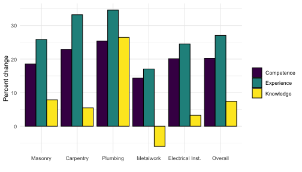

In the above analysis, and in Table \@ref(tab:skills), scores are pooled at the trade and wave level. Alternatively, we can observe the change in scores for individuals before taking means. Individual changes in score averaged across trades are shown in Figure \@ref(fig:improvement2). Viewed thus, improvements in competence and experience scores are much more pronounced, with apprentices in masonry doubling their experience and nearly doubling their competence (on the other hand, improvements for electrical installation appear lower compared to the case where data is pooled). However, due to attrition between the two waves, this subgroup analysis suffers from small group size, with $N=34$ for masonry and $N=20$ for carpentry.

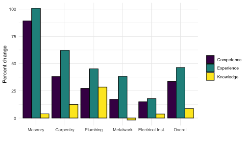

Evidence of apprenticeship effectiveness is clearer when regarding the apprentice competency and experience metrics. Table \@ref(tab:compexp1) in the Appendix shows that mean competency score among all apprentices improved from 76% of tasks at baseline to 92% at endline, an improvement of .66 standard deviations. Improvements were observed across all trades, and all differences were statistically significant at standard levels with the exception of carpentry. Similarly, apprentices improved from having performed 73% of tasks at baseline to 92% at endline, an improvement of .73 standard deviations.

## Firm Benefits {#firmbenefits}

_The main benefit for firms stems from the productive value of students. This productive value arises when the student is neither attending courses nor doing exercises that produce no value. In that time, the student is working—either doing tasks that could be performed equally well by an unskilled employee 17 or doing tasks for which training is necessary. Comparing the activities in the beginning and end of the dual education program suggests that the share of skilled work remains relatively constant over time, while the productivity of the skilled work clearly goes up over time_

In traditional models of apprenticeship training, firms benefit primarily through the productive activities of the apprentices during training.  [@bolli2021]. Additional benefits may accrue to the firm if apprentices stay in the firm, both through higher productivity when compared to external hires, and savings on recruitment and hiring costs.

_With regard to the productive value—which is the major benefit component—the calculation has four components, namely the time students spend in firms, the share of time students use for different activities, the wage of employees with corresponding skill level, and the lower productivity of students relative to skilled employees._


_benefits from training might arise during the program, but also after the end of the program. During the program, students provide productive value by performing either un-/semi-skilled or skilled work. After the program, they provide benefits in the form of saved hiring costs or saved adjustment costs or after the end of the program. Indeed, if students stay in the firm after the end of the program, firms can potentially save hiring costs because no new employee needs to be hired. Similarly, newly hired employee create adjustment costs that can be saved if the students stay in the firm._


<table style="NAborder-bottom: 0;">
<caption>Apprenticeship fees reported by firm.</caption>
 <thead>
  <tr>
   <th style="text-align:left;"> Trade </th>
   <th style="text-align:left;"> N </th>
   <th style="text-align:left;"> Baseline </th>
   <th style="text-align:left;"> N </th>
   <th style="text-align:left;"> Endline </th>
   <th style="text-align:left;"> p-value </th>
  </tr>
 </thead>
<tbody>
  <tr>
   <td style="text-align:left;"> Initiation </td>
   <td style="text-align:left;"> 422 </td>
   <td style="text-align:left;"> 6,137 (9,728) </td>
   <td style="text-align:left;"> 199 </td>
   <td style="text-align:left;"> 8,907 (21,624) </td>
   <td style="text-align:left;"> 0.047 </td>
  </tr>
  <tr>
   <td style="text-align:left;"> Training </td>
   <td style="text-align:left;"> 421 </td>
   <td style="text-align:left;"> 80,802 (91,492) </td>
   <td style="text-align:left;"> 198 </td>
   <td style="text-align:left;"> 83,321 (93,048) </td>
   <td style="text-align:left;"> 0.12 </td>
  </tr>
  <tr>
   <td style="text-align:left;"> Graduation </td>
   <td style="text-align:left;"> 414 </td>
   <td style="text-align:left;"> 21,165 (44,276) </td>
   <td style="text-align:left;"> 188 </td>
   <td style="text-align:left;"> 21,848 (59,390) </td>
   <td style="text-align:left;"> 0.5 </td>
  </tr>
  <tr>
   <td style="text-align:left;"> Materials </td>
   <td style="text-align:left;"> 422 </td>
   <td style="text-align:left;"> 14,705 (22,075) </td>
   <td style="text-align:left;"> 195 </td>
   <td style="text-align:left;"> 11,826 (11,748) </td>
   <td style="text-align:left;"> 0.10 </td>
  </tr>
  <tr>
   <td style="text-align:left;"> Contract </td>
   <td style="text-align:left;"> 418 </td>
   <td style="text-align:left;"> 19,161 (39,921) </td>
   <td style="text-align:left;"> 197 </td>
   <td style="text-align:left;"> 11,254 (29,489) </td>
   <td style="text-align:left;"> 0.2 </td>
  </tr>
  <tr>
   <td style="text-align:left;"> Application </td>
   <td style="text-align:left;"> 416 </td>
   <td style="text-align:left;"> 7,029 (10,105) </td>
   <td style="text-align:left;"> 197 </td>
   <td style="text-align:left;"> 10,112 (9,561) </td>
   <td style="text-align:left;"> &lt;0.001 </td>
  </tr>
  <tr>
   <td style="text-align:left;"> Total </td>
   <td style="text-align:left;"> 391 </td>
   <td style="text-align:left;"> 159,870 (107,787) </td>
   <td style="text-align:left;"> 188 </td>
   <td style="text-align:left;"> 153,684 (97,974) </td>
   <td style="text-align:left;"> 0.2 </td>
  </tr>
</tbody>
<tfoot>
<tr><td style="padding: 0; " colspan="100%">
<sup>1</sup> Mean (SD). Fees reported in FCFA by firm.</td></tr>
<tr><td style="padding: 0; " colspan="100%">
<sup>2</sup> Paired t-test</td></tr>
</tfoot>
</table>


<table style="NAborder-bottom: 0;">
<caption>Apprenticeship fees reported by apprentices and firm owners.</caption>
 <thead>
<tr>
<th style="empty-cells: hide;border-bottom:hidden;" colspan="1"></th>
<th style="border-bottom:hidden;padding-bottom:0; padding-left:3px;padding-right:3px;text-align: center; " colspan="2"><div style="border-bottom: 1px solid #ddd; padding-bottom: 5px; ">Baseline</div></th>
<th style="border-bottom:hidden;padding-bottom:0; padding-left:3px;padding-right:3px;text-align: center; " colspan="2"><div style="border-bottom: 1px solid #ddd; padding-bottom: 5px; ">Endline</div></th>
</tr>
  <tr>
   <th style="text-align:left;"> Fee Type </th>
   <th style="text-align:left;"> Apprentice </th>
   <th style="text-align:left;"> Firm </th>
   <th style="text-align:left;"> Apprentice </th>
   <th style="text-align:left;"> Firm </th>
  </tr>
 </thead>
<tbody>
  <tr>
   <td style="text-align:left;"> Initiation </td>
   <td style="text-align:left;"> 16,748 (41,421) </td>
   <td style="text-align:left;"> 6,137 (9,728) </td>
   <td style="text-align:left;"> 16,748 (41,421) </td>
   <td style="text-align:left;"> 6,137 (9,728) </td>
  </tr>
  <tr>
   <td style="text-align:left;"> Training </td>
   <td style="text-align:left;"> 150,000 (69,255) </td>
   <td style="text-align:left;"> 80,802 (91,492) </td>
   <td style="text-align:left;"> 150,000 (69,255) </td>
   <td style="text-align:left;"> 80,802 (91,492) </td>
  </tr>
  <tr>
   <td style="text-align:left;"> Graduation </td>
   <td style="text-align:left;"> 100,000 (45,563) </td>
   <td style="text-align:left;"> 21,165 (44,276) </td>
   <td style="text-align:left;"> 100,000 (45,563) </td>
   <td style="text-align:left;"> 21,165 (44,276) </td>
  </tr>
  <tr>
   <td style="text-align:left;"> Materials </td>
   <td style="text-align:left;"> 24,039 (20,688) </td>
   <td style="text-align:left;"> 14,705 (22,075) </td>
   <td style="text-align:left;"> 24,039 (20,688) </td>
   <td style="text-align:left;"> 14,705 (22,075) </td>
  </tr>
  <tr>
   <td style="text-align:left;"> Contract </td>
   <td style="text-align:left;"> 41,681 (51,194) </td>
   <td style="text-align:left;"> 19,161 (39,921) </td>
   <td style="text-align:left;"> 41,681 (51,194) </td>
   <td style="text-align:left;"> 19,161 (39,921) </td>
  </tr>
  <tr>
   <td style="text-align:left;"> Application </td>
   <td style="text-align:left;"> 17,506 (6,625) </td>
   <td style="text-align:left;"> 7,029 (10,105) </td>
   <td style="text-align:left;"> 17,506 (6,625) </td>
   <td style="text-align:left;"> 7,029 (10,105) </td>
  </tr>
  <tr>
   <td style="text-align:left;"> Total </td>
   <td style="text-align:left;"> 174,291 (115,590) </td>
   <td style="text-align:left;"> 159,870 (107,787) </td>
   <td style="text-align:left;"> 174,291 (115,590) </td>
   <td style="text-align:left;"> 159,870 (107,787) </td>
  </tr>
</tbody>
<tfoot><tr><td style="padding: 0; " colspan="100%">
<sup>1</sup> Mean (SD). Fees in FCFA.</td></tr></tfoot>
</table>

## Costs to Firm {#firmcosts}

The total costs of CQP training were estimated to be 100,000 to 250,000 FCFA (\$165-\$413) in 2012 [@david-gnahoui2017, citing Zinsou, 2012]. The authors reported that costs vary by trade and region.

In addition to rating apprentice's progress in terms of competence and skill, firm owners were asked to identify any costs directly or indirectly related to their training activities. These costs can be divided into two categories: **Equipment costs** comprise all costs for physical infrastructure necessary for training: **raw materials** such as cement, lumber, or scrap metal used in the course of training; **training equipment** such as workbenches, toolkits, or other machines purchased or rented specifically for training purposes, **rent** for training facilities if training was not conducted exclusively in the firm owner's workshop, and **books and any other training materials**.
**Wage costs** comprise of apprentice wages (in many cases not applicable, as many apprentices receive no regular compensation during their training), **allowances** which are disbursed irregularly by the firm owner for small expenses such as travel and meals, and **foregone trainer productivity**, which is calculated as the wage of a trained employee times hours trained in the business per year, extrapolated from the reported hours trained in the past month. As all figures were reported at the firm level, they are normalized to account for the number of apprentices in the firm, yielding approximate costs per apprentice per year.

Raw materials take a particular toll on small firms (no more than one employee and one apprentice) and carpentry workshops, accounting for xx% of total costs for the former and xx% of total costs for the latter. Since questions addressed apprenticeship in the firm in general, not a specific program, we are not able to differentiate between CQP and traditional apprentices in estimating cost of training, and will assume equal costs in the net benefit analysis in the following section.


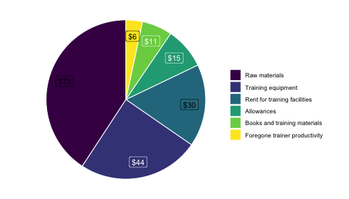


## Net Benefits {#net}

Net benefits from apprenticeship training amount to, in a basic accounting sense, the total financial and productive gains to firms resulting from training apprentices less the costs of training. The benefits take the form of the various fees paid by the apprentices' family to the trainer and the productive activities of the apprentice during the training period, as outlined in Section \@ref(firmbenefits). Costs refer to the various expenditures reported by the firm, such as training equipment and raw materials, as well as apprentice wages and allowances, as detailed in Section \@ref(firmcosts).

The first model used to estimate net benefits

The second model used to estimate net benefits reduces net benefits of apprenticeship for the firm to the direct material incomes and expenditures related to training; namely, apprenticeship fees from the apprentices and their parents, an approximation of apprentice wages, training costs, and total reported allowances disbursed to the apprentice. Training expenditures were reported for the previous month for the entire firm, and are divided by the number of apprentices training in the firm and extrapolated over twelve months to arrive at total annual costs to the firm. Likewise, reported monthly allowances are multiplied by twelve.

$$ \textbf{Model I:} \hspace{.4cm} \textit{annual firm net benefits} = \frac{\textit{fees received}}{4} - \textit{apprentice allowances} $$
Firms reported up to four wages differing according to the status and experience of apprentices: first-year CQP apprentices, third-year CQP apprentices, first-year non-CQP apprentices, and third-year non-CQP apprentices. The annual wage used for the net benefit calculation is an average of the first-year and third-year reported wages (see Table \@ref(tab:wages) in the Appendix for all reported wages), the implicit assumption being that apprentices are paid the former in the first two years of their apprenticeship and the latter in the last two years. Moreover, as all apprenticeship fees are reported as a single payment, we assume a four-year training period and divide total reported fees by four to compute an annual fee. Thus, we arrive at the following formula for total benefits per apprentice per year:

$$\textbf{Model II:}\hspace{.4cm} \textit{annual firm net benefits} = \frac{\textit{fees received}}{4} - \textit{apprentice allowances} - \textit{training costs}$$
A more comprehensive accounting of firm costs and benefits from training may account for factors which are not directly observable, such as apprentice productivity and savings on hiring costs, as well as benefits that materialize in the future, such as apprentice labor post completion [@walther2007]. Working within the limitations of the survey data, we expand our model of costs and benefits to include the estimated productivity of apprentices throughout the duration of their training as well as foregone productivity of trainers in the course of training apprentices. To compute apprentice productivity, we assume a competitive labor market in which employee wages are equal to their marginal productivity. Furthermore, we assume apprentice productivity is equal to that of an untrained employee with no more than a primary education for the first two years of training, and increases to that of a trained employee (who had trained at the training firm) for the final two years. Finally, we estimate the foregone productivity of training staff by extrapolating the number of hours trained per week (reported by the firm owner) over a year and multiplying it by the wage the firm pays to an experienced employee (who had trained with the same firm). We account for the number of training staff and the number of apprentices and continue to assume a four-year training period for all apprentices. In this formulation, the net annual benefits accruing to the firm take the form:

$$ \textbf{Model III:} $$
$$ \begin{aligned} \textit{annual net benefits} =  &\textit{ fees received}/4 - \textit{apprentice allowances} - \textit{training costs } + \\ & \textit{estimated apprentice productivity } - \\ & \textit{estimated foregone trainer productivity} \end{aligned} $$


<table style="NAborder-bottom: 0;">
<caption>Summary Statistics: Apprentice Sample</caption>
 <thead>
  <tr>
   <th style="text-align:left;">  </th>
   <th style="text-align:left;"> Overall, N = 667 </th>
   <th style="text-align:left;"> Selected </th>
   <th style="text-align:left;"> Not Selected </th>
   <th style="text-align:left;"> Did Not Apply </th>
  </tr>
 </thead>
<tbody>
  <tr>
   <td style="text-align:left;"> Model I </td>
   <td style="text-align:left;"> 47.67 (48.59) </td>
   <td style="text-align:left;"> 39.32 (43.14) </td>
   <td style="text-align:left;"> 42.07 (45.90) </td>
   <td style="text-align:left;"> 59.22 (52.90) </td>
  </tr>
  <tr>
   <td style="text-align:left;"> Model II </td>
   <td style="text-align:left;"> 16.09 (74.17) </td>
   <td style="text-align:left;"> 9.66 (72.60) </td>
   <td style="text-align:left;"> 2.44 (77.63) </td>
   <td style="text-align:left;"> 31.24 (70.83) </td>
  </tr>
  <tr>
   <td style="text-align:left;"> Model III </td>
   <td style="text-align:left;"> 95.03 (319.00) </td>
   <td style="text-align:left;"> 90.49 (323.22) </td>
   <td style="text-align:left;"> 95.81 (335.49) </td>
   <td style="text-align:left;"> 98.78 (304.61) </td>
  </tr>
</tbody>
<tfoot>
<tr><td style="padding: 0; " colspan="100%">
<sup>1</sup> Mean (SD)</td></tr>
<tr><td style="padding: 0; " colspan="100%">
<sup>2</sup> Mean (SD). Annual net benefits per apprentice in $US.</td></tr>
</tfoot>
</table>

Table \@ref(tab:netbenefits) shows the estimated annual net benefits of training apprentices, calculated separately for apprentices who successfully applied to the CQP program, applied to the CQP program but were not accepted, and apprentices who did not apply. In all models, training is associated with a net benefit ranging from break-even to about \$100 per year for the training firm. 

Interestingly, benefits of apprenticeship in Models I and II are considerably higher for apprentices whose trainers chose not to send them to the CQP. As these models do not account for apprentice productivity, this suggests that firms reporting higher skilled wages (and thus higher apprentice productivity in our estimation) are more likely to send apprentices to the CQP. Estimated net benefits do not vary widely accros waves (Table \@ref(tab:netbenefits1) in the Appendix). 

All three models generate net benefit distributions with long left and right tails. In an attempt to rein in noisy data, we truncate estimated net benefits at the 1st, 5th and 10th percentiles and recalculate mean benefits (Table \@ref(fig:hist1)). Using Model 1, mean net benefits amount to 47.52 \$US when dropping the top and bottom percentile, 45.88 \$USD when the top and bottom 5% are dropped, and 44.78 \$US when the top and bottom deciles are dropped. Using Model 2, mean net benefits amount to 18.01 \$US when dropping the top and bottom percentile, 21.25 \$USD when the top and bottom 5% are dropped, and 22.25 \$US when the top and bottom deciles are dropped. Using Model 3, mean net benefits amount to 83.22 \$US when dropping the top and bottom percentile, 48.63 \$USD when the top and bottom 5% are dropped, and 38.37 \$US when the top and bottom deciles are dropped.

Apprentice training thus represents a major contribution to the revenue and profits of the training firms. Mean annual revenue in surveyed firms ranged from \$375 at baseline and \$475 at endline. Profits ranged from \$114 and \$161 depending on survey wave and accounting method^[Firms reported being 27\% less profitable at endline, despite reporting 26\% higher revenues, due primarily to a rise in wage bills. As the number of total employees and apprentices in training stayed constant, this points to increased bargaining power for workers at the surveyed firms]. **Net benefits from training accounted for 15.91% of firm revenues (for firms with positive net benefits) and 39.3% of profits (for firms with positive profits and net benefits) using Model 1, 13.57% of revenues and 35.31% of profits according to Model 2, and 25.12% of revenues and 89.15% of profits according to Model 3.**

Moreover, recall that the total cost of a four-year CQP training program was estimated to be between \$165 and \$413 in 2012, of which the trainer is covers 10\%. Assuming the most conservative estimate of net benefits (Model II), the average firm owner accrues a net benefit of 38.64 \$US from training a CQP apprentice for four years, about covering the firms 10\% share of the most expensive cost estimate, $413. Assuming Model I and \$413 CQP cost, the training firm nearly covers CQP costs within a single year; when estimated apprentice productivity is included (Model III), firms recover CQP fees nine times over.

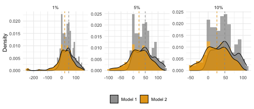

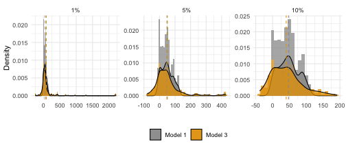


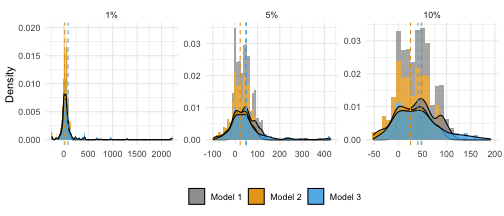

A histogram and kernel density plot suggest that the distribution of net benefits is similar across models. Distributions are bimodel, with a concentration of firm breaking even for each apprentice trained and second clustering of firms making about 50 \$US in net benefits. Using Model 1, there is a third, smaller grouping of firms making a profit of approximately 100 \$US. Finally, with high wages (especially for larger firms) skewing the projected apprentice productivity estimates, we find that Model 3 generates a distribution with a particularly long right tail, extending to up to \$US 2,250 per apprentice annually. These estimates should be discounted as they are not credible given the context.

## Regression Analysis {#regression}

In addition to one-off financial benefits associated with training, which are reflected by a positive balance in the net benefit calculations presented above, apprenticeship training may affect firm productivity through a variety of channels. First, apprentices participating in the CQP program may acquire skills at a faster pace than their traditional counterparts as a direct result of their theoretical training. Moreover, theoretical training may "spill over" to the master trainer and other employees in the workshop, for instance by introducing new technologies or improving knowledge about the operation of existing workshop machinery.

In this section, we employ a simple linear model to link firm outcomes.

### Firm-level outcomes

<table style="NAborder-bottom: 0;">
<caption>Firm Characteristics</caption>
 <thead>
  <tr>
   <th style="text-align:left;">  </th>
   <th style="text-align:left;"> N </th>
   <th style="text-align:left;"> Baseline </th>
   <th style="text-align:left;"> N </th>
   <th style="text-align:left;"> Endline </th>
   <th style="text-align:left;"> p-value </th>
  </tr>
 </thead>
<tbody>
  <tr>
   <td style="text-align:left;"> Firm size (reported) </td>
   <td style="text-align:left;"> 197 </td>
   <td style="text-align:left;"> 6.73 (7.54) </td>
   <td style="text-align:left;"> 150 </td>
   <td style="text-align:left;"> 6.56 (7.10) </td>
   <td style="text-align:left;"> 0.6 </td>
  </tr>
  <tr>
   <td style="text-align:left;"> Firm size (calculated) </td>
   <td style="text-align:left;"> 196 </td>
   <td style="text-align:left;"> 9.57 (13.94) </td>
   <td style="text-align:left;"> 150 </td>
   <td style="text-align:left;"> 8.87 (10.90) </td>
   <td style="text-align:left;"> 0.2 </td>
  </tr>
  <tr>
   <td style="text-align:left;"> Apprentices in training </td>
   <td style="text-align:left;"> 197 </td>
   <td style="text-align:left;"> 6.12 (7.28) </td>
   <td style="text-align:left;"> 150 </td>
   <td style="text-align:left;"> 6.07 (7.98) </td>
   <td style="text-align:left;"> 0.5 </td>
  </tr>
  <tr>
   <td style="text-align:left;"> Revenues </td>
   <td style="text-align:left;"> 159 </td>
   <td style="text-align:left;"> 378.97 (445.64) </td>
   <td style="text-align:left;"> 141 </td>
   <td style="text-align:left;"> 475.88 (432.99) </td>
   <td style="text-align:left;"> 0.003 </td>
  </tr>
  <tr>
   <td style="text-align:left;"> Non-wage expenses </td>
   <td style="text-align:left;"> 196 </td>
   <td style="text-align:left;"> 150.09 (277.13) </td>
   <td style="text-align:left;"> 146 </td>
   <td style="text-align:left;"> 158.38 (268.76) </td>
   <td style="text-align:left;"> &gt;0.9 </td>
  </tr>
  <tr>
   <td style="text-align:left;"> Total wages </td>
   <td style="text-align:left;"> 196 </td>
   <td style="text-align:left;"> 90.28 (204.39) </td>
   <td style="text-align:left;"> 148 </td>
   <td style="text-align:left;"> 179.05 (304.93) </td>
   <td style="text-align:left;"> &lt;0.001 </td>
  </tr>
  <tr>
   <td style="text-align:left;"> Profits (reported) </td>
   <td style="text-align:left;"> 167 </td>
   <td style="text-align:left;"> 155.71 (223.75) </td>
   <td style="text-align:left;"> 136 </td>
   <td style="text-align:left;"> 113.58 (121.90) </td>
   <td style="text-align:left;"> 0.012 </td>
  </tr>
  <tr>
   <td style="text-align:left;"> Profits (calculated) </td>
   <td style="text-align:left;"> 158 </td>
   <td style="text-align:left;"> 161.97 (274.59) </td>
   <td style="text-align:left;"> 139 </td>
   <td style="text-align:left;"> 143.11 (320.83) </td>
   <td style="text-align:left;"> &gt;0.9 </td>
  </tr>
</tbody>
<tfoot>
<tr><td style="padding: 0; " colspan="100%">
<sup>1</sup> Mean (SD). Revenues, expenses, and profits in USD.</td></tr>
<tr><td style="padding: 0; " colspan="100%">
<sup>2</sup> Paired t-test</td></tr>
</tfoot>
</table>

To estimate the effect of training CQP apprentices on firm size and profits, we first run a simple pooled OLS regression of the form

$$ y_{it} =  a+CQP_i+apprentices_{it}+X_{it}+u_{it}, $$
where $y_{it}$ is the outcome of interest, $X_{it}$ is a matrix of additional covariates for firm $i$ in wave $t$, and $u_{it}$ is an error term. $CQP_i$ is the number of CQP applicants who were accepted into the 2019 cohort of the program, while $apprentices_{it}$ controls for the total number of apprentices training with the firm (and in contrast to $CQP_i$ is a time-varying measure). The pooled OLS estimation results are shown in Table \@ref(tab:firmregs), columns 1 and 4. 

Since firm size and profits are correlated across the two survey waves (rendering pooled OLS biased and inconsistent), we also estimate a firm-demeaned fixed effects model for both outcomes (columns 2 and 5). Finally, in order to capture the effect of the time-invariant $CQP_i$, we estimate a random effects model in which the intercept varies between firms (columns 3 and 6). The outcomes of interest are firm size and profits. To approximate firm size, we aggregate all individuals engaged in productive activities at the firm, including family and occasional workers, but excluding apprentices. To approximate firm profits, we subtract the reported wage bill and non-wage expenses from the reported firm revenue. Firm characteristics are shown in Table \@ref(tab:profits).

If there is no correlation between the firm-specific effect and the effect of apprentices on firm size (?), then the random effects estimator is more efficient. However, it is implausible that there is zero correlation between the number of app


\begin{table}[H] \centering 
  \caption{Firm-level regressions} 
  \label{tab:firmregs} 
\begin{tabular}{@{\extracolsep{5pt}}lcccccc} 
\\[-1.8ex]\hline 
\hline \\[-1.8ex] 
\\[-1.8ex] & \multicolumn{3}{c}{Size (excluding apprentices)} & \multicolumn{3}{c}{Annual profits (USD)} \\ 
\\[-1.8ex] & \textit{OLS} & \textit{panel} & \textit{linear} & \textit{OLS} & \textit{panel} & \textit{linear} \\ 
 & \textit{} & \textit{linear} & \textit{mixed-effects} & \textit{} & \textit{linear} & \textit{mixed-effects} \\ 
\\[-1.8ex] & (1) & (2) & (3) & (4) & (5) & (6)\\ 
\hline \\[-1.8ex] 
 Apprentices & 0.59$^{***}$ & 0.37$^{***}$ & 0.57$^{***}$ & 30.00 & $-$52.00 & 92.00$^{**}$ \\ 
  & (0.08) & (0.09) & (0.04) & (95.00) & (80.00) & (45.00) \\ 
  CQP participants & $-$5.20 &  & 0.11 & $-$1,497.00 &  & 86.00 \\ 
  & (4.80) &  & (0.09) & (4,591.00) &  & (114.00) \\ 
  Employees$^<U+2020>$ &  &  &  & 180.00 & 331.00$^{***}$ & $-$62.00 \\ 
  &  &  &  & (115.00) & (84.00) & (53.00) \\ 
  Wave & $-$0.09 & $-$0.58 & $-$0.18 & 160.00 & $-$11.00 & $-$132.00 \\ 
  & (0.48) & (0.53) & (0.44) & (440.00) & (420.00) & (411.00) \\ 
  Constant & 0.33 &  & $-$0.36 & 3,643.00 &  & 1,416.00$^{***}$ \\ 
  & (2.80) &  & (0.39) & (3,285.00) &  & (353.00) \\ 
 \hline \\[-1.8ex] 
Observations & 321 & 346 & 321 & 277 & 297 & 277 \\ 
R$^{2}$ & 0.83 & 0.12 &  & 0.66 & 0.13 &  \\ 
Log Likelihood &  &  & $-$924.00 &  &  & $-$2,615.00 \\ 
F Statistic & 3.50$^{***}$ & 9.80$^{***}$ &  & 1.20 & 5.40$^{***}$ &  \\ 
\hline 
\hline \\[-1.8ex] 
\textit{Note:}  & \multicolumn{6}{r}{$^{*}$p$<$0.1; $^{**}$p$<$0.05; $^{***}$p$<$0.01} \\ 
 & \multicolumn{6}{r}{Omitted wave: Baseline} \\ 
 & \multicolumn{6}{r}{$^<U+2020>$Excluding apprentices.} \\ 
\end{tabular} 
\end{table} 

The results are shown in Table \@ref(tab:firmregs). While the number of apprentices trained by the firm is shown to be associated with firm size - approximately two apprentices for each additional non-apprentice worker - no additional effect for apprentices participating in the CQP is found. Nor are firms which train more CQP participants found to more profitable, once the total number of trainees and non-apprentice employees are accounted for. The fixed effects model with a within estimator (column 5) points to a significant association between firm profits and the number of non-apprentice employees (330 $US annual profit per additional employee), while the random effects model suggests that apprentices increase profits, while other types of employees do not. 

### Apprentice-level outcomes

Next, we examine apprentice-level effects of training on our various measures of apprentice learning outcomes, outlined in section \ref{appbenefits}. The basic specification used is

$$ y_{it} =  a+\sum_{j}CQP_{ij}+u_{it}, $$
where $y_{it}$ is the outcome for apprentice $i$ at time $t$, $CQP_{ij}$ indicates apprentice status in the context of the CQP program: either successful applicant, unsuccessful applicant, or non-applicant, $a$ is a constant, and $u_{it}$ is an error term. Model coefficents are estimated using _R_'s _lme4_ package. 

In addition, we run an 

The random effects specification can be written as:

$$ y_{it} =  a+\sum_{j}CQP_{ij}+u_{it} $$ 

$$ y_{it} =  a+\sum_{j}CQP_{ij}+\mathbf{X}_{it}+u_{it} $$ 

When  apprentices who apply to the CQP program have higher competence and experience scores than non-applicants, but that actual participation in the CQP does not accelerate learning as captured by our three measures. Using

The mixed effects specifications are also run using controls for workshop trade and a variety of additional firm- and apprentice-level characteristics: results do not change substantially compared to the base specification (see Table \ref{expregrobustnew} in the Appendix). There is still no discernible effect of CQP participation on apprentice experience, competency, or knowledge. 


\begin{table}[H] \centering 
  \caption{Apprentice-level regressions} 
  \label{tab:firmregs} 
\begin{tabular}{@{\extracolsep{0pt}}lcccccc} 
\\[-1.8ex]\hline 
\hline \\[-1.8ex] 
\\[-1.8ex] & \multicolumn{6}{c}{Experience} \\ 
\\[-1.8ex] & \multicolumn{3}{c}{\textit{OLS}} & \multicolumn{3}{c}{\textit{panel}} \\ 
 & \multicolumn{3}{c}{\textit{}} & \multicolumn{3}{c}{\textit{linear}} \\ 
\\[-1.8ex] & (1) & (2) & (3) & (4) & (5) & (6)\\ 
\hline \\[-1.8ex] 
 CQP participant & $-$0.02 & 0.23 & $-$0.01 & $-$0.02 & $-$0.01 & $-$0.01 \\ 
  & (0.02) & (0.25) & (0.02) & (0.03) & (0.03) & (0.03) \\ 
  CQP non-applicant & $-$0.14$^{***}$ & 0.30 & $-$0.12$^{***}$ & $-$0.13$^{***}$ & $-$0.12$^{***}$ & $-$0.14$^{***}$ \\ 
  & (0.03) & (0.29) & (0.02) & (0.03) & (0.03) & (0.03) \\ 
  Wave &  &  & 0.17$^{***}$ & 0.17$^{***}$ & 0.17$^{***}$ & 0.18$^{***}$ \\ 
  &  &  & (0.02) & (0.02) & (0.02) & (0.03) \\ 
  Employees$^<U+2020>$ &  &  &  &  & 0.001 & 0.0004 \\ 
  &  &  &  &  & (0.002) & (0.002) \\ 
  Apprentices &  &  &  &  & 0.003 & 0.002 \\ 
  &  &  &  &  & (0.002) & (0.002) \\ 
  Total instructors &  &  &  &  &  & 0.02$^{**}$ \\ 
  &  &  &  &  &  & (0.01) \\ 
  Days trained per week &  &  &  &  &  & $-$0.02$^{*}$ \\ 
  &  &  &  &  &  & (0.01) \\ 
  Duration, last training &  &  &  &  &  & 0.001 \\ 
  &  &  &  &  &  & (0.01) \\ 
  Constant & 0.85$^{***}$ & 0.70$^{***}$ & 0.79$^{***}$ & 0.79$^{***}$ & 0.77$^{***}$ & 0.76$^{***}$ \\ 
  & (0.02) & (0.21) & (0.02) & (0.02) & (0.02) & (0.04) \\ 
 \hline \\[-1.8ex] 
Apprentice FE & NO & YES & NO &  &  &  \\ 
Time FE & NO & NO & YES & YES & YES & YES \\ 
Observations & 596 & 596 & 596 & 596 & 594 & 440 \\ 
R$^{2}$ & 0.07 & 0.78 & 0.18 & 0.15 & 0.16 & 0.18 \\ 
F Statistic & 23.00$^{***}$ & 1.60$^{***}$ & 44.00$^{***}$ & 142.00$^{***}$ & 146.00$^{***}$ & 102.00$^{***}$ \\ 
\hline 
\hline \\[-1.8ex] 
\textit{Note:}  & \multicolumn{6}{r}{$^{*}$p$<$0.1; $^{**}$p$<$0.05; $^{***}$p$<$0.01} \\ 
 & \multicolumn{6}{r}{Omitted CQP category: applied but was not accepted.} \\ 
 & \multicolumn{6}{r}{Omitted wave: Baseline.} \\ 
\end{tabular} 
\end{table} 


\begin{table}[H] \centering 
  \caption{Apprentice-level regressions} 
  \label{tab:firmregs} 
\begin{tabular}{@{\extracolsep{0pt}}lcccccccc} 
\\[-1.8ex]\hline 
\hline \\[-1.8ex] 
\\[-1.8ex] & \multicolumn{3}{c}{Experience} & \multicolumn{3}{c}{Competency} & \multicolumn{2}{c}{Knowledge} \\ 
\\[-1.8ex] & \textit{OLS} & \multicolumn{2}{c}{\textit{linear}} & \textit{OLS} & \multicolumn{2}{c}{\textit{linear}} & \textit{OLS} & \textit{linear} \\ 
 & \textit{} & \multicolumn{2}{c}{\textit{mixed-effects}} & \textit{} & \multicolumn{2}{c}{\textit{mixed-effects}} & \textit{} & \textit{mixed-effects} \\ 
\\[-1.8ex] & (1) & (2) & (3) & (4) & (5) & (6) & (7) & (8)\\ 
\hline \\[-1.8ex] 
 CQP - participant & 0.16 & $-$0.02 & $-$0.02 & $-$0.09 & $-$0.02 & $-$0.02 & 0.10 & $-$0.04 \\ 
  & (0.22) & (0.03) & (0.02) & (0.21) & (0.02) & (0.02) & (0.18) & (0.02) \\ 
  CQP - did not apply & 0.30 & $-$0.13$^{***}$ &  & 0.10 & $-$0.14$^{***}$ &  &  &  \\ 
  & (0.25) & (0.03) &  & (0.24) & (0.02) &  &  &  \\ 
  Wave & 0.15$^{***}$ & 0.17$^{***}$ & 0.15$^{***}$ & 0.11$^{***}$ & 0.13$^{***}$ & 0.12$^{***}$ & 0.03$^{*}$ & 0.03$^{**}$ \\ 
  & (0.02) & (0.02) & (0.02) & (0.02) & (0.02) & (0.02) & (0.02) & (0.01) \\ 
  Constant & 0.70$^{***}$ & 0.79$^{***}$ & 0.79$^{***}$ & 0.90$^{***}$ & 0.83$^{***}$ & 0.83$^{***}$ & 0.50$^{***}$ & 0.79$^{***}$ \\ 
  & (0.18) & (0.02) & (0.02) & (0.17) & (0.02) & (0.02) & (0.13) & (0.02) \\ 
 \hline \\[-1.8ex] 
Observations & 596 & 596 & 376 & 596 & 596 & 376 & 390 & 390 \\ 
R$^{2}$ & 0.84 &  &  & 0.84 &  &  & 0.87 &  \\ 
Log Likelihood &  & 44.00 & 85.00 &  & 76.00 & 122.00 &  & 96.00 \\ 
F Statistic & 2.30$^{***}$ &  &  & 2.20$^{***}$ &  &  & 3.50$^{***}$ &  \\ 
\hline 
\hline \\[-1.8ex] 
\textit{Note:}  & \multicolumn{8}{r}{$^{*}$p$<$0.1; $^{**}$p$<$0.05; $^{***}$p$<$0.01} \\ 
 & \multicolumn{8}{r}{Omitted CQP category: applied but was not accepted.} \\ 
 & \multicolumn{8}{r}{Omitted wave: Baseline.} \\ 
\end{tabular} 
\end{table} 


\begin{table}[H] \centering 
  \caption{Apprentice-level regressions, firm fixed effects} 
  \label{tab:firmregs} 
\begin{tabular}{@{\extracolsep{0pt}}lcccccccc} 
\\[-1.8ex]\hline 
\hline \\[-1.8ex] 
\\[-1.8ex] & \multicolumn{4}{c}{Experience score} & \multicolumn{4}{c}{Competency score} \\ 
\\[-1.8ex] & \multicolumn{2}{c}{\textit{OLS}} & \multicolumn{2}{c}{\textit{linear}} & \multicolumn{2}{c}{\textit{OLS}} & \multicolumn{2}{c}{\textit{linear}} \\ 
 & \multicolumn{2}{c}{\textit{}} & \multicolumn{2}{c}{\textit{mixed-effects}} & \multicolumn{2}{c}{\textit{}} & \multicolumn{2}{c}{\textit{mixed-effects}} \\ 
\\[-1.8ex] & (1) & (2) & (3) & (4) & (5) & (6) & (7) & (8)\\ 
\hline \\[-1.8ex] 
 CQP participants & 0.00 & 0.00 & $-$0.02 & $-$0.02 & $-$0.20 & 0.00 & $-$0.03 & 0.01 \\ 
  & (0.36) & (0.22) & (0.03) & (0.02) & (0.34) & (0.19) & (0.03) & (0.03) \\ 
  CQP non-applicants & 0.15 &  & $-$0.13$^{***}$ &  & 0.11 &  & $-$0.16$^{***}$ &  \\ 
  & (0.25) &  & (0.03) &  & (0.24) &  & (0.02) &  \\ 
  Wave & 0.15$^{***}$ & 0.13$^{***}$ & 0.17$^{***}$ & 0.15$^{***}$ & 0.11$^{***}$ & 0.09$^{***}$ & 0.12$^{***}$ & 0.10$^{***}$ \\ 
  & (0.02) & (0.02) & (0.02) & (0.02) & (0.02) & (0.02) & (0.02) & (0.02) \\ 
  Constant & 0.45 & 0.87$^{***}$ & 0.79$^{***}$ & 0.79$^{***}$ & 0.49$^{*}$ & 0.91$^{***}$ & 0.90$^{***}$ & 0.90$^{***}$ \\ 
  & (0.31) & (0.16) & (0.02) & (0.02) & (0.29) & (0.13) & (0.11) & (0.13) \\ 
 \hline \\[-1.8ex] 
Observations & 596 & 376 & 596 & 376 & 596 & 376 & 596 & 376 \\ 
R$^{2}$ & 0.84 & 0.81 &  &  & 0.84 & 0.82 &  &  \\ 
Log Likelihood &  &  & 44.00 & 85.00 &  &  & 8.70 & 61.00 \\ 
F Statistic & 2.30$^{***}$ & 2.10$^{***}$ &  &  & 2.20$^{***}$ & 2.30$^{***}$ &  &  \\ 
\hline 
\hline \\[-1.8ex] 
\textit{Note:}  & \multicolumn{8}{r}{$^{*}$p$<$0.1; $^{**}$p$<$0.05; $^{***}$p$<$0.01} \\ 
 & \multicolumn{8}{r}{Omitted CQP category: rejected applicants} \\ 
 & \multicolumn{8}{r}{Omitted wave: Baseline} \\ 
\end{tabular} 
\end{table} 

<!---

## Firm and apprentice satisfaction


# Conclusion {#conclusion}
_This paper analyses the costs and benefits of dual training for companies in Chile. The model has three main components: (1) the costs that arise during the programme, (2) the benefits that companies receive during the programme in terms of student’s productivity, and (3) the potential benefits that companies can obtain in hiring and adjustment savings if students are hired after the programme. Using an online survey, we compute the cost and benefits._


_Optimism about the role that TVET can play in supporting productivity and inclusion stems from the role that is often attributed to TVET in the economic transformation of East Asia and from the low unemployment rates in countries with strong TVET systems like Germany. Moreover, in Sub-Saharan Africa, TVET is seen as a promising route for the majority of young Africans, who lack the foundational skills, the means, or the interest to take a more academic track._
-->
\clearpage

## Limitations {#limitations}

# Conclusions {#conclusions}

# References {.unnumbered}

::: {#refs}
:::

```{=tex}
\appendix
\clearpage
```
# Appendix


<table style="NAborder-bottom: 0;">
<caption>Change in Apprentice Knowledge</caption>
 <thead>
  <tr>
   <th style="text-align:left;"> Trade </th>
   <th style="text-align:left;"> N </th>
   <th style="text-align:left;"> Baseline </th>
   <th style="text-align:left;"> N </th>
   <th style="text-align:left;"> Endline </th>
   <th style="text-align:left;"> p-value </th>
  </tr>
 </thead>
<tbody>
  <tr>
   <td style="text-align:left;"> Electrical Installation </td>
   <td style="text-align:left;"> 77 </td>
   <td style="text-align:left;"> 0.90 (0.16) </td>
   <td style="text-align:left;"> 49 </td>
   <td style="text-align:left;"> 0.93 (0.10) </td>
   <td style="text-align:left;"> 0.4 </td>
  </tr>
  <tr>
   <td style="text-align:left;"> Masonry </td>
   <td style="text-align:left;"> 56 </td>
   <td style="text-align:left;"> 0.76 (0.19) </td>
   <td style="text-align:left;"> 30 </td>
   <td style="text-align:left;"> 0.82 (0.20) </td>
   <td style="text-align:left;"> 0.8 </td>
  </tr>
  <tr>
   <td style="text-align:left;"> Carpentry </td>
   <td style="text-align:left;"> 25 </td>
   <td style="text-align:left;"> 0.91 (0.17) </td>
   <td style="text-align:left;"> 15 </td>
   <td style="text-align:left;"> 0.97 (0.09) </td>
   <td style="text-align:left;"> 0.3 </td>
  </tr>
  <tr>
   <td style="text-align:left;"> Plumbing </td>
   <td style="text-align:left;"> 38 </td>
   <td style="text-align:left;"> 0.52 (0.12) </td>
   <td style="text-align:left;"> 26 </td>
   <td style="text-align:left;"> 0.64 (0.16) </td>
   <td style="text-align:left;"> 0.013 </td>
  </tr>
  <tr>
   <td style="text-align:left;"> Metalwork </td>
   <td style="text-align:left;"> 209 </td>
   <td style="text-align:left;"> 0.85 (0.18) </td>
   <td style="text-align:left;"> 117 </td>
   <td style="text-align:left;"> 0.88 (0.15) </td>
   <td style="text-align:left;"> 0.8 </td>
  </tr>
  <tr>
   <td style="text-align:left;"> Overall </td>
   <td style="text-align:left;"> 247 </td>
   <td style="text-align:left;"> 0.77 (0.21) </td>
   <td style="text-align:left;"> 143 </td>
   <td style="text-align:left;"> 0.81 (0.19) </td>
   <td style="text-align:left;"> 0.078 </td>
  </tr>
</tbody>
<tfoot>
<tr><td style="padding: 0; " colspan="100%">
<sup>1</sup> Mean (SD). Proportion of correctly answered knowledge questions.</td></tr>
<tr><td style="padding: 0; " colspan="100%">
<sup>2</sup> Paired t-test</td></tr>
</tfoot>
</table>

<table style="NAborder-bottom: 0;">
<caption>Firm Evaluations of Apprentice Skill Over Time</caption>
 <thead>
  <tr>
   <th style="text-align:left;"> Group </th>
   <th style="text-align:left;"> Trade </th>
   <th style="text-align:left;"> N </th>
   <th style="text-align:left;"> Baseline </th>
   <th style="text-align:left;"> N </th>
   <th style="text-align:left;"> Endline </th>
   <th style="text-align:left;"> p-value </th>
  </tr>
 </thead>
<tbody>
  <tr>
   <td style="text-align:left;"> Competencies </td>
   <td style="text-align:left;"> Electrical Installation </td>
   <td style="text-align:left;"> 125 </td>
   <td style="text-align:left;"> 0.80 (0.24) </td>
   <td style="text-align:left;"> 69 </td>
   <td style="text-align:left;"> 0.96 (0.09) </td>
   <td style="text-align:left;"> &lt;0.001 </td>
  </tr>
  <tr>
   <td style="text-align:left;">  </td>
   <td style="text-align:left;"> Masonry </td>
   <td style="text-align:left;"> 90 </td>
   <td style="text-align:left;"> 0.75 (0.22) </td>
   <td style="text-align:left;"> 39 </td>
   <td style="text-align:left;"> 0.90 (0.18) </td>
   <td style="text-align:left;"> 0.008 </td>
  </tr>
  <tr>
   <td style="text-align:left;">  </td>
   <td style="text-align:left;"> Carpentry </td>
   <td style="text-align:left;"> 48 </td>
   <td style="text-align:left;"> 0.76 (0.28) </td>
   <td style="text-align:left;"> 21 </td>
   <td style="text-align:left;"> 0.93 (0.15) </td>
   <td style="text-align:left;"> 0.14 </td>
  </tr>
  <tr>
   <td style="text-align:left;">  </td>
   <td style="text-align:left;"> Plumbing </td>
   <td style="text-align:left;"> 54 </td>
   <td style="text-align:left;"> 0.73 (0.29) </td>
   <td style="text-align:left;"> 26 </td>
   <td style="text-align:left;"> 0.92 (0.15) </td>
   <td style="text-align:left;"> 0.008 </td>
  </tr>
  <tr>
   <td style="text-align:left;">  </td>
   <td style="text-align:left;"> Metalwork </td>
   <td style="text-align:left;"> 86 </td>
   <td style="text-align:left;"> 0.75 (0.22) </td>
   <td style="text-align:left;"> 38 </td>
   <td style="text-align:left;"> 0.86 (0.21) </td>
   <td style="text-align:left;"> 0.006 </td>
  </tr>
  <tr>
   <td style="text-align:left;">  </td>
   <td style="text-align:left;"> Overall </td>
   <td style="text-align:left;"> 403 </td>
   <td style="text-align:left;"> 0.76 (0.24) </td>
   <td style="text-align:left;"> 193 </td>
   <td style="text-align:left;"> 0.92 (0.16) </td>
   <td style="text-align:left;"> &lt;0.001 </td>
  </tr>
  <tr>
   <td style="text-align:left;"> Experience </td>
   <td style="text-align:left;"> Electrical Installation </td>
   <td style="text-align:left;"> 125 </td>
   <td style="text-align:left;"> 0.77 (0.26) </td>
   <td style="text-align:left;"> 69 </td>
   <td style="text-align:left;"> 0.96 (0.08) </td>
   <td style="text-align:left;"> &lt;0.001 </td>
  </tr>
  <tr>
   <td style="text-align:left;">  </td>
   <td style="text-align:left;"> Masonry </td>
   <td style="text-align:left;"> 90 </td>
   <td style="text-align:left;"> 0.72 (0.23) </td>
   <td style="text-align:left;"> 39 </td>
   <td style="text-align:left;"> 0.91 (0.13) </td>
   <td style="text-align:left;"> &lt;0.001 </td>
  </tr>
  <tr>
   <td style="text-align:left;">  </td>
   <td style="text-align:left;"> Carpentry </td>
   <td style="text-align:left;"> 48 </td>
   <td style="text-align:left;"> 0.73 (0.31) </td>
   <td style="text-align:left;"> 21 </td>
   <td style="text-align:left;"> 0.98 (0.06) </td>
   <td style="text-align:left;"> 0.013 </td>
  </tr>
  <tr>
   <td style="text-align:left;">  </td>
   <td style="text-align:left;"> Plumbing </td>
   <td style="text-align:left;"> 54 </td>
   <td style="text-align:left;"> 0.66 (0.30) </td>
   <td style="text-align:left;"> 26 </td>
   <td style="text-align:left;"> 0.89 (0.17) </td>
   <td style="text-align:left;"> 0.001 </td>
  </tr>
  <tr>
   <td style="text-align:left;">  </td>
   <td style="text-align:left;"> Metalwork </td>
   <td style="text-align:left;"> 86 </td>
   <td style="text-align:left;"> 0.72 (0.24) </td>
   <td style="text-align:left;"> 38 </td>
   <td style="text-align:left;"> 0.85 (0.15) </td>
   <td style="text-align:left;"> 0.004 </td>
  </tr>
  <tr>
   <td style="text-align:left;">  </td>
   <td style="text-align:left;"> Overall </td>
   <td style="text-align:left;"> 403 </td>
   <td style="text-align:left;"> 0.73 (0.26) </td>
   <td style="text-align:left;"> 193 </td>
   <td style="text-align:left;"> 0.92 (0.13) </td>
   <td style="text-align:left;"> &lt;0.001 </td>
  </tr>
</tbody>
<tfoot>
<tr><td style="padding: 0; " colspan="100%">
<sup>1</sup> Mean (SD). Proportion of tasks reported by firm.</td></tr>
<tr><td style="padding: 0; " colspan="100%">
<sup>2</sup> Paired t-test</td></tr>
</tfoot>
</table>


<table style="NAborder-bottom: 0;">
<caption>Wages</caption>
 <thead>
  <tr>
   <th style="text-align:left;">  </th>
   <th style="text-align:left;"> N </th>
   <th style="text-align:left;"> Baseline </th>
   <th style="text-align:left;"> N </th>
   <th style="text-align:left;"> Endline </th>
  </tr>
 </thead>
<tbody>
  <tr>
   <td style="text-align:left;"> Former apprentice (diff. workshop) </td>
   <td style="text-align:left;"> 139 </td>
   <td style="text-align:left;"> 10,432 (34,117) </td>
   <td style="text-align:left;"> 140 </td>
   <td style="text-align:left;"> 10,536 (26,292) </td>
  </tr>
  <tr>
   <td style="text-align:left;"> Former apprentice (same workshop) </td>
   <td style="text-align:left;"> 139 </td>
   <td style="text-align:left;"> 11,331 (40,992) </td>
   <td style="text-align:left;"> 140 </td>
   <td style="text-align:left;"> 9,089 (25,946) </td>
  </tr>
  <tr>
   <td style="text-align:left;"> Worker with secondary educ. or more </td>
   <td style="text-align:left;"> 128 </td>
   <td style="text-align:left;"> 4,375 (21,294) </td>
   <td style="text-align:left;"> 140 </td>
   <td style="text-align:left;"> 5,464 (31,475) </td>
  </tr>
  <tr>
   <td style="text-align:left;"> Worker with primary educ. or less </td>
   <td style="text-align:left;"> 132 </td>
   <td style="text-align:left;"> 3,182 (18,314) </td>
   <td style="text-align:left;"> 140 </td>
   <td style="text-align:left;"> 2,607 (20,722) </td>
  </tr>
  <tr>
   <td style="text-align:left;"> Paid family worker </td>
   <td style="text-align:left;"> 124 </td>
   <td style="text-align:left;"> 2,298 (11,668) </td>
   <td style="text-align:left;"> 140 </td>
   <td style="text-align:left;"> 2,304 (10,854) </td>
  </tr>
  <tr>
   <td style="text-align:left;"> Occassional worker </td>
   <td style="text-align:left;"> 155 </td>
   <td style="text-align:left;"> 23,790 (46,723) </td>
   <td style="text-align:left;"> 145 </td>
   <td style="text-align:left;"> 16,500 (35,451) </td>
  </tr>
  <tr>
   <td style="text-align:left;"> Firm owner </td>
   <td style="text-align:left;"> 173 </td>
   <td style="text-align:left;"> 49,523 (53,448) </td>
   <td style="text-align:left;"> 144 </td>
   <td style="text-align:left;"> 74,792 (57,615) </td>
  </tr>
  <tr>
   <td style="text-align:left;"> Traditional apprentice (first year) </td>
   <td style="text-align:left;"> 172 </td>
   <td style="text-align:left;"> 276 (2,395) </td>
   <td style="text-align:left;"> 140 </td>
   <td style="text-align:left;"> 3,607 (6,177) </td>
  </tr>
  <tr>
   <td style="text-align:left;"> Traditional apprentice (third year) </td>
   <td style="text-align:left;"> 172 </td>
   <td style="text-align:left;"> 465 (3,785) </td>
   <td style="text-align:left;"> 140 </td>
   <td style="text-align:left;"> 6,696 (9,952) </td>
  </tr>
  <tr>
   <td style="text-align:left;"> CQP apprentice (first year) </td>
   <td style="text-align:left;"> 170 </td>
   <td style="text-align:left;"> 765 (3,639) </td>
   <td style="text-align:left;"> 140 </td>
   <td style="text-align:left;"> 1,696 (5,083) </td>
  </tr>
  <tr>
   <td style="text-align:left;"> CQP apprentice (third year) </td>
   <td style="text-align:left;"> 166 </td>
   <td style="text-align:left;"> 994 (5,559) </td>
   <td style="text-align:left;"> 140 </td>
   <td style="text-align:left;"> 7,571 (21,348) </td>
  </tr>
</tbody>
<tfoot><tr><td style="padding: 0; " colspan="100%">
<sup>1</sup> Mean (SD). Monthly wages in FCFA.</td></tr></tfoot>
</table>


<table style="NAborder-bottom: 0;">
<caption>Changes in competency and experience scores by CQP status</caption>
 <thead>
  <tr>
   <th style="text-align:left;"> Group </th>
   <th style="text-align:left;"> Trade </th>
   <th style="text-align:left;"> N </th>
   <th style="text-align:left;"> Selected </th>
   <th style="text-align:left;"> N </th>
   <th style="text-align:left;"> Not Selected </th>
   <th style="text-align:left;"> N </th>
   <th style="text-align:left;"> Did Not Apply </th>
  </tr>
 </thead>
<tbody>
  <tr>
   <td style="text-align:left;"> Comp. </td>
   <td style="text-align:left;"> Electrical Installation </td>
   <td style="text-align:left;"> 15 </td>
   <td style="text-align:left;"> 0.11 (0.16) </td>
   <td style="text-align:left;"> 25 </td>
   <td style="text-align:left;"> 0.03 (0.09) </td>
   <td style="text-align:left;"> 23 </td>
   <td style="text-align:left;"> 0.15 (0.24) </td>
  </tr>
  <tr>
   <td style="text-align:left;">  </td>
   <td style="text-align:left;"> Masonry </td>
   <td style="text-align:left;"> 14 </td>
   <td style="text-align:left;"> 0.13 (0.26) </td>
   <td style="text-align:left;"> 10 </td>
   <td style="text-align:left;"> 0.14 (0.24) </td>
   <td style="text-align:left;"> 10 </td>
   <td style="text-align:left;"> 0.17 (0.41) </td>
  </tr>
  <tr>
   <td style="text-align:left;">  </td>
   <td style="text-align:left;"> Carpentry </td>
   <td style="text-align:left;"> 12 </td>
   <td style="text-align:left;"> 0.05 (0.24) </td>
   <td style="text-align:left;"> 3 </td>
   <td style="text-align:left;"> 0.18 (0.24) </td>
   <td style="text-align:left;"> 5 </td>
   <td style="text-align:left;"> 0.24 (0.58) </td>
  </tr>
  <tr>
   <td style="text-align:left;">  </td>
   <td style="text-align:left;"> Plumbing </td>
   <td style="text-align:left;"> 15 </td>
   <td style="text-align:left;"> 0.18 (0.26) </td>
   <td style="text-align:left;"> 7 </td>
   <td style="text-align:left;"> -0.03 (0.18) </td>
   <td style="text-align:left;"> 4 </td>
   <td style="text-align:left;"> 0.35 (0.29) </td>
  </tr>
  <tr>
   <td style="text-align:left;">  </td>
   <td style="text-align:left;"> Metalwork </td>
   <td style="text-align:left;"> 23 </td>
   <td style="text-align:left;"> 0.09 (0.11) </td>
   <td style="text-align:left;"> 2 </td>
   <td style="text-align:left;"> 0.13 (0.00) </td>
   <td style="text-align:left;"> 12 </td>
   <td style="text-align:left;"> 0.07 (0.29) </td>
  </tr>
  <tr>
   <td style="text-align:left;">  </td>
   <td style="text-align:left;"> Overall </td>
   <td style="text-align:left;"> 80 </td>
   <td style="text-align:left;"> 0.11 (0.20) </td>
   <td style="text-align:left;"> 47 </td>
   <td style="text-align:left;"> 0.06 (0.17) </td>
   <td style="text-align:left;"> 54 </td>
   <td style="text-align:left;"> 0.16 (0.32) </td>
  </tr>
  <tr>
   <td style="text-align:left;"> Exp. </td>
   <td style="text-align:left;"> Electrical Installation </td>
   <td style="text-align:left;"> 15 </td>
   <td style="text-align:left;"> 0.14 (0.20) </td>
   <td style="text-align:left;"> 25 </td>
   <td style="text-align:left;"> 0.04 (0.10) </td>
   <td style="text-align:left;"> 23 </td>
   <td style="text-align:left;"> 0.17 (0.25) </td>
  </tr>
  <tr>
   <td style="text-align:left;">  </td>
   <td style="text-align:left;"> Masonry </td>
   <td style="text-align:left;"> 14 </td>
   <td style="text-align:left;"> 0.19 (0.23) </td>
   <td style="text-align:left;"> 10 </td>
   <td style="text-align:left;"> 0.13 (0.24) </td>
   <td style="text-align:left;"> 10 </td>
   <td style="text-align:left;"> 0.29 (0.33) </td>
  </tr>
  <tr>
   <td style="text-align:left;">  </td>
   <td style="text-align:left;"> Carpentry </td>
   <td style="text-align:left;"> 12 </td>
   <td style="text-align:left;"> 0.09 (0.23) </td>
   <td style="text-align:left;"> 3 </td>
   <td style="text-align:left;"> 0.48 (0.14) </td>
   <td style="text-align:left;"> 5 </td>
   <td style="text-align:left;"> 0.25 (0.45) </td>
  </tr>
  <tr>
   <td style="text-align:left;">  </td>
   <td style="text-align:left;"> Plumbing </td>
   <td style="text-align:left;"> 15 </td>
   <td style="text-align:left;"> 0.20 (0.28) </td>
   <td style="text-align:left;"> 7 </td>
   <td style="text-align:left;"> 0.13 (0.31) </td>
   <td style="text-align:left;"> 4 </td>
   <td style="text-align:left;"> 0.38 (0.26) </td>
  </tr>
  <tr>
   <td style="text-align:left;">  </td>
   <td style="text-align:left;"> Metalwork </td>
   <td style="text-align:left;"> 23 </td>
   <td style="text-align:left;"> 0.14 (0.19) </td>
   <td style="text-align:left;"> 2 </td>
   <td style="text-align:left;"> 0.13 (0.00) </td>
   <td style="text-align:left;"> 12 </td>
   <td style="text-align:left;"> 0.12 (0.38) </td>
  </tr>
  <tr>
   <td style="text-align:left;">  </td>
   <td style="text-align:left;"> Overall </td>
   <td style="text-align:left;"> 80 </td>
   <td style="text-align:left;"> 0.15 (0.22) </td>
   <td style="text-align:left;"> 47 </td>
   <td style="text-align:left;"> 0.10 (0.21) </td>
   <td style="text-align:left;"> 54 </td>
   <td style="text-align:left;"> 0.21 (0.31) </td>
  </tr>
</tbody>
<tfoot><tr><td style="padding: 0; " colspan="100%">
<sup>1</sup> Mean (SD). Change in scores over time.</td></tr></tfoot>
</table>


<table style="NAborder-bottom: 0;">
<caption>Firm vs. Self-reported Evaluations of Apprentice Skill</caption>
 <thead>
  <tr>
   <th style="text-align:left;"> Group </th>
   <th style="text-align:left;"> Trade </th>
   <th style="text-align:left;"> N </th>
   <th style="text-align:left;"> Apprentice </th>
   <th style="text-align:left;"> N </th>
   <th style="text-align:left;"> Firm </th>
  </tr>
 </thead>
<tbody>
  <tr>
   <td style="text-align:left;"> Competencies </td>
   <td style="text-align:left;"> Electrical Installation </td>
   <td style="text-align:left;"> 49 </td>
   <td style="text-align:left;"> 0.97 (0.06) </td>
   <td style="text-align:left;"> 46 </td>
   <td style="text-align:left;"> 0.98 (0.05) </td>
  </tr>
  <tr>
   <td style="text-align:left;">  </td>
   <td style="text-align:left;"> Masonry </td>
   <td style="text-align:left;"> 28 </td>
   <td style="text-align:left;"> 0.95 (0.08) </td>
   <td style="text-align:left;"> 28 </td>
   <td style="text-align:left;"> 0.94 (0.10) </td>
  </tr>
  <tr>
   <td style="text-align:left;">  </td>
   <td style="text-align:left;"> Carpentry </td>
   <td style="text-align:left;"> 14 </td>
   <td style="text-align:left;"> 0.92 (0.13) </td>
   <td style="text-align:left;"> 16 </td>
   <td style="text-align:left;"> 0.95 (0.08) </td>
  </tr>
  <tr>
   <td style="text-align:left;">  </td>
   <td style="text-align:left;"> Plumbing </td>
   <td style="text-align:left;"> 25 </td>
   <td style="text-align:left;"> 0.95 (0.13) </td>
   <td style="text-align:left;"> 22 </td>
   <td style="text-align:left;"> 0.92 (0.15) </td>
  </tr>
  <tr>
   <td style="text-align:left;">  </td>
   <td style="text-align:left;"> Metalwork </td>
   <td style="text-align:left;"> 21 </td>
   <td style="text-align:left;"> 0.90 (0.17) </td>
   <td style="text-align:left;"> 26 </td>
   <td style="text-align:left;"> 0.92 (0.15) </td>
  </tr>
  <tr>
   <td style="text-align:left;">  </td>
   <td style="text-align:left;"> Overall </td>
   <td style="text-align:left;"> 137 </td>
   <td style="text-align:left;"> 0.95 (0.11) </td>
   <td style="text-align:left;"> 138 </td>
   <td style="text-align:left;"> 0.95 (0.11) </td>
  </tr>
  <tr>
   <td style="text-align:left;"> Experience </td>
   <td style="text-align:left;"> Electrical Installation </td>
   <td style="text-align:left;"> 49 </td>
   <td style="text-align:left;"> 0.97 (0.06) </td>
   <td style="text-align:left;"> 46 </td>
   <td style="text-align:left;"> 0.97 (0.06) </td>
  </tr>
  <tr>
   <td style="text-align:left;">  </td>
   <td style="text-align:left;"> Masonry </td>
   <td style="text-align:left;"> 28 </td>
   <td style="text-align:left;"> 0.95 (0.09) </td>
   <td style="text-align:left;"> 28 </td>
   <td style="text-align:left;"> 0.93 (0.11) </td>
  </tr>
  <tr>
   <td style="text-align:left;">  </td>
   <td style="text-align:left;"> Carpentry </td>
   <td style="text-align:left;"> 14 </td>
   <td style="text-align:left;"> 0.95 (0.12) </td>
   <td style="text-align:left;"> 16 </td>
   <td style="text-align:left;"> 0.99 (0.03) </td>
  </tr>
  <tr>
   <td style="text-align:left;">  </td>
   <td style="text-align:left;"> Plumbing </td>
   <td style="text-align:left;"> 25 </td>
   <td style="text-align:left;"> 0.98 (0.06) </td>
   <td style="text-align:left;"> 22 </td>
   <td style="text-align:left;"> 0.89 (0.17) </td>
  </tr>
  <tr>
   <td style="text-align:left;">  </td>
   <td style="text-align:left;"> Metalwork </td>
   <td style="text-align:left;"> 21 </td>
   <td style="text-align:left;"> 0.89 (0.16) </td>
   <td style="text-align:left;"> 26 </td>
   <td style="text-align:left;"> 0.89 (0.11) </td>
  </tr>
  <tr>
   <td style="text-align:left;">  </td>
   <td style="text-align:left;"> Overall </td>
   <td style="text-align:left;"> 137 </td>
   <td style="text-align:left;"> 0.95 (0.10) </td>
   <td style="text-align:left;"> 138 </td>
   <td style="text-align:left;"> 0.94 (0.11) </td>
  </tr>
</tbody>
<tfoot><tr><td style="padding: 0; " colspan="100%">
<sup>1</sup> Mean (SD). Proportion of tasks reported by apprentices and firms at endline.</td></tr></tfoot>
</table>


\begin{table}[H] \centering 
  \caption{Firm Growth} 
  \label{} 
\begin{tabular}{@{\extracolsep{5pt}}lccc} 
\\[-1.8ex]\hline 
\hline \\[-1.8ex] 
 & \multicolumn{3}{c}{\textit{Dependent variable:}} \\ 
\cline{2-4} 
\\[-1.8ex] & Revenues & Profits & Profits \\ 
 &  & (Reported) & (Computed) \\ 
\hline \\[-1.8ex] 
 CQP trainees & 2,544 & 2,330 & 10,709 \\ 
  & (15,084) & (5,649) & (13,583) \\ 
  Total apprentices & $-$14,554 & $-$881 & $-$8,427 \\ 
  & (9,414) & (3,943) & (8,453) \\ 
  Baseline firm size & 16,391$^{**}$ & $-$167 & 9,239 \\ 
  & (6,481) & (2,232) & (5,819) \\ 
  Constant & 78,387$^{**}$ & $-$29,698$^{**}$ & $-$6,592 \\ 
  & (32,039) & (13,668) & (28,978) \\ 
 \hline \\[-1.8ex] 
Observations & 110 & 113 & 109 \\ 
R$^{2}$ & 0 & 0 & 0 \\ 
Adjusted R$^{2}$ & 0 & $-$0 & 0 \\ 
Residual Std. Error & 255,825 & 113,037 & 229,697 \\ 
F Statistic & 2$^{*}$ & 0 & 1 \\ 
\hline 
\hline \\[-1.8ex] 
\textit{Note:}  & \multicolumn{3}{r}{$^{*}$p$<$0.1; $^{**}$p$<$0.05; $^{***}$p$<$0.01} \\ 
\end{tabular} 
\end{table} 


\begin{table}[H] \centering 
  \caption{Apprentice Knowledge 1} 
  \label{skillsreg1} 
\begin{tabular}{@{\extracolsep{5pt}}lccccc} 
\\[-1.8ex]\hline 
\hline \\[-1.8ex] 
 & \multicolumn{5}{c}{\textit{Dependent variable:}} \\ 
\cline{2-6} 
\\[-1.8ex] & \multicolumn{5}{c}{Fraction of correctly answered skills questions (with firm FE)} \\ 
\hline \\[-1.8ex] 
 Selected into CQP & 0.016 & 0.007 & $-$0.004 & $-$0.002 & 0.014 \\ 
  & (0.025) & (0.027) & (0.029) & (0.028) & (0.033) \\ 
  Wave &  & 0.012 & 0.012 & 0.013 & $-$0.025 \\ 
  &  & (0.022) & (0.022) & (0.022) & (0.076) \\ 
  CQP x Wave &  & 0.024 & 0.023 & 0.022 & 0.054 \\ 
  &  & (0.028) & (0.028) & (0.029) & (0.076) \\ 
  Years in training at baseline &  &  & $-$0.019 & $-$0.016 & $-$0.004 \\ 
  &  &  & (0.015) & (0.015) & (0.018) \\ 
  Firm size &  &  &  & $-$0.001 & 0.002 \\ 
  &  &  &  & (0.003) & (0.003) \\ 
  Total apprentices &  &  &  & 0.003 & 0.007 \\ 
  &  &  &  & (0.004) & (0.006) \\ 
  CQP apprentices &  &  &  & $-$0.200 & 0.042 \\ 
  &  &  &  & (0.170) & (0.150) \\ 
  Total instructors &  &  &  &  & 0.008 \\ 
  &  &  &  &  & (0.017) \\ 
  Days trained per week &  &  &  &  & $-$0.074 \\ 
  &  &  &  &  & (0.059) \\ 
  Duration, last training &  &  &  &  & 0.013 \\ 
  &  &  &  &  & (0.013) \\ 
  External training &  &  &  &  & $-$0.037 \\ 
  &  &  &  &  & (0.036) \\ 
  Constant & 0.800$^{***}$ & 0.790$^{***}$ & 0.830$^{***}$ & 0.810$^{***}$ & 0.450 \\ 
  & (0.120) & (0.120) & (0.120) & (0.120) & (0.280) \\ 
 \hline \\[-1.8ex] 
Firm FE & YES & YES & YES & YES & YES \\ 
Observations & 390 & 390 & 390 & 367 & 237 \\ 
R$^{2}$ & 0.820 & 0.830 & 0.830 & 0.830 & 0.920 \\ 
Adjusted R$^{2}$ & 0.660 & 0.660 & 0.660 & 0.670 & 0.730 \\ 
Residual Std. Error & 0.120 & 0.120 & 0.120 & 0.120 & 0.110 \\ 
F Statistic & 5.000$^{***}$ & 5.000$^{***}$ & 5.000$^{***}$ & 5.200$^{***}$ & 4.800$^{***}$ \\ 
\hline 
\hline \\[-1.8ex] 
\textit{Note:}  & \multicolumn{5}{r}{$^{*}$p$<$0.1; $^{**}$p$<$0.05; $^{***}$p$<$0.01} \\ 
\end{tabular} 
\end{table} 


\begin{table}[H] \centering 
  \caption{Apprentice Knowledge 2} 
  \label{skillsreg2} 
\begin{tabular}{@{\extracolsep{5pt}}lccccc} 
\\[-1.8ex]\hline 
\hline \\[-1.8ex] 
 & \multicolumn{5}{c}{\textit{Dependent variable:}} \\ 
\cline{2-6} 
\\[-1.8ex] & \multicolumn{5}{c}{Fraction of correctly answered skills questions} \\ 
\hline \\[-1.8ex] 
 Selected into CQP & $-$0.043$^{**}$ & $-$0.046$^{*}$ & $-$0.046$^{*}$ & $-$0.037 & $-$0.002 \\ 
  & (0.021) & (0.026) & (0.026) & (0.027) & (0.031) \\ 
  Wave &  & 0.041 & 0.041 & 0.049 & $-$0.013 \\ 
  &  & (0.033) & (0.033) & (0.033) & (0.080) \\ 
  CQP x Wave &  & 0.010 & 0.010 & 0.004 & 0.032 \\ 
  &  & (0.043) & (0.043) & (0.043) & (0.092) \\ 
  Years in training at baseline &  &  & 0.0004 & 0.010 & 0.022$^{**}$ \\ 
  &  &  & (0.008) & (0.008) & (0.011) \\ 
  Firm size &  &  &  & $-$0.004$^{*}$ & $-$0.003 \\ 
  &  &  &  & (0.002) & (0.002) \\ 
  Total apprentices &  &  &  & 0.013$^{***}$ & 0.013$^{***}$ \\ 
  &  &  &  & (0.004) & (0.005) \\ 
  CQP apprentices &  &  &  & $-$0.001 & $-$0.001 \\ 
  &  &  &  & (0.004) & (0.004) \\ 
  Total instructors &  &  &  &  & $-$0.015 \\ 
  &  &  &  &  & (0.013) \\ 
  Days trained per week &  &  &  &  & $-$0.012 \\ 
  &  &  &  &  & (0.014) \\ 
  Duration, last training &  &  &  &  & 0.001 \\ 
  &  &  &  &  & (0.006) \\ 
  External training &  &  &  &  & $-$0.045 \\ 
  &  &  &  &  & (0.030) \\ 
  Constant & 0.810$^{***}$ & 0.800$^{***}$ & 0.790$^{***}$ & 0.720$^{***}$ & 0.710$^{***}$ \\ 
  & (0.016) & (0.020) & (0.029) & (0.033) & (0.052) \\ 
 \hline \\[-1.8ex] 
Firm FE & NO & NO & NO & NO & NO \\ 
Observations & 390 & 390 & 390 & 367 & 237 \\ 
R$^{2}$ & 0.011 & 0.023 & 0.023 & 0.088 & 0.120 \\ 
Adjusted R$^{2}$ & 0.008 & 0.016 & 0.013 & 0.070 & 0.079 \\ 
Residual Std. Error & 0.200 & 0.200 & 0.200 & 0.200 & 0.200 \\ 
F Statistic & 4.300$^{**}$ & 3.100$^{**}$ & 2.300$^{*}$ & 5.000$^{***}$ & 2.800$^{***}$ \\ 
\hline 
\hline \\[-1.8ex] 
\textit{Note:}  & \multicolumn{5}{r}{$^{*}$p$<$0.1; $^{**}$p$<$0.05; $^{***}$p$<$0.01} \\ 
\end{tabular} 
\end{table} 


\begin{table}[!htbp] \centering 
  \caption{Apprentice Competence 1} 
  \label{} 
\begin{tabular}{@{\extracolsep{5pt}}lcccc} 
\\[-1.8ex]\hline 
\hline \\[-1.8ex] 
 & \multicolumn{4}{c}{\textit{Dependent variable:}} \\ 
\cline{2-5} 
\\[-1.8ex] & \multicolumn{4}{c}{Fraction of tasks deemed competent (with Firm FE)} \\ 
\hline \\[-1.8ex] 
 Selected into CQP & $-$0.036 & $-$0.025 & 0.011 & 0.011 \\ 
  & (0.030) & (0.031) & (0.029) & (0.030) \\ 
  Did not apply for CQP & $-$0.180$^{***}$ & $-$0.160$^{***}$ & $-$0.110$^{***}$ & $-$0.110$^{***}$ \\ 
  & (0.025) & (0.024) & (0.024) & (0.025) \\ 
  Wave &  & 0.130$^{***}$ & $-$0.006 & $-$0.001 \\ 
  &  & (0.023) & (0.029) & (0.030) \\ 
  CQP x Wave &  & $-$0.011 & $-$0.016 & $-$0.018 \\ 
  &  & (0.035) & (0.033) & (0.034) \\ 
  Years in training at baseline &  &  & 0.071$^{***}$ & 0.071$^{***}$ \\ 
  &  &  & (0.009) & (0.010) \\ 
  Firm size &  &  &  & $-$0.003 \\ 
  &  &  &  & (0.003) \\ 
  Total apprentices &  &  &  & 0.005 \\ 
  &  &  &  & (0.005) \\ 
  CQP apprentices &  &  &  & 0.053 \\ 
  &  &  &  & (0.150) \\ 
  Constant & 0.950$^{***}$ & 0.900$^{***}$ & 0.790$^{***}$ & 0.790$^{***}$ \\ 
  & (0.110) & (0.110) & (0.099) & (0.100) \\ 
 \hline \\[-1.8ex] 
Firm FE & YES & YES & YES & YES \\ 
Observations & 596 & 596 & 576 & 536 \\ 
R$^{2}$ & 0.530 & 0.590 & 0.660 & 0.660 \\ 
Adjusted R$^{2}$ & 0.300 & 0.380 & 0.480 & 0.470 \\ 
Residual Std. Error & 0.190 & 0.180 & 0.170 & 0.170 \\ 
F Statistic & 2.300$^{***}$ & 2.900$^{***}$ & 3.700$^{***}$ & 3.600$^{***}$ \\ 
\hline 
\hline \\[-1.8ex] 
\textit{Note:}  & \multicolumn{4}{r}{$^{*}$p$<$0.1; $^{**}$p$<$0.05; $^{***}$p$<$0.01} \\ 
\end{tabular} 
\end{table} 


\begin{table}[!htbp] \centering 
  \caption{Apprentice Competence 2} 
  \label{} 
\begin{tabular}{@{\extracolsep{5pt}}lcccc} 
\\[-1.8ex]\hline 
\hline \\[-1.8ex] 
 & \multicolumn{4}{c}{\textit{Dependent variable:}} \\ 
\cline{2-5} 
\\[-1.8ex] & \multicolumn{4}{c}{Fraction of tasks deemed competent} \\ 
\hline \\[-1.8ex] 
 Selected into CQP & $-$0.016 & $-$0.015 & $-$0.009 & 0.001 \\ 
  & (0.023) & (0.026) & (0.024) & (0.025) \\ 
  Did not apply for CQP & $-$0.160$^{***}$ & $-$0.140$^{***}$ & $-$0.120$^{***}$ & $-$0.120$^{***}$ \\ 
  & (0.023) & (0.022) & (0.022) & (0.022) \\ 
  Wave &  & 0.140$^{***}$ & 0.036 & 0.040 \\ 
  &  & (0.024) & (0.026) & (0.027) \\ 
  CQP x Wave &  & $-$0.0003 & $-$0.011 & $-$0.027 \\ 
  &  & (0.038) & (0.036) & (0.036) \\ 
  Years in training at baseline &  &  & 0.053$^{***}$ & 0.055$^{***}$ \\ 
  &  &  & (0.006) & (0.006) \\ 
  Firm size &  &  &  & $-$0.002 \\ 
  &  &  &  & (0.002) \\ 
  Total apprentices &  &  &  & 0.008$^{**}$ \\ 
  &  &  &  & (0.003) \\ 
  CQP apprentices &  &  &  & 0.002 \\ 
  &  &  &  & (0.003) \\ 
  Constant & 0.880$^{***}$ & 0.830$^{***}$ & 0.690$^{***}$ & 0.650$^{***}$ \\ 
  & (0.018) & (0.019) & (0.024) & (0.027) \\ 
 \hline \\[-1.8ex] 
Firm FE & No & No & No & No \\ 
Observations & 596 & 596 & 576 & 536 \\ 
R$^{2}$ & 0.095 & 0.170 & 0.290 & 0.320 \\ 
Adjusted R$^{2}$ & 0.092 & 0.170 & 0.280 & 0.310 \\ 
Residual Std. Error & 0.220 & 0.210 & 0.200 & 0.190 \\ 
F Statistic & 31.000$^{***}$ & 30.000$^{***}$ & 46.000$^{***}$ & 31.000$^{***}$ \\ 
\hline 
\hline \\[-1.8ex] 
\textit{Note:}  & \multicolumn{4}{r}{$^{*}$p$<$0.1; $^{**}$p$<$0.05; $^{***}$p$<$0.01} \\ 
\end{tabular} 
\end{table} 


\begin{table}[!htbp] \centering 
  \caption{Apprentice Competence 3} 
  \label{} 
\begin{tabular}{@{\extracolsep{5pt}}lccccc} 
\\[-1.8ex]\hline 
\hline \\[-1.8ex] 
 & \multicolumn{5}{c}{\textit{Dependent variable:}} \\ 
\cline{2-6} 
\\[-1.8ex] & \multicolumn{5}{c}{Fraction of tasks deemed competent (with Firm FE)} \\ 
\hline \\[-1.8ex] 
 Selected into CQP & $-$0.001 & $-$0.009 & 0.006 & 0.006 & 0.014 \\ 
  & (0.031) & (0.031) & (0.031) & (0.031) & (0.037) \\ 
  Wave &  & 0.077$^{***}$ & 0.007 & 0.005 & $-$0.033 \\ 
  &  & (0.026) & (0.040) & (0.041) & (0.100) \\ 
  CQP x Wave &  & 0.038 & 0.039 & 0.042 & 0.083 \\ 
  &  & (0.032) & (0.032) & (0.033) & (0.100) \\ 
  Years in training at baseline &  &  & 0.034$^{**}$ & 0.037$^{**}$ & 0.062$^{***}$ \\ 
  &  &  & (0.016) & (0.016) & (0.020) \\ 
  Firm size &  &  &  & 0.0003 & 0.002 \\ 
  &  &  &  & (0.003) & (0.004) \\ 
  Total apprentices &  &  &  & 0.001 & $-$0.008 \\ 
  &  &  &  & (0.005) & (0.007) \\ 
  CQP apprentices &  &  &  & 0.066 & $-$0.110 \\ 
  &  &  &  & (0.180) & (0.170) \\ 
  Total instructors &  &  &  &  & 0.020 \\ 
  &  &  &  &  & (0.020) \\ 
  Days trained per week &  &  &  &  & 0.011 \\ 
  &  &  &  &  & (0.068) \\ 
  Duration, last training &  &  &  &  & $-$0.012 \\ 
  &  &  &  &  & (0.016) \\ 
  External training &  &  &  &  & $-$0.028 \\ 
  &  &  &  &  & (0.042) \\ 
  Constant & 1.000$^{***}$ & 0.920$^{***}$ & 0.850$^{***}$ & 0.840$^{***}$ & 1.100$^{***}$ \\ 
  & (0.140) & (0.130) & (0.130) & (0.140) & (0.320) \\ 
 \hline \\[-1.8ex] 
Firm FE & YES & YES & YES & YES & YES \\ 
Observations & 376 & 376 & 376 & 355 & 228 \\ 
R$^{2}$ & 0.690 & 0.740 & 0.750 & 0.740 & 0.880 \\ 
Adjusted R$^{2}$ & 0.390 & 0.490 & 0.500 & 0.480 & 0.610 \\ 
Residual Std. Error & 0.140 & 0.130 & 0.130 & 0.130 & 0.120 \\ 
F Statistic & 2.300$^{***}$ & 3.000$^{***}$ & 3.000$^{***}$ & 2.900$^{***}$ & 3.200$^{***}$ \\ 
\hline 
\hline \\[-1.8ex] 
\textit{Note:}  & \multicolumn{5}{r}{$^{*}$p$<$0.1; $^{**}$p$<$0.05; $^{***}$p$<$0.01} \\ 
\end{tabular} 
\end{table} 


\begin{table}[!htbp] \centering 
  \caption{Apprentice Competence 4} 
  \label{} 
\begin{tabular}{@{\extracolsep{5pt}}lccccc} 
\\[-1.8ex]\hline 
\hline \\[-1.8ex] 
 & \multicolumn{5}{c}{\textit{Dependent variable:}} \\ 
\cline{2-6} 
\\[-1.8ex] & \multicolumn{5}{c}{Fraction of tasks deemed competent} \\ 
\hline \\[-1.8ex] 
 Selected into CQP & $-$0.016 & $-$0.026 & $-$0.025 & $-$0.012 & $-$0.015 \\ 
  & (0.019) & (0.023) & (0.022) & (0.023) & (0.029) \\ 
  Wave &  & 0.110$^{***}$ & 0.046 & 0.050 & 0.011 \\ 
  &  & (0.029) & (0.032) & (0.032) & (0.088) \\ 
  CQP x wave &  & 0.030 & 0.029 & 0.013 & 0.051 \\ 
  &  & (0.038) & (0.037) & (0.037) & (0.098) \\ 
  Years in training at baseline &  &  & 0.029$^{***}$ & 0.032$^{***}$ & 0.040$^{***}$ \\ 
  &  &  & (0.007) & (0.007) & (0.011) \\ 
  Firm size &  &  &  & $-$0.001 & $-$0.002 \\ 
  &  &  &  & (0.002) & (0.002) \\ 
  Total apprentices &  &  &  & 0.004 & 0.006 \\ 
  &  &  &  & (0.003) & (0.004) \\ 
  CQP apprentices &  &  &  & 0.0004 & 0.002 \\ 
  &  &  &  & (0.003) & (0.004) \\ 
  Total instructors &  &  &  &  & 0.027$^{**}$ \\ 
  &  &  &  &  & (0.013) \\ 
  Days trained per week &  &  &  &  & $-$0.019 \\ 
  &  &  &  &  & (0.013) \\ 
  Duration, last training &  &  &  &  & 0.005 \\ 
  &  &  &  &  & (0.006) \\ 
  External training &  &  &  &  & 0.009 \\ 
  &  &  &  &  & (0.028) \\ 
  Constant & 0.880$^{***}$ & 0.840$^{***}$ & 0.760$^{***}$ & 0.730$^{***}$ & 0.670$^{***}$ \\ 
  & (0.015) & (0.018) & (0.025) & (0.028) & (0.050) \\ 
 \hline \\[-1.8ex] 
Firm FE & NO & NO & NO & NO & NO \\ 
Observations & 376 & 376 & 376 & 355 & 228 \\ 
R$^{2}$ & 0.002 & 0.110 & 0.150 & 0.170 & 0.170 \\ 
Adjusted R$^{2}$ & $-$0.001 & 0.100 & 0.140 & 0.150 & 0.130 \\ 
Residual Std. Error & 0.180 & 0.170 & 0.170 & 0.170 & 0.180 \\ 
F Statistic & 0.690 & 16.000$^{***}$ & 17.000$^{***}$ & 9.900$^{***}$ & 4.000$^{***}$ \\ 
\hline 
\hline \\[-1.8ex] 
\textit{Note:}  & \multicolumn{5}{r}{$^{*}$p$<$0.1; $^{**}$p$<$0.05; $^{***}$p$<$0.01} \\ 
\end{tabular} 
\end{table} 


\begin{table}[!htbp] \centering 
  \caption{Apprentice Experience 1} 
  \label{} 
\begin{tabular}{@{\extracolsep{5pt}}lcccc} 
\\[-1.8ex]\hline 
\hline \\[-1.8ex] 
 & \multicolumn{4}{c}{\textit{Dependent variable:}} \\ 
\cline{2-5} 
\\[-1.8ex] & \multicolumn{4}{c}{Fraction of tasks which apprentice has experienced (with Firm FE)} \\ 
\hline \\[-1.8ex] 
 Selected into CQP & $-$0.035 & $-$0.017 & 0.010 & 0.019 \\ 
  & (0.031) & (0.031) & (0.030) & (0.030) \\ 
  Did not apply for CQP & $-$0.170$^{***}$ & $-$0.150$^{***}$ & $-$0.096$^{***}$ & $-$0.098$^{***}$ \\ 
  & (0.027) & (0.025) & (0.025) & (0.025) \\ 
  Wave &  & 0.180$^{***}$ & 0.042 & 0.052$^{*}$ \\ 
  &  & (0.023) & (0.029) & (0.030) \\ 
  CQP x Wave &  & $-$0.025 & $-$0.022 & $-$0.040 \\ 
  &  & (0.036) & (0.034) & (0.034) \\ 
  Years in training at baseline &  &  & 0.068$^{***}$ & 0.068$^{***}$ \\ 
  &  &  & (0.010) & (0.010) \\ 
  Firm size &  &  &  & $-$0.004 \\ 
  &  &  &  & (0.003) \\ 
  Total apprentices in firm &  &  &  & 0.006 \\ 
  &  &  &  & (0.005) \\ 
  CQP apprentices in firm &  &  &  & 0.098 \\ 
  &  &  &  & (0.160) \\ 
  Constant & 0.910$^{***}$ & 0.840$^{***}$ & 0.740$^{***}$ & 0.740$^{***}$ \\ 
  & (0.120) & (0.110) & (0.100) & (0.100) \\ 
 \hline \\[-1.8ex] 
Firm FE & YES & YES & YES & YES \\ 
Observations & 596 & 596 & 576 & 536 \\ 
R$^{2}$ & 0.540 & 0.620 & 0.680 & 0.680 \\ 
Adjusted R$^{2}$ & 0.310 & 0.430 & 0.510 & 0.510 \\ 
Residual Std. Error & 0.200 & 0.180 & 0.170 & 0.170 \\ 
F Statistic & 2.400$^{***}$ & 3.300$^{***}$ & 4.000$^{***}$ & 4.000$^{***}$ \\ 
\hline 
\hline \\[-1.8ex] 
\textit{Note:}  & \multicolumn{4}{r}{$^{*}$p$<$0.1; $^{**}$p$<$0.05; $^{***}$p$<$0.01} \\ 
\end{tabular} 
\end{table} 


\begin{table}[!htbp] \centering 
  \caption{Apprentice Experience 2} 
  \label{} 
\begin{tabular}{@{\extracolsep{5pt}}lcccc} 
\\[-1.8ex]\hline 
\hline \\[-1.8ex] 
 & \multicolumn{4}{c}{\textit{Dependent variable:}} \\ 
\cline{2-5} 
\\[-1.8ex] & \multicolumn{4}{c}{Fraction of tasks which apprentice has experienced} \\ 
\hline \\[-1.8ex] 
 Selected into CQP & $-$0.016 & $-$0.005 & $-$0.002 & 0.020 \\ 
  & (0.025) & (0.028) & (0.026) & (0.026) \\ 
  Did not apply for CQP & $-$0.140$^{***}$ & $-$0.120$^{***}$ & $-$0.100$^{***}$ & $-$0.095$^{***}$ \\ 
  & (0.025) & (0.024) & (0.023) & (0.023) \\ 
  Wave &  & 0.180$^{***}$ & 0.076$^{***}$ & 0.087$^{***}$ \\ 
  &  & (0.025) & (0.028) & (0.028) \\ 
  CQP x Wave &  & $-$0.026 & $-$0.030 & $-$0.061 \\ 
  &  & (0.040) & (0.038) & (0.038) \\ 
  Years in training at baseline &  &  & 0.054$^{***}$ & 0.056$^{***}$ \\ 
  &  &  & (0.007) & (0.007) \\ 
  Firm size &  &  &  & $-$0.002 \\ 
  &  &  &  & (0.002) \\ 
  Total apprentices in firm &  &  &  & 0.009$^{**}$ \\ 
  &  &  &  & (0.003) \\ 
  CQP apprentices in firm &  &  &  & $-$0.0004 \\ 
  &  &  &  & (0.003) \\ 
  Constant & 0.850$^{***}$ & 0.780$^{***}$ & 0.640$^{***}$ & 0.590$^{***}$ \\ 
  & (0.019) & (0.020) & (0.026) & (0.028) \\ 
 \hline \\[-1.8ex] 
Firm FE & No & No & No & No \\ 
Observations & 596 & 596 & 576 & 536 \\ 
R$^{2}$ & 0.071 & 0.180 & 0.280 & 0.320 \\ 
Adjusted R$^{2}$ & 0.068 & 0.180 & 0.280 & 0.310 \\ 
Residual Std. Error & 0.240 & 0.220 & 0.210 & 0.200 \\ 
F Statistic & 23.000$^{***}$ & 33.000$^{***}$ & 45.000$^{***}$ & 31.000$^{***}$ \\ 
\hline 
\hline \\[-1.8ex] 
\textit{Note:}  & \multicolumn{4}{r}{$^{*}$p$<$0.1; $^{**}$p$<$0.05; $^{***}$p$<$0.01} \\ 
\end{tabular} 
\end{table} 

<table style="NAborder-bottom: 0;">
<caption>Net benefits</caption>
 <thead>
  <tr>
   <th style="text-align:left;"> Group </th>
   <th style="text-align:left;">  </th>
   <th style="text-align:left;"> Overall, N = 427 </th>
   <th style="text-align:left;"> Selected </th>
   <th style="text-align:left;"> Not Selected </th>
   <th style="text-align:left;"> Did Not Apply </th>
  </tr>
 </thead>
<tbody>
  <tr>
   <td style="text-align:left;"> Baseline </td>
   <td style="text-align:left;"> Model I </td>
   <td style="text-align:left;"> 50.56 (48.50) </td>
   <td style="text-align:left;"> 39.35 (39.96) </td>
   <td style="text-align:left;"> 40.76 (44.81) </td>
   <td style="text-align:left;"> 66.45 (53.17) </td>
  </tr>
  <tr>
   <td style="text-align:left;">  </td>
   <td style="text-align:left;"> Model II </td>
   <td style="text-align:left;"> 19.25 (77.44) </td>
   <td style="text-align:left;"> 9.74 (74.23) </td>
   <td style="text-align:left;"> 4.38 (79.03) </td>
   <td style="text-align:left;"> 36.84 (76.21) </td>
  </tr>
  <tr>
   <td style="text-align:left;">  </td>
   <td style="text-align:left;"> Model III </td>
   <td style="text-align:left;"> 106.81 (365.83) </td>
   <td style="text-align:left;"> 99.36 (389.39) </td>
   <td style="text-align:left;"> 83.59 (333.99) </td>
   <td style="text-align:left;"> 127.82 (364.67) </td>
  </tr>
  <tr>
   <td style="text-align:left;"> Endline </td>
   <td style="text-align:left;"> Model I </td>
   <td style="text-align:left;"> 42.52 (48.44) </td>
   <td style="text-align:left;"> 39.27 (48.14) </td>
   <td style="text-align:left;"> 44.28 (47.94) </td>
   <td style="text-align:left;"> 44.69 (49.51) </td>
  </tr>
  <tr>
   <td style="text-align:left;">  </td>
   <td style="text-align:left;"> Model II </td>
   <td style="text-align:left;"> 10.48 (67.75) </td>
   <td style="text-align:left;"> 9.53 (70.24) </td>
   <td style="text-align:left;"> -0.81 (75.75) </td>
   <td style="text-align:left;"> 19.99 (57.28) </td>
  </tr>
  <tr>
   <td style="text-align:left;">  </td>
   <td style="text-align:left;"> Model III </td>
   <td style="text-align:left;"> 74.09 (210.54) </td>
   <td style="text-align:left;"> 75.97 (166.56) </td>
   <td style="text-align:left;"> 116.23 (339.63) </td>
   <td style="text-align:left;"> 40.34 (85.88) </td>
  </tr>
  <tr>
   <td style="text-align:left;"> Overall </td>
   <td style="text-align:left;"> Model I </td>
   <td style="text-align:left;"> 47.67 (48.59) </td>
   <td style="text-align:left;"> 39.32 (43.14) </td>
   <td style="text-align:left;"> 42.07 (45.90) </td>
   <td style="text-align:left;"> 59.22 (52.90) </td>
  </tr>
  <tr>
   <td style="text-align:left;">  </td>
   <td style="text-align:left;"> Model II </td>
   <td style="text-align:left;"> 16.09 (74.17) </td>
   <td style="text-align:left;"> 9.66 (72.60) </td>
   <td style="text-align:left;"> 2.44 (77.63) </td>
   <td style="text-align:left;"> 31.24 (70.83) </td>
  </tr>
  <tr>
   <td style="text-align:left;">  </td>
   <td style="text-align:left;"> Model III </td>
   <td style="text-align:left;"> 95.03 (319.00) </td>
   <td style="text-align:left;"> 90.49 (323.22) </td>
   <td style="text-align:left;"> 95.81 (335.49) </td>
   <td style="text-align:left;"> 98.78 (304.61) </td>
  </tr>
</tbody>
<tfoot>
<tr><td style="padding: 0; " colspan="100%">
<sup>1</sup> Mean (SD)</td></tr>
<tr><td style="padding: 0; " colspan="100%">
<sup>2</sup> Mean (SD). Net benefits in $US of apprenticeship for training firm per apprentice per year.</td></tr>
</tfoot>
</table>


\begin{table}[!htbp] \centering 
  \caption{Apprentice Experience 3} 
  \label{} 
\begin{tabular}{@{\extracolsep{5pt}}lccccc} 
\\[-1.8ex]\hline 
\hline \\[-1.8ex] 
 & \multicolumn{5}{c}{\textit{Dependent variable:}} \\ 
\cline{2-6} 
\\[-1.8ex] & \multicolumn{5}{c}{Fraction of tasks which apprentice has experienced (with Firm FE)} \\ 
\hline \\[-1.8ex] 
 Selected into CQP & $-$0.015 & $-$0.018 & 0.001 & 0.009 & 0.002 \\ 
  & (0.037) & (0.036) & (0.036) & (0.034) & (0.042) \\ 
  Wave &  & 0.120$^{***}$ & 0.033 & 0.027 & 0.042 \\ 
  &  & (0.030) & (0.047) & (0.045) & (0.120) \\ 
  CQP x Wave &  & 0.032 & 0.033 & 0.015 & 0.011 \\ 
  &  & (0.038) & (0.037) & (0.036) & (0.120) \\ 
  Years in training at baseline &  &  & 0.041$^{**}$ & 0.049$^{***}$ & 0.079$^{***}$ \\ 
  &  &  & (0.018) & (0.017) & (0.024) \\ 
  Firm size &  &  &  & $-$0.004 & 0.001 \\ 
  &  &  &  & (0.003) & (0.004) \\ 
  Total apprentices &  &  &  & 0.006 & $-$0.009 \\ 
  &  &  &  & (0.005) & (0.008) \\ 
  CQP apprentices &  &  &  & 0.100 & $-$0.110 \\ 
  &  &  &  & (0.200) & (0.200) \\ 
  Total instructors &  &  &  &  & 0.017 \\ 
  &  &  &  &  & (0.023) \\ 
  Days trained per week &  &  &  &  & 0.009 \\ 
  &  &  &  &  & (0.078) \\ 
  Duration, last training &  &  &  &  & $-$0.011 \\ 
  &  &  &  &  & (0.018) \\ 
  External training &  &  &  &  & $-$0.076 \\ 
  &  &  &  &  & (0.049) \\ 
  Constant & 1.000$^{***}$ & 0.880$^{***}$ & 0.800$^{***}$ & 0.770$^{***}$ & 1.100$^{***}$ \\ 
  & (0.170) & (0.150) & (0.160) & (0.150) & (0.370) \\ 
 \hline \\[-1.8ex] 
Firm FE & YES & YES & YES & YES & YES \\ 
Observations & 376 & 376 & 376 & 355 & 228 \\ 
R$^{2}$ & 0.640 & 0.720 & 0.730 & 0.740 & 0.870 \\ 
Adjusted R$^{2}$ & 0.300 & 0.460 & 0.470 & 0.480 & 0.570 \\ 
Residual Std. Error & 0.170 & 0.150 & 0.150 & 0.140 & 0.140 \\ 
F Statistic & 1.900$^{***}$ & 2.700$^{***}$ & 2.800$^{***}$ & 2.900$^{***}$ & 2.900$^{***}$ \\ 
\hline 
\hline \\[-1.8ex] 
\textit{Note:}  & \multicolumn{5}{r}{$^{*}$p$<$0.1; $^{**}$p$<$0.05; $^{***}$p$<$0.01} \\ 
\end{tabular} 
\end{table} 


\begin{table}[!htbp] \centering 
  \caption{Apprentice Experience 4} 
  \label{} 
\begin{tabular}{@{\extracolsep{5pt}}lccccc} 
\\[-1.8ex]\hline 
\hline \\[-1.8ex] 
 & \multicolumn{5}{c}{\textit{Dependent variable:}} \\ 
\cline{2-6} 
\\[-1.8ex] & \multicolumn{5}{c}{Fraction of tasks which apprentice has experienced} \\ 
\hline \\[-1.8ex] 
 Selected into CQP & $-$0.016 & $-$0.022 & $-$0.020 & 0.002 & $-$0.005 \\ 
  & (0.021) & (0.025) & (0.025) & (0.025) & (0.032) \\ 
  Wave &  & 0.140$^{***}$ & 0.072$^{**}$ & 0.082$^{**}$ & 0.069 \\ 
  &  & (0.032) & (0.035) & (0.034) & (0.097) \\ 
  CQP x Wave &  & 0.019 & 0.018 & $-$0.010 & $-$0.028 \\ 
  &  & (0.042) & (0.041) & (0.040) & (0.110) \\ 
  Years in training at baseline &  &  & 0.033$^{***}$ & 0.034$^{***}$ & 0.043$^{***}$ \\ 
  &  &  & (0.008) & (0.008) & (0.012) \\ 
  Firm size &  &  &  & $-$0.002 & $-$0.004 \\ 
  &  &  &  & (0.002) & (0.003) \\ 
  Total apprentices &  &  &  & 0.007$^{*}$ & 0.009$^{*}$ \\ 
  &  &  &  & (0.004) & (0.005) \\ 
  CQP apprentices &  &  &  & $-$0.002 & 0.0005 \\ 
  &  &  &  & (0.003) & (0.004) \\ 
  Total instructors &  &  &  &  & 0.035$^{**}$ \\ 
  &  &  &  &  & (0.014) \\ 
  Days trained per week &  &  &  &  & $-$0.017 \\ 
  &  &  &  &  & (0.015) \\ 
  Duration, last training &  &  &  &  & 0.007 \\ 
  &  &  &  &  & (0.007) \\ 
  External training &  &  &  &  & 0.018 \\ 
  &  &  &  &  & (0.031) \\ 
  Constant & 0.850$^{***}$ & 0.800$^{***}$ & 0.710$^{***}$ & 0.680$^{***}$ & 0.600$^{***}$ \\ 
  & (0.017) & (0.020) & (0.028) & (0.031) & (0.055) \\ 
 \hline \\[-1.8ex] 
Firm FE & NO & NO & NO & NO & NO \\ 
Observations & 376 & 376 & 376 & 355 & 228 \\ 
R$^{2}$ & 0.001 & 0.130 & 0.170 & 0.180 & 0.160 \\ 
Adjusted R$^{2}$ & $-$0.001 & 0.120 & 0.160 & 0.170 & 0.120 \\ 
Residual Std. Error & 0.200 & 0.190 & 0.190 & 0.180 & 0.200 \\ 
F Statistic & 0.550 & 18.000$^{***}$ & 19.000$^{***}$ & 11.000$^{***}$ & 3.800$^{***}$ \\ 
\hline 
\hline \\[-1.8ex] 
\textit{Note:}  & \multicolumn{5}{r}{$^{*}$p$<$0.1; $^{**}$p$<$0.05; $^{***}$p$<$0.01} \\ 
\end{tabular} 
\end{table} 


% Table created by stargazer v.5.2.3 by Marek Hlavac, Social Policy Institute. E-mail: marek.hlavac at gmail.com
% Date and time: Wed, May 11, 2022 - 18:28:50
\begin{table}[!htbp] \centering 
  \caption{Skills Questions} 
  \label{} 
\begin{tabular}{@{\extracolsep{5pt}}lcccc} 
\\[-1.8ex]\hline 
\hline \\[-1.8ex] 
 & \multicolumn{4}{c}{\textit{Dependent variable:}} \\ 
\cline{2-5} 
\\[-1.8ex] & \multicolumn{4}{c}{Fraction of Correct Answers} \\ 
\hline \\[-1.8ex] 
 Participation in CQP & $-$0.042$^{**}$ & 0.021 & 0.021 & 0.021 \\ 
  & (0.021) & (0.025) & (0.025) & (0.028) \\ 
  Years in Training & 0.009 & 0.007 & 0.008 & 0.006 \\ 
  & (0.006) & (0.006) & (0.006) & (0.010) \\ 
  Firm Size &  &  & $-$0.001 & $-$0.0003 \\ 
  &  &  & (0.003) & (0.002) \\ 
  Total Apprentices Hired &  &  & 0.003 & 0.004 \\ 
  &  &  & (0.004) & (0.004) \\ 
  CQP Apprentices &  &  & $-$0.220 & 0.077 \\ 
  &  &  & (0.170) & (0.140) \\ 
  Total Instructors &  &  &  & 0.015 \\ 
  &  &  &  & (0.013) \\ 
  Days Trained per Week &  &  &  & $-$0.023 \\ 
  &  &  &  & (0.027) \\ 
  Duration of Last Training &  &  &  & 0.016$^{*}$ \\ 
  &  &  &  & (0.009) \\ 
  External Training in Past Month & 0.780$^{***}$ & 0.770$^{***}$ & 0.760$^{***}$ & 0.360 \\ 
  & (0.027) & (0.120) & (0.120) & (0.250) \\ 
 \hline \\[-1.8ex] 
Firm FE & NO & YES & YES & YES \\ 
Observations & 390 & 390 & 367 & 259 \\ 
R$^{2}$ & 0.016 & 0.820 & 0.830 & 0.910 \\ 
Adjusted R$^{2}$ & 0.011 & 0.660 & 0.670 & 0.740 \\ 
Residual Std. Error & 0.200 & 0.120 & 0.120 & 0.100 \\ 
F Statistic & 3.100$^{**}$ & 5.000$^{***}$ & 5.200$^{***}$ & 5.500$^{***}$ \\ 
\hline 
\hline \\[-1.8ex] 
\textit{Note:}  & \multicolumn{4}{r}{$^{*}$p$<$0.1; $^{**}$p$<$0.05; $^{***}$p$<$0.01} \\ 
\end{tabular} 
\end{table} 


\begin{table}[!htbp] \centering 
  \caption{Apprentice Competence} 
  \label{} 
\begin{tabular}{@{\extracolsep{5pt}}lcccccc} 
\\[-1.8ex]\hline 
\hline \\[-1.8ex] 
 & \multicolumn{6}{c}{\textit{Dependent variable:}} \\ 
\cline{2-7} 
\\[-1.8ex] & \multicolumn{6}{c}{Fraction of tasks - competence} \\ 
\hline \\[-1.8ex] 
 CQP participant & $-$0.016 & $-$0.036 & $-$0.025 & 0.011 & 0.011 & 0.014 \\ 
  & (0.023) & (0.030) & (0.031) & (0.029) & (0.030) & (0.037) \\ 
  Did not apply for CQP & $-$0.160$^{***}$ & $-$0.180$^{***}$ & $-$0.160$^{***}$ & $-$0.110$^{***}$ & $-$0.110$^{***}$ &  \\ 
  & (0.023) & (0.025) & (0.024) & (0.024) & (0.025) &  \\ 
  Wave &  &  & 0.130$^{***}$ & $-$0.006 & $-$0.001 & $-$0.033 \\ 
  &  &  & (0.023) & (0.029) & (0.030) & (0.100) \\ 
  CQP x wave &  &  & $-$0.011 & $-$0.016 & $-$0.018 & 0.083 \\ 
  &  &  & (0.035) & (0.033) & (0.034) & (0.100) \\ 
  Years in training &  &  &  & 0.071$^{***}$ & 0.071$^{***}$ & 0.062$^{***}$ \\ 
  &  &  &  & (0.009) & (0.010) & (0.020) \\ 
  Firm size &  &  &  &  & $-$0.003 & 0.002 \\ 
  &  &  &  &  & (0.003) & (0.004) \\ 
  Total apprentices &  &  &  &  & 0.005 & $-$0.008 \\ 
  &  &  &  &  & (0.005) & (0.007) \\ 
  CQP apprentices &  &  &  &  & 0.053 & $-$0.110 \\ 
  &  &  &  &  & (0.150) & (0.170) \\ 
  Total instructors &  &  &  &  &  & 0.020 \\ 
  &  &  &  &  &  & (0.020) \\ 
  Days trained per week &  &  &  &  &  & 0.011 \\ 
  &  &  &  &  &  & (0.068) \\ 
  Duration, last training &  &  &  &  &  & $-$0.012 \\ 
  &  &  &  &  &  & (0.016) \\ 
  External training &  &  &  &  &  & $-$0.028 \\ 
  &  &  &  &  &  & (0.042) \\ 
  Constant & 0.880$^{***}$ & 0.950$^{***}$ & 0.900$^{***}$ & 0.790$^{***}$ & 0.790$^{***}$ & 1.100$^{***}$ \\ 
  & (0.018) & (0.110) & (0.110) & (0.099) & (0.100) & (0.320) \\ 
 \hline \\[-1.8ex] 
Firm FE & NO & YES & YES & YES & YES & YES \\ 
Observations & 596 & 596 & 596 & 576 & 536 & 228 \\ 
R$^{2}$ & 0.095 & 0.530 & 0.590 & 0.660 & 0.660 & 0.880 \\ 
Adjusted R$^{2}$ & 0.092 & 0.300 & 0.380 & 0.480 & 0.470 & 0.610 \\ 
Residual Std. Error & 0.220 & 0.190 & 0.180 & 0.170 & 0.170 & 0.120 \\ 
F Statistic & 31.000$^{***}$ & 2.300$^{***}$ & 2.900$^{***}$ & 3.700$^{***}$ & 3.600$^{***}$ & 3.200$^{***}$ \\ 
\hline 
\hline \\[-1.8ex] 
\textit{Note:}  & \multicolumn{6}{r}{$^{*}$p$<$0.1; $^{**}$p$<$0.05; $^{***}$p$<$0.01} \\ 
\end{tabular} 
\end{table} 


\begin{table}[!htbp] \centering 
  \caption{Apprentice Experience} 
  \label{} 
\begin{tabular}{@{\extracolsep{5pt}}lcccccc} 
\\[-1.8ex]\hline 
\hline \\[-1.8ex] 
 & \multicolumn{6}{c}{\textit{Dependent variable:}} \\ 
\cline{2-7} 
\\[-1.8ex] & \multicolumn{6}{c}{Fraction of tasks - experience} \\ 
\hline \\[-1.8ex] 
 CQP participant & $-$0.016 & $-$0.035 & $-$0.017 & 0.010 & 0.019 & 0.002 \\ 
  & (0.025) & (0.031) & (0.031) & (0.030) & (0.030) & (0.042) \\ 
  Did not apply for CQP & $-$0.140$^{***}$ & $-$0.170$^{***}$ & $-$0.150$^{***}$ & $-$0.096$^{***}$ & $-$0.098$^{***}$ &  \\ 
  & (0.025) & (0.027) & (0.025) & (0.025) & (0.025) &  \\ 
  Wave &  &  & 0.180$^{***}$ & 0.042 & 0.052$^{*}$ & 0.042 \\ 
  &  &  & (0.023) & (0.029) & (0.030) & (0.120) \\ 
  CQP x wave &  &  & $-$0.025 & $-$0.022 & $-$0.040 & 0.011 \\ 
  &  &  & (0.036) & (0.034) & (0.034) & (0.120) \\ 
  Years in training &  &  &  & 0.068$^{***}$ & 0.068$^{***}$ & 0.079$^{***}$ \\ 
  &  &  &  & (0.010) & (0.010) & (0.024) \\ 
  Firm size &  &  &  &  & $-$0.004 & 0.001 \\ 
  &  &  &  &  & (0.003) & (0.004) \\ 
  Total apprentices &  &  &  &  & 0.006 & $-$0.009 \\ 
  &  &  &  &  & (0.005) & (0.008) \\ 
  CQP apprentices &  &  &  &  & 0.098 & $-$0.110 \\ 
  &  &  &  &  & (0.160) & (0.200) \\ 
  Total instructors &  &  &  &  &  & 0.017 \\ 
  &  &  &  &  &  & (0.023) \\ 
  Days trained per week &  &  &  &  &  & 0.009 \\ 
  &  &  &  &  &  & (0.078) \\ 
  Duration, last training &  &  &  &  &  & $-$0.011 \\ 
  &  &  &  &  &  & (0.018) \\ 
  External training &  &  &  &  &  & $-$0.076 \\ 
  &  &  &  &  &  & (0.049) \\ 
  Constant & 0.850$^{***}$ & 0.910$^{***}$ & 0.840$^{***}$ & 0.740$^{***}$ & 0.740$^{***}$ & 1.100$^{***}$ \\ 
  & (0.019) & (0.120) & (0.110) & (0.100) & (0.100) & (0.370) \\ 
 \hline \\[-1.8ex] 
Firm FE & NO & YES & YES & YES & YES & YES \\ 
Observations & 596 & 596 & 596 & 576 & 536 & 228 \\ 
R$^{2}$ & 0.071 & 0.540 & 0.620 & 0.680 & 0.680 & 0.870 \\ 
Adjusted R$^{2}$ & 0.068 & 0.310 & 0.430 & 0.510 & 0.510 & 0.570 \\ 
Residual Std. Error & 0.240 & 0.200 & 0.180 & 0.170 & 0.170 & 0.140 \\ 
F Statistic & 23.000$^{***}$ & 2.400$^{***}$ & 3.300$^{***}$ & 4.000$^{***}$ & 4.000$^{***}$ & 2.900$^{***}$ \\ 
\hline 
\hline \\[-1.8ex] 
\textit{Note:}  & \multicolumn{6}{r}{$^{*}$p$<$0.1; $^{**}$p$<$0.05; $^{***}$p$<$0.01} \\ 
\end{tabular} 
\end{table} 

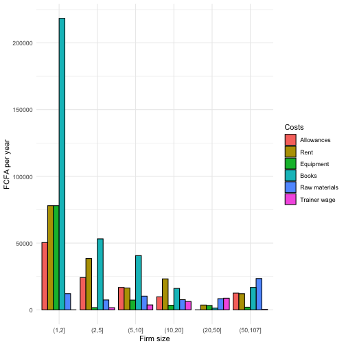

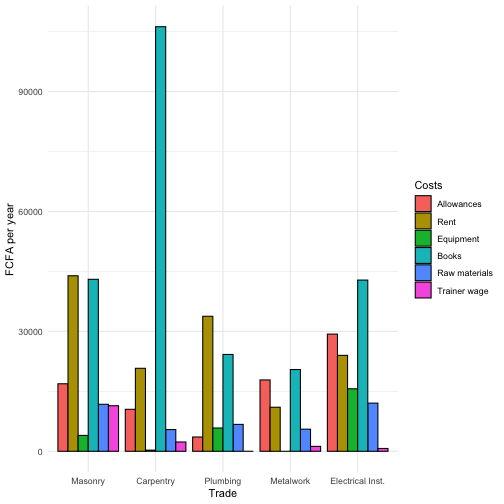


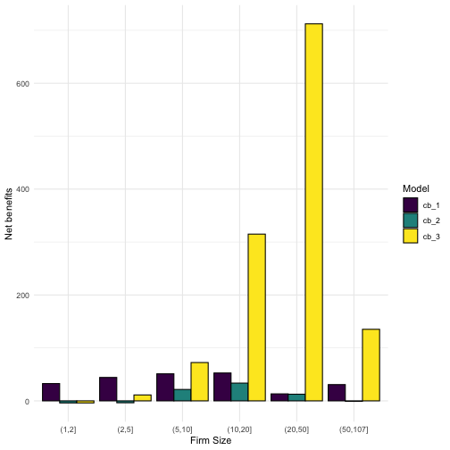

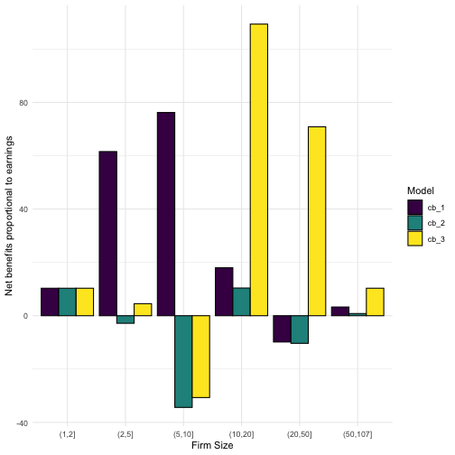

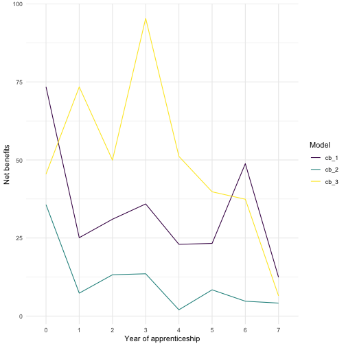

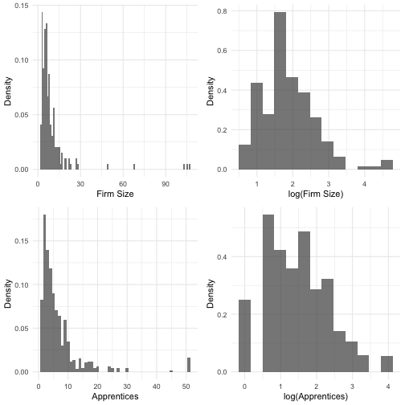


\begin{table}[H] \centering 
  \caption{Fixed effects regression: firm size} 
  \label{} 
\begin{tabular}{@{\extracolsep{5pt}}lcccc} 
\\[-1.8ex]\hline 
\hline \\[-1.8ex] 
 & \multicolumn{4}{c}{\textit{Dependent variable:}} \\ 
\cline{2-5} 
\\[-1.8ex] & \multicolumn{4}{c}{Firm Size (excluding apprentices)} \\ 
\hline \\[-1.8ex] 
 Apprentices & 0.560$^{***}$ & 0.370$^{***}$ & 0.570$^{***}$ & 0.370$^{***}$ \\ 
  & (0.033) & (0.087) & (0.033) & (0.087) \\ 
  Carpentry &  &  & $-$1.200 & 0.740 \\ 
  &  &  & (0.870) & (6.700) \\ 
  Plumbing &  &  & $-$1.700$^{**}$ & $-$2.700 \\ 
  &  &  & (0.840) & (6.600) \\ 
  Metalwork &  &  & $-$2.400$^{***}$ & 1.000 \\ 
  &  &  & (0.750) & (6.500) \\ 
  Electrical Inst. &  &  & $-$2.000$^{***}$ & 0.130 \\ 
  &  &  & (0.690) & (5.600) \\ 
  Wave & $-$0.600 & $-$0.580 & $-$0.540 & $-$0.580 \\ 
  & (0.500) & (0.530) & (0.490) & (0.530) \\ 
  Constant & $-$0.004 & 1.800 & 1.400$^{**}$ & 1.600 \\ 
  & (0.380) & (3.300) & (0.580) & (4.600) \\ 
 \hline \\[-1.8ex] 
Firm FE & NO & YES & NO & YES \\ 
Trade FE & NO & NO & YES & YES \\ 
Observations & 346 & 346 & 346 & 346 \\ 
R$^{2}$ & 0.470 & 0.770 & 0.480 & 0.770 \\ 
Adjusted R$^{2}$ & 0.460 & 0.460 & 0.480 & 0.460 \\ 
Residual Std. Error & 4.600 & 4.600 & 4.500 & 4.600 \\ 
F Statistic & 150.000$^{***}$ & 2.500$^{***}$ & 53.000$^{***}$ &  \\ 
\hline 
\hline \\[-1.8ex] 
\textit{Note:}  & \multicolumn{4}{r}{$^{*}$p$<$0.1; $^{**}$p$<$0.05; $^{***}$p$<$0.01} \\ 
 & \multicolumn{4}{r}{Omitted trade: Masonry} \\ 
 & \multicolumn{4}{r}{Omitted wave: Baseline} \\ 
\end{tabular} 
\end{table} 


\begin{table}[H] \centering 
  \caption{Random effects regression: firm size} 
  \label{} 
\begin{tabular}{@{\extracolsep{5pt}}lcccc} 
\\[-1.8ex]\hline 
\hline \\[-1.8ex] 
 & \multicolumn{4}{c}{\textit{Dependent variable:}} \\ 
\cline{2-5} 
\\[-1.8ex] & \multicolumn{4}{c}{Firm Size (excluding apprentices)} \\ 
\hline \\[-1.8ex] 
 Apprentices, total & 0.560$^{***}$ & 0.570$^{***}$ & 0.590$^{***}$ & 0.570$^{***}$ \\ 
  & (0.033) & (0.041) & (0.040) & (0.041) \\ 
  CQP apprentices (2019)3 &  & 0.110 & 0.120 & 0.110 \\ 
  &  & (0.089) & (0.083) & (0.089) \\ 
  Wave & $-$0.600 & $-$0.180 & $-$0.140 & $-$0.180 \\ 
  & (0.490) & (0.440) & (0.480) & (0.440) \\ 
  Constant & 0.006 & $-$0.360 & $-$0.460 & $-$0.360 \\ 
  & (0.380) & (0.390) & (0.550) & (0.390) \\ 
 \hline \\[-1.8ex] 
Firm FE & NO & YES & NO & YES \\ 
Trade FE & NO & NO & YES & YES \\ 
Observations & 346 & 321 & 321 & 321 \\ 
Log Likelihood & $-$1,019.000 & $-$924.000 & $-$924.000 & $-$924.000 \\ 
Akaike Inf. Crit. & 2,048.000 & 1,861.000 & 1,860.000 & 1,861.000 \\ 
Bayesian Inf. Crit. & 2,067.000 & 1,883.000 & 1,882.000 & 1,883.000 \\ 
\hline 
\hline \\[-1.8ex] 
\textit{Note:}  & \multicolumn{4}{r}{$^{*}$p$<$0.1; $^{**}$p$<$0.05; $^{***}$p$<$0.01} \\ 
 & \multicolumn{4}{r}{Omitted trade: Masonry} \\ 
 & \multicolumn{4}{r}{Omitted wave: Baseline} \\ 
\end{tabular} 
\end{table} 


\begin{table}[H] \centering 
  \caption{} 
  \label{} 
\begin{tabular}{@{\extracolsep{5pt}}lcccc} 
\\[-1.8ex]\hline 
\hline \\[-1.8ex] 
 & \multicolumn{4}{c}{\textit{Dependent variable:}} \\ 
\cline{2-5} 
\\[-1.8ex] & \multicolumn{2}{c}{Firm Growth} & \multicolumn{2}{c}{Firm Growth} \\ 
 & Reported & Reported & Computed & Computed \\ 
\hline \\[-1.8ex] 
 CQP apprentices, 2019 cohort & $-$0.012 & 0.260$^{**}$ & $-$0.850$^{***}$ & $-$0.082 \\ 
  & (0.090) & (0.100) & (0.120) & (0.130) \\ 
  Diff. in total apprentices & 0.980$^{***}$ & 0.850$^{***}$ & 1.600$^{***}$ & 1.200$^{***}$ \\ 
  & (0.051) & (0.056) & (0.070) & (0.066) \\ 
  Baseline firm size (reported) &  & $-$0.220$^{***}$ &  &  \\ 
  &  & (0.049) &  &  \\ 
  Baseline firm size (computed) &  &  &  & $-$0.280$^{***}$ \\ 
  &  &  &  & (0.031) \\ 
  Constant & 0.350 & 1.300$^{***}$ & 1.300$^{***}$ & 2.600$^{***}$ \\ 
  & (0.330) & (0.380) & (0.460) & (0.390) \\ 
 \hline \\[-1.8ex] 
Observations & 138 & 138 & 137 & 137 \\ 
R$^{2}$ & 0.740 & 0.770 & 0.810 & 0.880 \\ 
Adjusted R$^{2}$ & 0.730 & 0.760 & 0.810 & 0.880 \\ 
Residual Std. Error & 3.500 & 3.300 & 4.800 & 3.800 \\ 
F Statistic & 188.000$^{***}$ & 149.000$^{***}$ & 284.000$^{***}$ & 331.000$^{***}$ \\ 
\hline 
\hline \\[-1.8ex] 
\textit{Note:}  & \multicolumn{4}{r}{$^{*}$p$<$0.1; $^{**}$p$<$0.05; $^{***}$p$<$0.01} \\ 
\end{tabular} 
\end{table} 


\begin{table}[!htbp] \centering 
  \caption{Apprentice-level random effects regressions} 
  \label{} 
\begin{tabular}{@{\extracolsep{5pt}}lccccc} 
\\[-1.8ex]\hline 
\hline \\[-1.8ex] 
 & \multicolumn{5}{c}{\textit{Dependent variable:}} \\ 
\cline{2-6} 
\\[-1.8ex] & \multicolumn{2}{c}{Experience} & \multicolumn{2}{c}{Competence} & Knowledge \\ 
\hline \\[-1.8ex] 
 CQP participants & 0.023 & 0.013 & 0.007 & $-$0.002 & 0.016 \\ 
  & (0.029) & (0.028) & (0.028) & (0.026) & (0.022) \\ 
  CQP non-applicants & $-$0.100$^{***}$ &  & $-$0.130$^{***}$ &  &  \\ 
  & (0.028) &  & (0.026) &  &  \\ 
  Wave & 0.170$^{***}$ & 0.120$^{***}$ & 0.130$^{***}$ & 0.088$^{**}$ & 0.053$^{*}$ \\ 
  & (0.035) & (0.043) & (0.033) & (0.038) & (0.032) \\ 
  CQP x wave & $-$0.014 & 0.044 & 0.039 & 0.080 & $-$0.012 \\ 
  & (0.054) & (0.057) & (0.051) & (0.050) & (0.044) \\ 
  Experience at baseline$^<U+2020>$ & 0.069$^{***}$ & 0.039$^{***}$ & 0.070$^{***}$ & 0.036$^{***}$ & 0.011 \\ 
  & (0.008) & (0.010) & (0.008) & (0.009) & (0.008) \\ 
  Firm size$^<U+00A7>$ & $-$0.001 & $-$0.002 & $-$0.002 & $-$0.001 & $-$0.001 \\ 
  & (0.002) & (0.002) & (0.002) & (0.002) & (0.002) \\ 
  Total apprentices in firm & 0.003$^{*}$ & 0.003 & 0.004$^{**}$ & 0.002 & 0.004$^{**}$ \\ 
  & (0.002) & (0.002) & (0.002) & (0.002) & (0.002) \\ 
  Total instructors in firm & 0.026$^{***}$ & 0.029$^{***}$ & 0.023$^{**}$ & 0.022$^{**}$ & $-$0.008 \\ 
  & (0.010) & (0.011) & (0.009) & (0.010) & (0.009) \\ 
  Days trained per week & $-$0.014 & $-$0.020 & $-$0.016 & $-$0.017 & 0.002 \\ 
  & (0.011) & (0.012) & (0.010) & (0.011) & (0.010) \\ 
  Duration, last training & 0.005 & 0.004 & 0.009$^{*}$ & 0.004 & 0.006 \\ 
  & (0.005) & (0.006) & (0.005) & (0.005) & (0.005) \\ 
  Trade: Carpentry & $-$0.008 & $-$0.020 & $-$0.005 & $-$0.006 & 0.170$^{***}$ \\ 
  & (0.040) & (0.045) & (0.038) & (0.042) & (0.037) \\ 
  Trade: Plumbing & $-$0.110$^{***}$ & $-$0.088$^{**}$ & $-$0.042 & $-$0.026 & $-$0.230$^{***}$ \\ 
  & (0.038) & (0.041) & (0.037) & (0.038) & (0.033) \\ 
  Trade: Metalwork & $-$0.029 & $-$0.040 & $-$0.031 & $-$0.038 & $-$0.086$^{***}$ \\ 
  & (0.033) & (0.038) & (0.031) & (0.035) & (0.031) \\ 
  Trade: Electrical inst. & 0.066$^{**}$ & 0.092$^{***}$ & 0.074$^{***}$ & 0.088$^{***}$ & 0.120$^{***}$ \\ 
  & (0.030) & (0.035) & (0.028) & (0.033) & (0.028) \\ 
  Constant & 0.540$^{***}$ & 0.630$^{***}$ & 0.560$^{***}$ & 0.680$^{***}$ & 0.690$^{***}$ \\ 
  & (0.046) & (0.051) & (0.044) & (0.047) & (0.041) \\ 
 \hline \\[-1.8ex] 
Observations & 422 & 268 & 422 & 268 & 275 \\ 
Log Likelihood & 14.000 & 25.000 & 35.000 & 48.000 & 84.000 \\ 
Akaike Inf. Crit. & 5.500 & $-$18.000 & $-$37.000 & $-$63.000 & $-$136.000 \\ 
Bayesian Inf. Crit. & 74.000 & 39.000 & 32.000 & $-$5.700 & $-$79.000 \\ 
\hline 
\hline \\[-1.8ex] 
\textit{Note:}  & \multicolumn{5}{r}{$^{*}$p$<$0.1; $^{**}$p$<$0.05; $^{***}$p$<$0.01} \\ 
 & \multicolumn{5}{r}{$^<U+2020>$Years in training in 2019.} \\ 
 & \multicolumn{5}{r}{$^<U+00A7>$Excluding apprentices.} \\ 
 & \multicolumn{5}{r}{Omitted trade: Masonry. Omitted wave: Baseline.} \\ 
\end{tabular} 
\end{table} 
